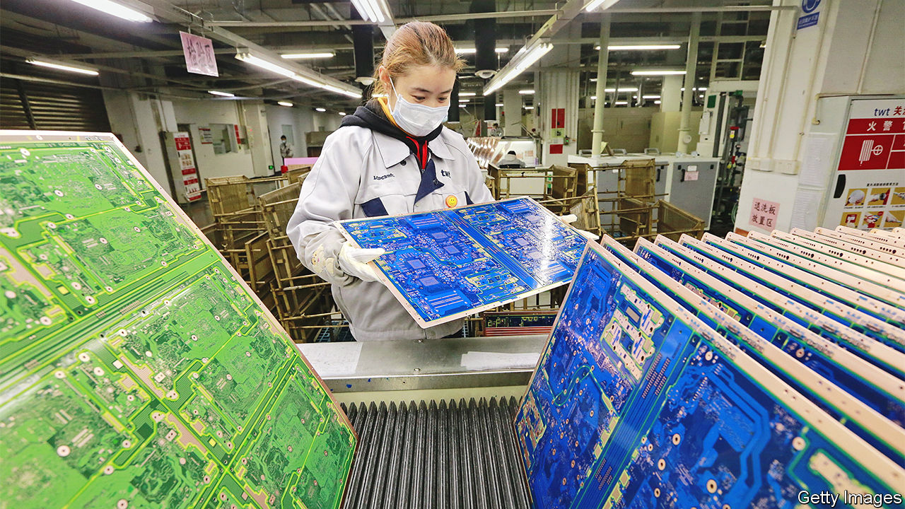
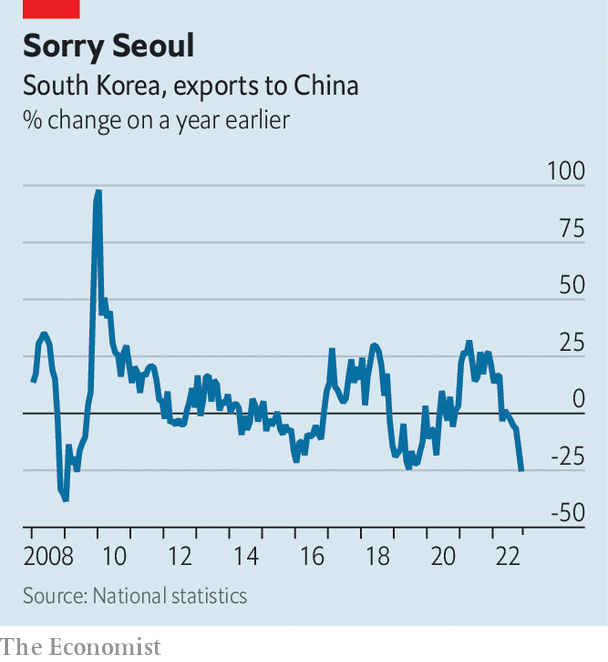

###### The chips hit the fan

# A global electronics slump is driving East Asia to the wall 

##### China’s zero-covid slowdown is only one factor troubling the region’s trade champions 

 

> Dec 8th 2022 

On December 7th China announced it was relaxing yet more of its covid-19 restrictions. The news was well received by the once roaring economies of East Asia. In recent days many have reported terrible trade data that suggest the domestic effects of China’s zero-covid policies have ricocheted across the region. A reopening, however tentative, can only help. But the reasons behind the tigers’ angst extend well beyond woes faced by their big neighbour. As the world spends less on expensive gadgets, the world’s busiest manufacturing hub is being driven to the wall. 

China is certainly a big factor in the sharp deceleration across the region. Asia’s largest economy is reeling from many months of disruptive pandemic-control measures and a homegrown property crisis. Data released on December 7th showed a 9% year-on-year fall in Chinese exports in November, a far steeper decline than expected by analysts. 

 


As Asia’s growth engine sputters, so does trade between countries in the region. Exports from trade-intensive South Korea, which slid by 14% year on year overall in November, were particularly hampered by dwindling sales to China, which shrank by 26%—the biggest 12-month decline since 2009. Taiwan’s sales to the mainland and Hong Kong slumped by 21% over the period. There may be more bad news to come. Dwindling intra-Asian trade, which is largely made up of intermediate goods, probably signals a deeper drop in future sales of finished products.

The China drag may start to ebb at some point next year—but slowly at best. The recovery of the world’s second-biggest economy could take many months and large outbreaks of covid-19, as rules are loosened, could cause short-term disruptions. 

Meanwhile a second, lesser known factor is likely to keep hindering East Asia’s trade giants: the storm facing the global electronics industry. Worldwide sales of PCs were down by 20% in the third quarter of the year compared with the same period in 2021. That is holding back Chinese exports of data-processing machines and their parts—the category which includes personal computers. These fell by 28% year on year in November. 

The shift is also bad news for South Korea, the dominant producer of the memory chips found in computers worldwide. Its exports of goods to Japan dwindled by 18% year on year in November. It even affects further-flung hubs like Singapore, whose exports of electronics fell by 9.3% in October. Oxford Economics, a consultancy, expects a further slump in goods exports from the region next year, of around 4%. 

Rapid increases in interest rates in America, with other central banks forced to follow suit, are fuelling the slowdown by crimping households’ and companies’ demand for consumer goods. That effect is visible in orders of machine tools from Japan, a bellwether for industrial activity globally. They fell by 5.5% year on year in October. Electrical and precision machinery orders were most affected, sinking by 27% over the period. 

The squeeze on Asian industry is in stark contrast to the years after the financial crisis, when low interest rates and a booming Chinese economy were a boon to the region’s industrial networks. Natixis, an investment bank, expects semiconductor demand to remain subdued until at least next summer; rate-setters at the Federal Reserve, and China’s public-health bosses, may remain cautious for even longer. East Asia’s famished tigers could face many more lean months. ■


