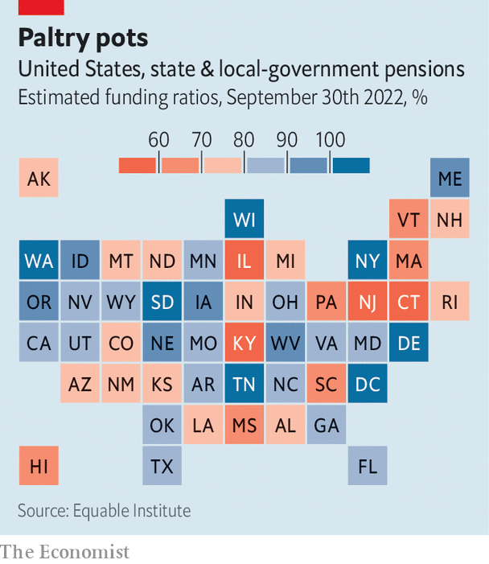
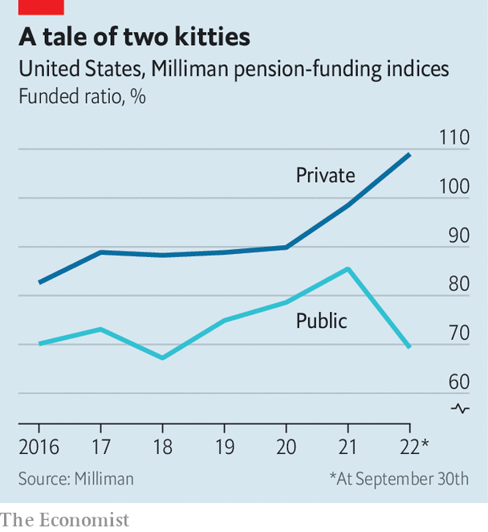

###### The incredible shrinking plan

# Can you afford to retire? 

##### Inflation and rising rates mean many future retirees could earn less than they had thought 

 

> Dec 5th 2022 

Can you afford to retire? The answer is much more likely to be no today than it was a year ago—especially for those old enough to ask themselves the question. The  is eroding the real value of savings. Higher interest rates have caused a repricing of bonds and stocks. The result is that the pot of assets many future pensioners are hoping to live off has shrunk fast. Pundits have long predicted that, as populations age and the number of workers for every dependent falls, those retirement savings would come under pressure—a problem they have dubbed the “pension time-bomb”. The fuse now looks much shorter. 

The soon-to-be retired are often advised to shift their assets into bonds and out of stocks as they prepare to stop working, to protect their savings from big stockmarket corrections. So-called “life-cycle” pension funds are usually invested almost entirely in stocks during their owners’ younger years, a strategy meant to capture the higher returns that listed equities tend to generate over long periods. As workers near retirement, these funds usually swap most of their equities for government bonds, which are supposed to hold their value. But with less than a month to go, 2022 looks set to be an appalling year for bonds. The typical portfolio of those closest to hanging up their boots has lost 17% of its value since January. 

A year ago, a 65-year-old who had saved a healthy $2.5m for their retirement and invested 80% of it in government bonds and 20% in stocks globally would have typically drawn an income of $100,000. If inflation stayed modest, they would have been able to draw a similar real income for the next 30 years. The asset-price crash, however, means that the value of the pot has fallen to around $2.1m—allowing them to draw nominal annual payments of just $83,000. Soaring inflation, meanwhile, has eaten up another 10% of that income, leaving them with just $75,000 in real terms. And the shrinkage is hardly over. Should inflation remain above 2% for a while—say it averages 3% a year instead—then a retiree who made it to 90 might well be living on just 65% of the real income they might have expected until recently.

This impoverishment could fast become reality for millions. A lot of baby-boomers turned into pension-boomers in 2021. The Federal Reserve Board of St Louis reckons there were 3.3m more retired people in October 2021 in America than 20 months before. More than half of Americans over 55 have left the labour force, up from 48% in the third quarter of 2019, according to the Pew Research Centre, a think-tank in Washington, DC. This reverses a decades-long increase in the share of people working past 55, which has slid back to the levels of 2007-09 in just a year. A similar pattern is evident across the OECD club of mostly rich countries.

Survey data already suggest some of those who recently retired are considering returning to work. Those who do not, or cannot, probably face leaner years than they had expected. But individuals are not the only ones who will bear the burden of the adjustment. Some of it will also be shouldered by governments, through social-security and national-insurance schemes. And part of it will be borne by a creature that is becoming ever rarer: the defined-benefit (DB) pension plan. 

Many of those considering retirement today spent much of their lives working during the golden age of DB schemes, when firms or employers in the public sector, such as schools and local governments, agreed to pay workers an annuity after they stopped working. Of the $40trn held in retirement assets in America today, $17trn is held in such schemes.

A typical DB payout is worth 2% of a worker’s final salary, multiplied by years of service. So a teacher employed for, say, 40 years, who retired when her salary was $80,000, would be paid $64,000 per year for the rest of her life. In this way the employer shouldered all the investment risk the individual would otherwise have to face; DB schemes, not their members, are the ones bearing the mighty losses in asset prices this year. Some plans also adjust payouts for inflation. 

Over recent decades, ageing populations and rising life expectancies have together pulled down interest rates; bigger savings pools chasing a finite volume of assets meant capital became cheaper. It gradually became clear to firms and public-sector agencies just how hard keeping their pension promises was going to be. From the 1980s the private sector therefore began to phase out its offerings of such plans: the share of employees enrolled in DB schemes in America dropped from nearly two-fifths at its peak to just a fifth by 2008. Then the strain of the financial crisis prompted many firms to reclassify DB plans as defined-contribution schemes, where workers simply contribute a set amount to the pot with no guarantee of what they get back after retirement. 

Public-sector employers have had much less success in reducing their exposure to these overgenerous pension schemes, however. The result is that around $13trn of America’s DB assets are managed by state, local and federal governments. Many of the biggest DB schemes, and some of the biggest pension funds in existence today, are run by public institutions, such as the California Public Employees’ Retirement System (CalPERS) and the Ontario Teachers’ Pension Plan (OTPP). The portfolios of such beasts, worth hundreds of billions of dollars, are suffering just as many more of their members are getting ready to ask for their money. 

The way to measure how easily a pension plan will meet its liabilities in the future is to look at its “funded ratio”. This compares the pot of investments it currently holds against the expected future value of the promises it has made to those paying in. The sum has three moving parts: the value of the current investment pot, the discount rate used to calculate the present value of future payouts, and the stream of those expected future payments. 

The third factor is the hardest to figure out, because future payouts are based on undetermined final salaries and on how long the recipient and their spouse, who is often eligible for payments, might live. Olivia Mitchell, a professor of insurance and risk management at the Wharton School of the University of Pennsylvania, points out that the income stream a DB pension scheme might owe to someone joining the plan today could stretch more than a century into the future, if you include payments made to partners. 

Still, it is the other two elements—the value of the investment pot and the discount rate—that decide whether funded ratios soar or sink. The easiest way to run a pension is to match assets with liabilities, by buying long-term bonds that pay out when pensioners come knocking. If yields on American government bonds are the benchmark, say, then the pension manager might simply buy lumps of them. Should the value of those assets plunge, the pension plan would still be able to meet its expected future liabilities: it would only have to hold the bonds to maturity and distribute the yield it was promised when it bought them. 

 


That strategy only works, though, if the plan is “fully funded”: that is, if the cash it has to begin with is worth 100% of its expected liabilities. If it is underfunded—perhaps because contributions are not high enough, or because it made some poor investments in the past—then putting all of its assets into the investments that earn the discount rate on its liabilities will set a fund up for bankruptcy down the road. Many underfunded pensions have had to take risks—by holding equities, for example—in a bid to fill their funding gaps. A combination of bad investment years (such as 2001 or 2008), falling discount rates, ageing populations and the political infeasibility of asking employees to contribute more has pushed a lot of DB schemes into the red in recent years. 

In isolation, falls in the value of the pot are bad. But although higher interest rates hurt asset values, they can also be helpful for pension schemes, because they reduce the present value of future payouts. This year has therefore not been a bad one for all pension plans. Indeed, corporate pensions in America have done rather well. After a bumper 2021, the average corporate pot was fully funded at the end of the year, for the first time since 2007. Corporate funds then moved to reduce their investment risk early by swapping many stocks for bonds—an asset-allocation shift so huge and rapid that it may have contributed to the end of America’s stockmarket rally at the start of this year. 

Corporate plans elsewhere have not been so lucky, if only because their stockmarkets did not do as well to start with. Many British corporate plans, for example, are still underfunded. In recent years that has led them to adopt strategies in a bid to protect themselves against falling interest rates; one, called “liability-driven investing” (ldi), nearly blew them up over the summer. To ensure they did not look more underfunded when rates fell, many British funds loaded up on derivatives that would pay out when rates dipped, but required them to cough up cash when they rose. As rates rocketed, many funds faced margin calls so big that they threatened to absorb all the cash the funds had to hand. Only when the  did the danger of bankruptcy ebb. 

The big losers of 2022, though, are public pensions. Whereas over the past 12 months the average funding ratio for a private plan has risen from 97% to around 110%, that of public pensions in America, which stood at 86% a year ago, their highest since the financial crisis, has dropped to 69%—close to a four-year low. 

 


There are two main reasons for the slump. One is that the discount rates used by public plans, rather than being benchmarked to a given asset market, are instead set by external committees. The trouble is that these committees did not reduce discount rates by as much as interest rates fell over the decade that followed the financial crisis, which made it difficult to raise them by much this year, as interest rates rose again. This means the liabilities those pension funds must face in the future remain nearly as high as before. 

At the same time, funds’ investments have performed poorly. As yields on bonds fell across the developed world in the 2010s many underfunded plans moved into riskier investments, such as leveraged loans, private equity, venture investing and even cryptocurrencies. OTPP held a stake in , a crypto exchange once valued at $32bn that went spectacularly bust last month. 

Funding ratios can dip only so far before pension funds get into serious trouble. “Once a plan is only 40% funded,” grimaces Mike Rosborough, a former portfolio manager at CalPERS now at AllianceBernstein, a research firm, “there is often no going back.” It becomes almost impossible, at those kinds of levels, for the pension plan to pay out the annual liabilities it owes to those who have already retired from the income it makes on its assets. It is instead forced to sell those assets off. This quickly becomes a self-perpetuating, vicious cycle: the more assets it has to sell, the smaller the pot, and the more underfunded it becomes. This can go on until the assets hit zero—at which point the plan becomes “pay as you go”: it uses the contributions of current payers to pay former workers, or is bailed out by taxpayers. 

This may never become a problem for CalPERS. California is a rich state which has been directing extra funding to its pension plans from its budget surplus for years. But it is becoming a scary possibility in American states like Kentucky, Illinois, Connecticut and New Jersey, where public pensions are around just half-funded.

Even with all their problems, pensioners that depend on underfunded public DB plans are miles better off than those relying on Social Security (the American equivalent of National Insurance). Transfers are mostly paid using contributions from current workers. That first started to look shaky in 2008, when withdrawals exceeded contributions for the first time. Payments have since been partly financed from a trust based on past surplus contributions. But the excess of withdrawals over contributions means that this trust is projected to run out in 2035, after which the state will have to make up the difference. The fate of many db and social-security pensioners alike could ultimately depend on the government’s willingness to bail them out. ■


