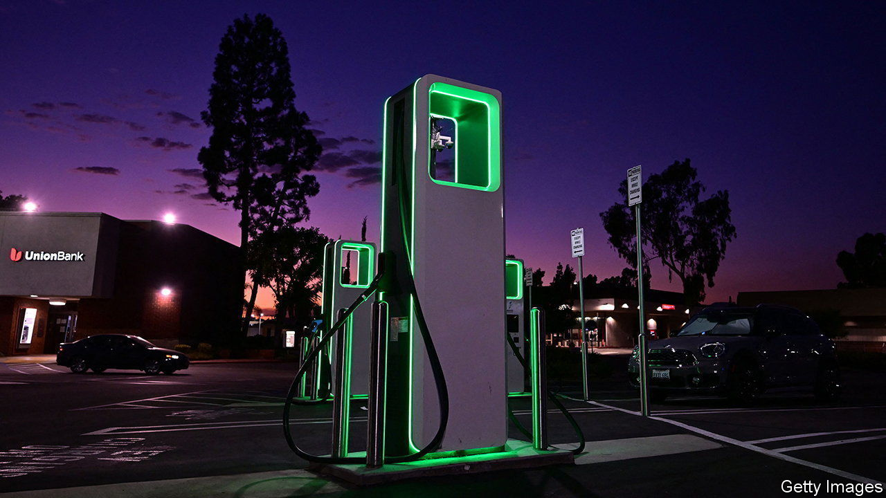
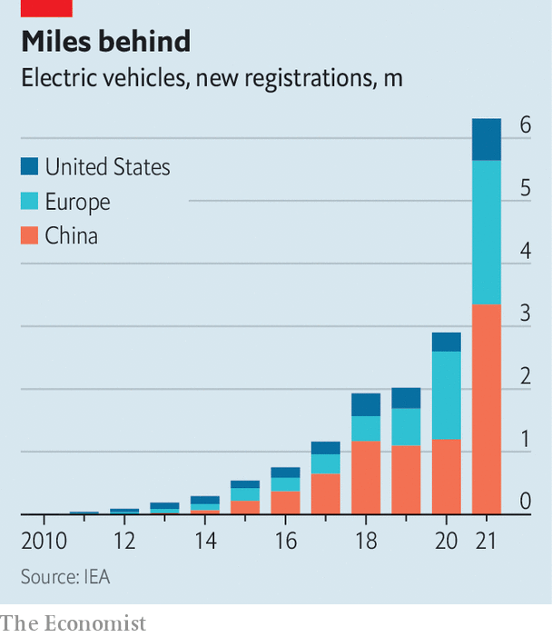

###### Concrete jungle

# Europe and America put a brave face on a growing economic rift 

##### The transatlantic tandem is drifting towards a full-fledged subsidy race 

 

> Dec 8th 2022 

A useful contrarian indicator for gauging the substance of international talks is whether negotiators talk about concrete. The more they do, the less they tend to achieve. The Trade and Technology Council (TTC), a forum for the EU and America to co-ordinate regulation, appears to prove this admittedly cynical rule. At its latest meeting on December 5th, the White House said it had advanced “concrete action” on transatlantic co-operation by launching new “concrete initiatives”, while a joint statement with the Europeans promised yet more “concrete outcomes” and “concrete actions”. 

The trouble is, despite all the talk of concreteness, America and Europe now have major disagreements in the economic realm and few obvious solutions. The main point of contention is the Inflation Reduction Act, the centrepiece of the Democrats’ climate-and-industrial strategy. The IRA, signed into law in August, features nearly $400bn in funding for energy-related projects, much of which is contingent on goods being produced in or near America. There are subsidies for automakers who buy locally made batteries, tax credits for domestic producers of renewable fuels and tax breaks for consumers who buy electric vehicles that contain enough North American components.

 


The Biden administration believes these incentives are needed to spur the development of America’s green economy. In industries such as electric vehicles, America is a laggard (see chart). The worry in Europe and Asia is that America’s giant market and generous handouts will attract their companies at the expense of their home bases. In the past year alone international carmakers from BMW and Toyota to Mercedes and Stellantis have announced big investments in America. The fallout from Russia’s invasion of Ukraine adds to the aggravation: a shift away from Russian energy supplies has raised costs in Europe, further harming its industries.

Europe’s displeasure was made clear on the eve of the meetings in Washington, DC. Emmanuel Macron, France’s president, called America’s subsidies a “killer for our industry” in an interview with CBS’s “60 Minutes” show. Ursula von der Leyen, president of the European Commission, the bloc’s executive arm, spoke of distortions caused by the American law. 

A single TTC meeting was never going to heal the rift. The forum packed into one day talks on risk management in artificial intelligence, standards for plastics recycling, warning systems for semiconductor supply-chain disruptions and more. And yet Valdis Dombrovskis, the European commissioner for trade, said he left the TTC feeling “slightly more optimistic” about co-operation with America. That optimism follows on from President Joe Biden’s pledge that America could tweak its subsidies to satisfy European companies.

Warm words aside, what can America do to help? Its climate tax credits, enshrined as law, cannot be easily modified. There is no chance of new legislation during the next two years of divided Congress. Instead the response is likely to come from Europe, where officials are mulling their own green incentives. The most concrete outcome of the TTC may thus be the continued drift of America and Europe towards a full-fledged subsidy race. ■


