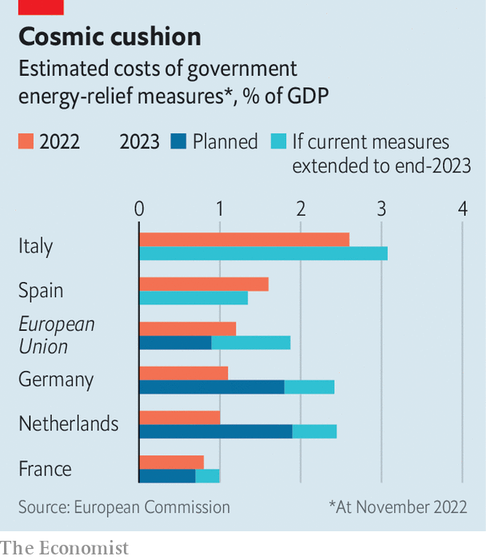

###### The monetary marathon

# Inflation is falling—but not enough 

##### Central bankers have a long way to go before they hit their targets 

 

> Dec 7th 2022 

Before the pandemic the idea of an annual rate of inflation of 10% in the euro zone would have seemed like a horror story. In November it was good news. Inflation had been 10.6% the month before. A similar surprise came from America. As inflation falls, so does the expected pace of interest-rate increases. On December 14th and 15th the Federal Reserve, European Central Bank and Bank of England will each probably raise rates by half a percentage point—a deceleration from the three-quarter-point rises that have recently prevailed. 

Globally, inflation has begun to decline primarily because energy prices have eased since the summer and because supply chains, long gummed up by the pandemic, are operating more smoothly. Yet inflation remains a very long way from central banks’ 2% targets. There are three reasons to think rate-setters will struggle to hit their goals soon.

The first is a continued scarcity of workers. While the news on prices has been good, the latest wage data are worrying. In America average hourly earnings had shown encouraging signs of softening since August. But updated figures released on December 2nd upended the picture, showing annualised growth of 5.1% over the past three months, roughly in line with other surveys. Since the data came out stockmarkets in America have fallen, in expectation of prolonged interest-rate rises. In Britain wages are growing at a similar rate; a wave of strikes may prompt still bigger increases. The euro zone’s labour markets, though not as sizzling, are hot enough to make policymakers worry that energy inflation could affect the rest of the economy as workers bargain for higher wages to offset rising living costs. 

 


The second problem is fiscal policy. It would help central banks to cool labour markets if governments shrank their budget deficits. Yet America’s recent Inflation Reduction Act makes only a minimal dent in government borrowing, and the Biden administration is trying to forgive swathes of student debt. Europe is splurging on energy subsidies despite warnings from the IMF and others that it is unwise to stimulate economies which lack spare productive capacity—a mistake America made in 2021, when President Joe Biden’s “American Rescue Plan” overheated the economy. If the EU retains its measures throughout 2023 the cost, net of taxes raised to fund the handouts, will reach nearly 2% of GDP (see chart). In aggregate Britain’s much advertised belt-tightening will not begin until 2025, thanks to its costly energy-price cap. 

Nearly two-thirds of the EU’s energy spending is on controlling prices for everyone, which is expensive and discourages energy saving. Only a fifth comes in the form of targeted redistribution to the needy, the approach recommended by the likes of the IMF. Even Germany, which has capped prices only up to 80% of a household’s previous usage, is still borrowing to fund the scheme, meaning that it will deliver an economic stimulus. 

The final danger is that energy inflation returns in 2023. This year Europe’s economies have benefited from weak competition for scarce supplies of global liquefied natural gas (LNG), in part because China’s economy has been hampered by its zero-covid policy. But China has begun to loosen its pandemic controls. If its economy reopens and rebounds, LNG prices could surge in 2023. Central bankers’ battle with inflation has reached an inflection point. But it will not be won for a long time. ■


