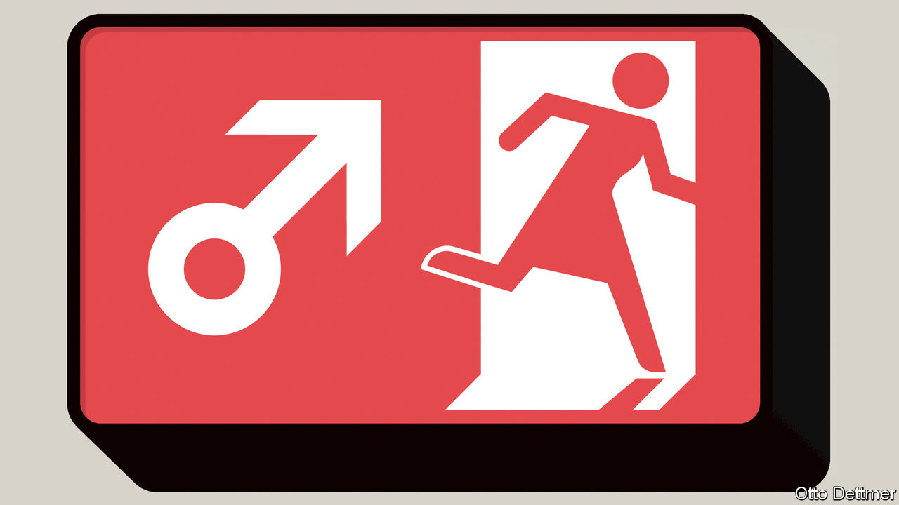

###### Free exchange

# Tackling sexual harassment could bring sizeable economic dividends 

##### New research puts a price tag on unpunished predation—and offers clues on how to deter abuse 

 

> Dec 8th 2022 

Five years after the MeToo movement gripped the world, the problem of sexual harassment continues to dog the economics profession. Fresh allegations of misconduct at universities in America and Europe are causing a torrent of older cases to emerge. Rooting out harassment in academia is particularly hard because career progression depends on the goodwill of not just senior colleagues but also peers at far-flung institutions, who often partner with juniors to conduct research and who review papers vying to get published in prestigious journals. 

Yet half a decade has not gone by in vain. Many economists are now using the same rigorous approach they bring to assessing the labour market, or the impact of workplace accidents, to gauge the effects of harassment. Their findings help give a sense of the cost—to victims and the wider workforce—of sexual coercion, demeaning treatment and degrading comments. Fortunately, the research also shows that some remedies do work, making the pay-off to halting misconduct both sizeable and attainable. 

The greatest cost of harassment is borne by the victims themselves. On top of the grave psychological costs, there are economic ones too. Victims tend to give up their jobs to look for new ones for which they may be less suited. Johanna Rickne of Stockholm University and Olle Folke of Uppsala University conducted a survey on sexual harassment and followed respondents for five years. They found that women who reported harassment were 25% likelier to leave their job than other women; the equivalent increase for male victims was 15%. The women who left also tended to earn less. Another study by Abi Adams-Prassl of Oxford University and colleagues, using Finnish data on violent incidents including sexual assault, shows that female victims have almost as much chance of being durably unemployed as workers laid off after the closure of a plant; for male victims, the likelihood is a little lower. 

The fear of being unemployed also appears to deter victims of sexual harassment from speaking up. Gordon Dahl of the University of California, San Diego, and Matthew Knepper of the University of Georgia find that only the more egregious cases tend to be reported during recessions.

Gender-based harassment also acts as a tax on the rest of the population. One way to pin an economic value on this is to estimate how much of a pay cut workers are ready to accept to avoid the risk of harassment. In their paper Ms Rickne and Mr Folke ran experiments with hypothetical job offers in Sweden. They find that, on average, the gender most at risk—most often women—is willing to give up 17% of their salaries to avoid harassment. In another study Joni Hersch, of Vanderbilt University, calculates that the collective sacrifice in earnings of American women per filed case of sexual harassment in any given year is $9.3m. 

Encouragingly, research can also guide thinking on how to tackle sexual harassment. One lesson is that improving outside options can help. Mr Dahl and Mr Knepper find that before North Carolina cut unemployment benefits in 2013, workers were more likely to report harassment. Amenities that make it easier to find work, such as transport links to thriving job basins, should also make a difference. Where the potential for retaliation is high and outside options are limited, such as in film-making or academia, field-wide institutions must be strong enough to punish deviations. The American Economic Association has written codes of conduct and can open investigations, but lacks the teeth to obtain evidence and impose sanctions. 

Another lesson is that employers themselves should have a strong interest in tackling sexual harassment. Caroline Coly of Bocconi University and co-authors find that, since 2017, women have been leaving organisations where they fear being harassed in higher numbers. The Finnish study also finds that women other than the victim tend to leave a firm where male violence towards women has been reported. The corollary is that firms that clamp down on harassers should be able to access a wider pool of talent, thereby allowing them to outperform competitors.

Evidence of such a bonus is starting to emerge. Research suggests firms run by female executives may have become more valuable since MeToo began. One reason could be that they tackle male wrongdoers differently. Ms Adams-Prassl and colleagues find that female leaders tend to sack perpetrators. That, in turn, prompts more women to stay. A paper by Mark Egan of Harvard Business School and colleagues also shows that female bosses are less tolerant of other types of misconduct by men, such as consumer disputes or regulatory offences.

Paying the price

Such incentives, however, can go only so far. The final lesson is that organisations under whose roofs harassment occurs often bear too little of the true cost. America’s federal laws cap the sexual-harassment damages a victim can receive from large firms at $300,000. Applying the same method used in workplace-safety cases, Ms Hersch argues, yields a larger amount: $9.3m, the earnings sacrifice women are willing to make to avoid harassment. Such payments could deter firms from tolerating misconduct. But they may not be enough to change norms and corporate culture. For that to happen, people in power need to speak out.

Economists now need to turn their focus to their own backyard. Anna, a former economics phd student at a European university (whose name we have changed), recounts how her supervisor made inappropriate comments and eventually asked her to spend the night at his place—which she declined—before turning vindictive when she requested a change of supervisor. After her PhD Anna chose to pursue a career outside academia. Not for a lack of ambition, she says, but to avoid the toxic culture and the unsafe environment it breeds. Economics would do well to make sure future Annas decide to stay. ■


