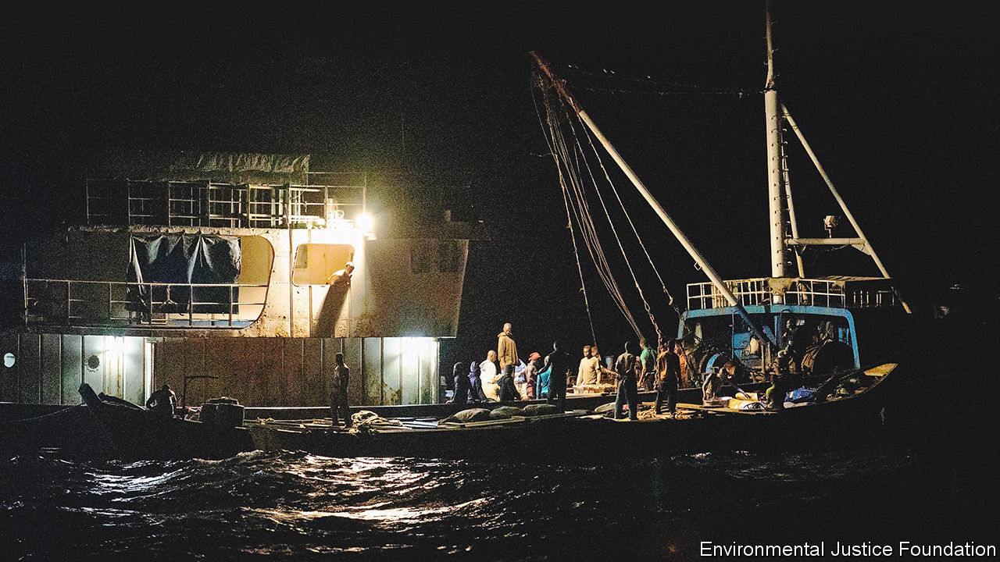
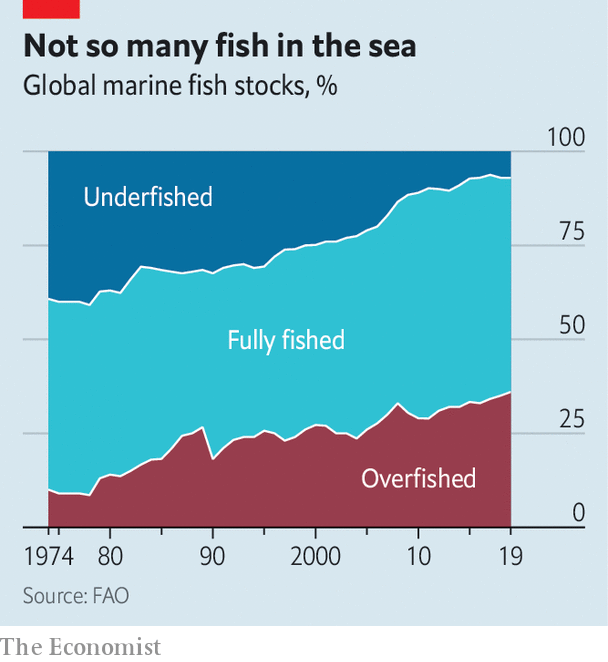

###### Pelagic politics

# China’s deep-water fishing fleet is the world’s most rapacious 

##### Even in a notoriously murky industry, it stands out 

 

> Dec 8th 2022 

From his shack, Mamadou Sarr points to more than 100 brightly painted pirogues hauled up above the Atlantic surf on Ouakam beach in Dakar, the capital of Senegal. In normal times they would be out fishing. But the dozen boats that ventured out that day had come back with barely any fish. Mr Sarr, who heads the local fishing association, opens boxes that would once have been full of bream and grouper to reveal only flies. At the beachside market, a woman sleeps on the table upon which she would usually gut fish.

A story of scarcity runs up and down the once bountiful coast of west Africa. There, communities of “artisanal” fishermen, who fish for subsistence and for the local market, are buffeted by forces shaped on the far side of the world, in China. For at least three decades that country’s central and local governments have encouraged the development of a long-distance fishing fleet, equipping boats that stay at sea for months or even years. 

China is not the only state with an eye on protein and profit far from its own waters. Japan, South Korea, Spain and Taiwan have fleets of their own. But it is by far the biggest. Some estimates put its size at over 3,600 boats, as many as the next three biggest combined. And unlike others’ fleets, China’s consciously projects state power and influence, sometimes as part of Xi Jinping’s signature economic and geopolitical project, the Belt and Road Initiative (BRI). A significant number of Chinese vessels are state-owned. 

A third differentiating feature is the fleet’s rapaciousness and lack of scruple in an industry notorious for both. In its wake comes overfishing, some of which is outright illegal; the collapse of local stocks; smuggling; links to organised crime; and the forced labour and general mistreatment of those who serve on the boats. 

All these factors are now playing out off the coast near Mr Sarr’s shack. The Chinese government publishes a list of foreign countries within whose 200-nautical-mile (370km) “exclusive economic zones” (EEZs) it has agreed contracts for fisheries operations. Over half of such agreements have been made with west African countries. Senegal is one. Mauritania to the north, vast and poor, accounts for nearly 30% of the total by itself.

The projects include not just the rights for Chinese vessels to fish in states’ coastal waters, but also to establish operations such as processing plants ashore. Mauritania has become a hub in the industry for fishmeal and fish oil. Such products are bought by aquaculture farms that raise fish for customers in China and other countries. The sorts of fish hoovered up to make them include those long fished by locals using small boats and hand nets. 

As the Environmental Justice Foundation, a London-based NGO, points out in a report released in March, all this has “transformed the political ecology” of fishing in west Africa. Locals who depend on small-scale fisheries to put food on the family table are forced into direct competition with Chinese industrial fishing concerns. It is an lopsided struggle.

It is not only fish stocks themselves that attract China’s fleets. So too do jurisdictions with poor governance, toothless rules and ample scope for buying influence. One small example is highlighted by the Outlaw Ocean Project, an American NGO. In 2017 a Chinese fishmeal plant in the Gambia, a BRI-branded project, turned a lagoon at the heart of a wildlife reserve crimson with illegally dumped arsenic, nitrates and phosphates. The operator was fined just $25,000 and allowed to continue operating—and dumping. 

 


Sometimes the rules are ignored entirely. Illegal, unreported and unregulated (IUU) fishing is rife among the Chinese fleet. Vessels exceed catch limits, kill protected species or fish where they should not (such as inshore zones reserved for artisanal fishermen). All that puts further pressure on the world’s seas, which are already fished nearly to capacity (see chart). Locally flagged vessels often conceal their Chinese ownership behind shell companies or joint ventures. Although foreign vessels are not allowed to fish in Ghanaian waters, much of its fleet is ultimately controlled by Chinese interests. 

Fishy business

One common illegal practice in Ghanaian waters is —the transfer at sea of frozen, often illegally caught, fish from big trawlers to small canoes, which run their cargoes ashore under cover of night for sale in local markets. Due partly to , Ghana’s stocks of sardinella—one type of sardine—have collapsed. And the smuggling forges links between Chinese fishermen and the local organised-crime groups that oversee fish markets on land. 

Back on Ouakam beach, Mr Sarr says that Chinese vessels bending the rules “rub salt in the wounds”. Chinese boats masquerading as Senegalese ones barely bother to hide their origin. A self-respecting Senegalese boat, he says, “should be called something like  or ”. Instead, the boats’ names are in Chinese script “that we cannot even read”. Mr Sarr worries that unemployed fishermen will join gangs, or attempt the illegal and often lethal voyage to the Canary Islands for work. There are instances of impoverished fishwives forced into prostitution. 

Neither sharp practices nor outright criminality are confined to the waters off Africa. Three years ago a huge “dark” fleet that was fishing for squid came to light thanks to sleuthing by Global Fishing Watch (GFW), an NGO set up with help from Google, a tech firm, and others. The boats had attempted to disappear by switching off transponders that are supposed to broadcast a vessel’s identity and position. But by overlaying the fleet’s radio traffic with satellite imagery, GFW discovered up to 900 boats fishing for squid within North Korea’s EEZ. That was certainly illegal—either it was poaching on an industrial scale or, if the fishing had been agreed with North Korea’s authorities, a violation of UN sanctions against that country.

The following year, the fleet (now 600-strong) was tracked to a patch of the Pacific Ocean just outside the EEZ surrounding the Galapagos islands, which belong to Ecuador. Hundreds of Chinese vessels have also pressed up against Argentina’s EEZ in the southern Atlantic. In 2021 Trygg Mat Tracking, a Norwegian NGO which tracks iuu fishing, confirmed the presence of hundreds of Chinese vessels in a new high-seas squid fishery in the north-west corner of the Indian Ocean, this time butting up against the EEZs of Yemen and Oman.

Fishing for squid in international waters is not necessarily illegal. In the north-western Indian Ocean, squid are excluded from regional agreements that regulate the harvesting of other sorts of marine wildlife, like tuna. But squid do not care about EEZs, and heavy fishing near another country’s waters is bound to affect its own catch within them. Since squid are prey for other species, including tuna, overfishing will have knock-on effects for other species too. And rapacious techniques are often suggestive of outright illegal activities in other areas. Evidence is mounting that these fleets are catching tuna for which they have no quota, finning sharks and killing other protected species. 

The treatment of humans can be shabby too. Fishing crews often include migrant workers from poor countries. Many are recruited by unscrupulous agencies that charge crippling commissions, and which withhold pay and passports. Vessels from several countries, including Taiwan, are notorious for mistreating their crews. Once again, though, it is China that has the worst reputation of all. 

Bright Tsai, a Ghanaian who worked on Chinese boats for 18 years, says that whereas Chinese officers and crew members slept below, he and his fellow west Africans slept on top of nets on deck. One cabin, its air-conditioner blasting away, was given over to fresh vegetables for Chinese crew members; the Ghanaians were fed garri, a cassava flour staple, rice and tomato paste—“always,” Mr Tsai says. 

Abuse is rife. Yadi Gunawan, a 34-year-old Indonesian former crew member on a Chinese squid boat, says he was kicked and beaten to get him to haul the nets faster, or as punishment for falling asleep on watch. As for Mr Tsai, when one chief engineer beat him with a piece of wood, he went to the Ghanaian police. They told him to settlethe case—he thinks they were bribed. That mix of negligence and malevolence sometimes proves fatal. The most notorious case involved the , a Chinese boat on which four Indonesians died over four months in 2019-20. 

Ocean sunlight

Still, the “dark fleets” do not have everything their own way. Satellite imagery increasingly helps fishing authorities and NGOs keep track of where boats are and what they are up to. In the face of international criticism, China issued regulations in 2020 to limit high-seas squid-fishing. In May it announced a three-month moratorium for the north-west Indian Ocean. Such moratoriums are only “voluntary”, and apply to times of year when stocks are relatively less abundant. The reforms may be half-hearted, but they suggest that making the fleet’s activities public has at least some power to change behaviour. 

More formal rules are coming, at least on paper. China’s latest five-year plan for the industry, published earlier this year, promised to crack down on IUU fishing and to more tightly control the size of distant-water fleets. But it was short on detail, and though there is official talk of capping the numbers of vessels, there is little suggestion of reducing them.

A recent agreement at the WTO, meanwhile, aims to cut global fishing subsidies. Once again, China is the world’s biggest subsidiser of fishing operations, paying around $2bn a year for things like fuel subsidies and tax incentives to build new boats. Local authorities in China have announced limits on cheap fuel, sometimes in return for paying fishermen for observing no-fishing periods. But the changes do not apply to distant-water vessels. In March China actually increased subsidies to two state-owned tuna firms. 

Campaigners argue that still more sunlight is needed. The Stimson Centre, a think-tank in Washington, DC, argues that fishing-access agreements that countries sign with China should be made public. Vessels should be compelled to broadcast their position. Fees paid to coastal states should go towards strengthening enforcement capacity. Mark Zimring of The Nature Conservancy, another ngo, says seafood-importing countries should insist on proof of provenance for what they buy. These improvements should apply to all countries with distant-water fleets. If China cares about its image, it would be in its own interest to lead the way. ■

