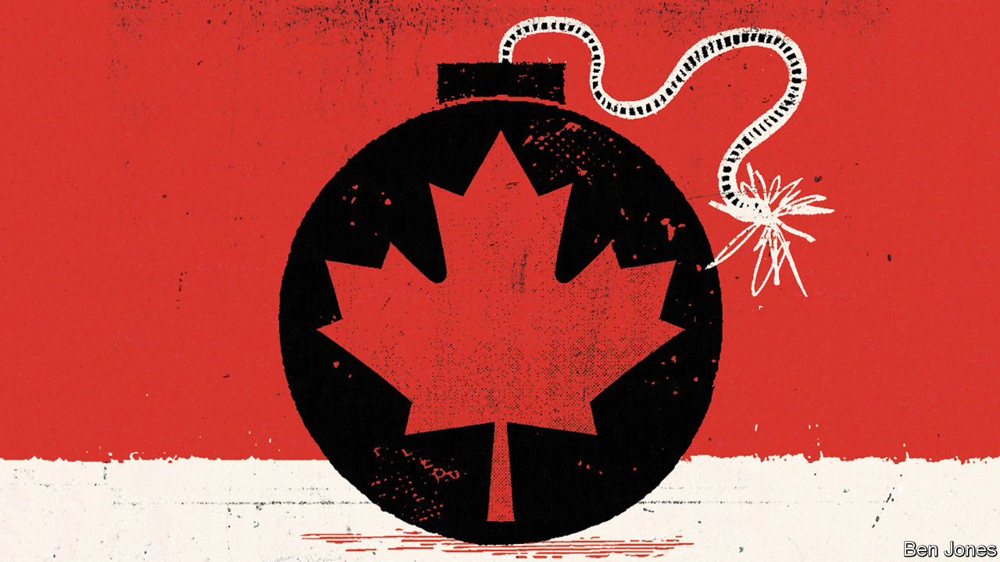

###### Charter fights

# Canada’s constitution is being trampled by populists 

##### The “notwithstanding clause” lets politicians nullify citizens’ rights. It needs to go 

 

> Dec 8th 2022 

For those who nod off at the mention of Canada’s constitution, the obscure-sounding “notwithstanding clause” will surely induce lethargy. But populists are increasingly  of this apparently innocuous article in the country’s Charter of Rights and Freedoms. Canadians should wake up and scrap the clause entirely.

Canada gained full control of its constitution as recently as 1982, in the era of boxy shoulder pads and Michael Jackson’s “Thriller”, as part of its “patriation” from Britain. The charter is central to it, as it codifies the rights that Canadians are entitled to. Pierre Trudeau, then the prime minister, reluctantly inserted the notwithstanding clause—otherwise known as Section 33—at the behest of the western provinces, because their premiers feared that their autonomy would be eroded by the augmented powers of the courts under the charter.

Section 33 allows governments to suspend some of their citizens’ basic rights, such as freedom of religion; freedom of thought, belief and expression; and the right of peaceful assembly. Although would-be autocrats could not curb the right to vote, they could use the clause to muzzle the press, arbitrarily arrest people or close places of worship. No other constitution contains such an expansive weapon.

The clause was long considered a nuclear option. But now high-handed governments in Quebec and Ontario are using it with abandon. In 2019 François Legault, the conservative premier of Quebec, invoked it when introducing a law to ban public servants from wearing religious symbols. This year his government applied it to push through a law further restricting the use of languages other than French in the workplace. Worryingly, the clause was also used to give a language-enforcement agency powers to conduct searches without a warrant, to ensure that  is being used in all written communication.

Doug Ford, the Conservative premier of Ontario, used Section 33 last year for the first time in the province’s history to pass a law that imposes restrictions on election-campaign advertising by organisations other than political parties. This was seemingly to boost Mr Ford’s chances of re-election this year, as the law curbed advertising from trade unions, or from those who could have criticised his record on dealing with covid-19. In October Mr Ford invoked Section 33 again, this time to help pass legislation that would have violated workers’ rights to bargain collectively. The law was repealed after the unions threatened a general strike.

Section 33 is not the only tool that provincial bosses are wielding in Canada, a country long considered a liberal beacon. On November 29th the Conservative government of Alberta introduced a bill that would let its government refuse to enforce federal laws if the legislature decided they were unconstitutional or caused “harm to Albertans”. 

Indeed, Justin Trudeau, the prime minister, is tempted by illiberal overreach. Earlier this year he used, for the first time, a draconian Emergencies Act to shut down a protest by lorry drivers in Ottawa, the capital. The notwithstanding clause is all the more dangerous in such a bare-fisted legislative climate.

Ideally, Section 33 would be scrapped. If that proves impossible, the Supreme Court should limit its use. Even in a country with the deep democratic instincts of Canada, it is naive to assume that a constitutional loophole will not be abused in defiance of fundamental freedoms. ■

