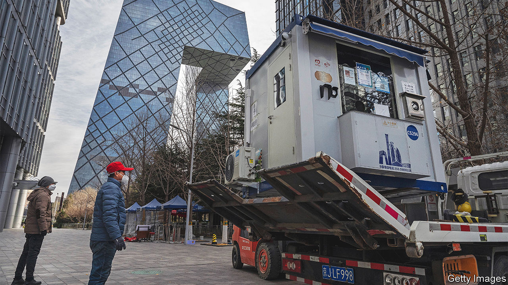

###### What is the plan?

# China is loosening its covid restrictions, at great risk 

##### The government has not done enough to prepare 

 

> Dec 7th 2022 

Does China still have covid-19 under control? In keeping with its flawed  of the virus, the answer is surely that it does not. The official tally of cases is falling, but that is probably because people are being tested less often. Not long ago the aim was to suppress every infection chain. Today social media suggest that an alarming and rapidly growing number of Chinese people know someone who has caught the disease.

If the virus is indeed spreading, watch out. Once Omicron gets going, it burns through a population like a forest fire. It may now move especially fast in China, because the virus is transmitted more easily during winter. Next month millions will return to their villages and hometowns to celebrate the lunar new year. Many could take covid with them even if they have no symptoms. 

Given that China was already struggling to contain the disease, this is an odd time to loosen restrictions. Other once-isolated places, such as Singapore and Taiwan, prepared for a spike in cases by administering vaccines, stockpiling antiviral drugs and expanding intensive-care units (ICUs); only then did they gradually open up. China seems to be throwing precaution to the winds. On December 7th  by, for example, lifting test requirements for most public venues and letting people with mild infections isolate at home rather than in state-run centres. If the government has a plan to avoid the surge of infections and deaths this could bring, nobody can say what it is—indeed, the lack of clarity alone would severely undermine it. 

The easing comes amid mounting public pressure, a sign that the government could not indefinitely sustain its excessively harsh zero-covid policy. For two years this let most Chinese enjoy a normal, virus-free existence and kept the economy humming. The spread of Omicron, though, meant that more and more people had become ensnared in the government’s controls. The economy was suffering. Frustration boiled over last month, when protests occurred in cities across the country.

A more accountable government might have acknowledged its errors while laying out the steps needed to leave zero-covid gradually, when life-saving measures were in place. But Xi Jinping and the Communist Party are rushing ahead, ready or not.

All signs point to not. The country has too few ICU beds to handle a big outbreak. It has not trained enough medical staff, nor adopted protocols on which patients to treat and where. Most important, only 40% of those aged over 80 have received three doses of local vaccine, the amount needed to provide good protection against severe disease and death. A new campaign to jab the old was announced late last month. But it needs time.

Officials and state media have begun telling people that Omicron is fairly harmless, no worse than the common cold. In a country where the government long stoked fear of the virus, this is jarring. It is also disingenuous. Although Omicron is milder than previous variants, it can still be deadly—especially in a population that has not acquired immunity through infection, as Hong Kong discovered when many elderly died during an outbreak in the spring. 

This raises the troubling prospect that the party will cover up the true number of covid deaths. It may also blame local officials, who have been handed an impossible task of easing restrictions while managing case numbers. They, like us, may be asking: is this really the plan? ■

