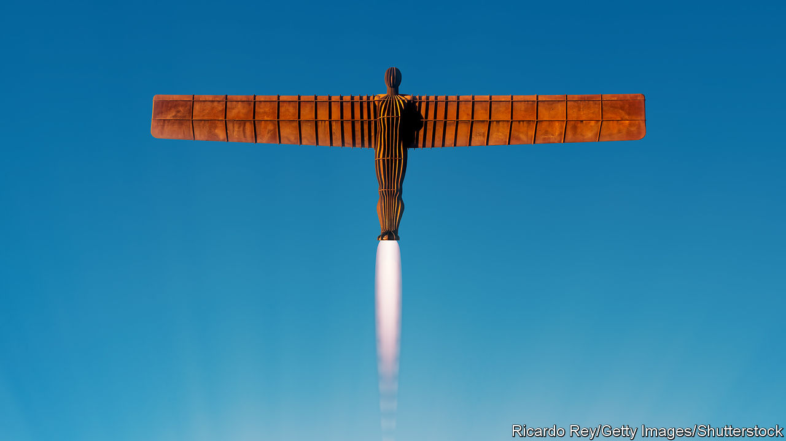

###### Free the north

# How to invigorate Britain’s second-tier cities 

##### One superstar city does not a successful economy make 

 

> Dec 8th 2022 

Manchester has plenty of swagger. It has the best team in club football, and is also home to Manchester United. Cranes dot the city centre. Its mayor, Andy Burnham, is the most recognised in the country, beating his counterparts in London and the West Midlands. Yet the cockiness disguises a big problem, for the city and for Britain. The Manchester urban area contains 3.4m people, making it about as populous as Amsterdam, Hamburg and San Diego. But its GDP per head at purchasing-power parity is at least a quarter lower than all three, and stuck at about 90% of the average in Britain itself. 

As with Manchester, so with Tyneside, Birmingham and other conurbations in the Midlands and north of England. Second-tier cities in most countries have productivity that matches or exceeds the national average; a pre-pandemic analysis by the OECD of 11 British second-tier cities, mostly in the north of England, found that gross value-added per worker was 86% of the British average. London is as rich as Paris, but metropolitan Birmingham or Leeds is nowhere near as rich as Lyon or Toulouse. 

No one should be happy about this lopsided picture, whether proud northerner or smug southerner. The country’s long-running growth problem cannot be solved—more to the point, has not been solved—by one superstar metropolis. 

These huge imbalances in Britain’s economic geography have not gone unnoticed. In the 2010s George Osborne, then chancellor of the exchequer, promoted the idea of a northern powerhouse. Boris Johnson put promises to tackle regional inequality at the heart of his 2019 election campaign. Gordon Brown, a former Labour prime minister, highlighted the problem in a set of proposals for constitutional reform this week (even if proposals to remake Parliament hogged all the attention). But diagnosis is plainly not the same as cure. 

It is true that Britain’s second-tier cities face some deep-rooted challenges. Manchester and other post-industrial spots share several ailments—poor health, labour-force scarring, too few people and jobs in their centres. But they could achieve so much more if politicians got a few relatively simple things right.

One is to focus on big conurbations, not towns. Some politicians persist in thinking that smaller places need lots of attention. Mr Johnson’s “levelling-up” agenda included a multi-billion-pound Towns Fund; Treasury workers are being moved to Darlington, a place with 108,000 people in north-eastern England that happens to be next to the constituency of Rishi Sunak, the prime minister. Invigorating metropolises has a far bigger impact; Greater Manchester is home to almost one in five people living in the north of England. And successful conurbations pull surrounding towns up. Britain needs several engines to fire, but they have to be big. 

A second priority is to rebalance public investment away from London. Between 2000 and 2019, the government devoted £10,000 ($12,160) per Londoner to economic development, science and technology, and transport. The equivalent figure for residents in the north-east and north-west hovered at around £5,000. There is a rationale for this: productive places generate higher returns on investment. But it is a recipe for entrenching the skew between the capital and the rest. And the Treasury has approved southern schemes, such as upgrading London’sThameslink railway, with low benefit-cost ratios. 

The third and most important priority is to devolve fiscal control. Cities must go cap in hand to Whitehall for much of their money. Only 6% of tax revenue in Britain is collected by local government, a large chunk of it for social care. That is a tiny share in comparison with others. Combine local and regional taxes, and France is on 14%, Germany 32% and America 36%. 

Worse, much of the money available to cities is in the form of pots for which they are invited to bid. These pots are numerous and often piddling. Civil servants sit in Whitehall, weighing applications for cash to run adult-numeracy programmes and to build public toilets hundreds of miles away. Officials in Greater Manchester are currently handling more than 110 grants from 15 government departments. The result is colossal inefficiency, especially when policies change—as they do, a lot. Officials wasted many hours this year preparing bids for investment zones, a wheeze of Liz Truss’s brief administration. 

This system also distorts decision-making. Cities define their needs in order to fit available grants. When there is money for sprucing up high streets, cities decide they must do that; when there is money for buses, everyone develops a bus obsession. Ministers in London may be tempted to dole out largesse for political ends. A report in 2020 by the Public Accounts Committee, a parliamentary body, was suspicious of how recipients of levelling-up grants were chosen; one town that got money was 535th out of 541 in the priority list. 

Mr Brown has some good ideas for tackling these problems, such as consolidating funding streams from Whitehall. But neither Labour nor the Tories have embraced the obvious prescription: give metropolises the power to raise much more money locally and spend it on what they need. Ideally this revenue would be in the form of property taxes, which are too low and are based on out-of-date valuations. Cities will develop an appetite for building if more of the proceeds come their way. 

Britain’s northern lites

They need more freedom, too. Greater Manchester has been allowed to plan for housing and office development at metropolitan scale, and is making a good go of it. Other metropolises are still denied that power. Mr Burnham is also being allowed to unpick one of Margaret Thatcher’s less wise reforms, in which buses outside London were privatised and deregulated. But it was a hell of a fight, and required a court case. 

Freer cities will inevitably make mistakes. More local revenue-raising risks widening the gap between the poorest and richest places; a mechanism for redistributing money that does not squelch all incentives to develop will be needed. But Britain’s economy cannot keep relying so heavily on London. And its second-tier cities cannot thrive unless they have more control of their destinies. Time to free the north. ■


