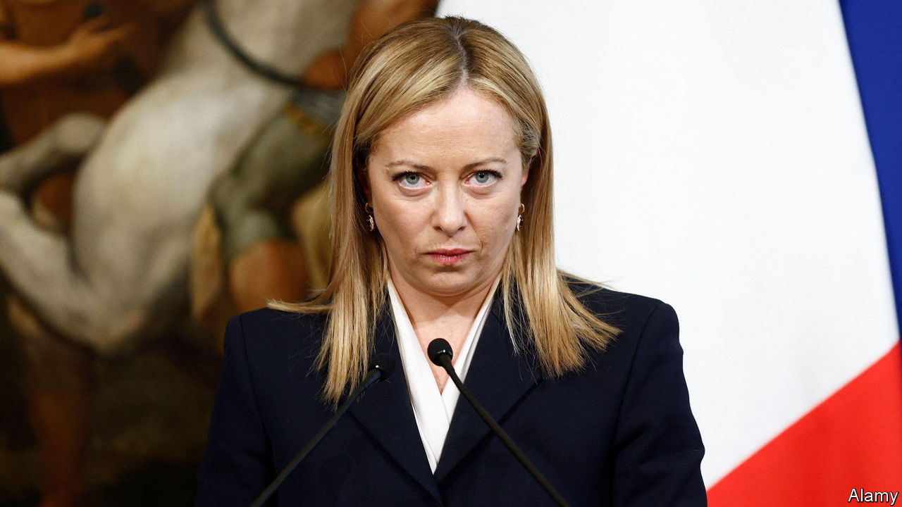

###### The Italian job

# Why Italy, like Europe, is crying out for big reform 

##### Giorgia Meloni needs to be bold. Sadly, she appears reluctant 

 

> Dec 8th 2022 

AT FIRST blush Italy, the euro area’s third-biggest economy, seems to be doing well in a continent beset by gloom. This year it has grown faster than both France and Germany. The big chunk of money it secured from the EU’s post-covid recovery fund is beginning to arrive, and that is meant to bring more of the pro-growth reforms that Brussels has insisted on for every tranche it pays out. Fears in some quarters that Italy’s new right-wing prime minister, Giorgia Meloni, would reverse the progress made by Mario Draghi, her predecessor—progress that led this newspaper to choose Italy as its country of the year in 2021—have so far proved unfounded.

However, optimism runs only so deep. Italy’s long-term performance remains lamentable. Its near-zero growth in GDP per head since 2000 is the worst in the OECD club of rich countries, and it is forecast to be in recession in 2023. This record, along with its huge public-sector debt, makes Italy potentially the single currency’s most vulnerable member. For the sake of Italy and Europe, much of which shares similar ailments, Ms Meloni’s government must take radical action to pep up the economy. 

The most important task is to do more to promote competition and so to enhance productivity. Mr Draghi’s government made a start. But Ms Meloni must do a lot more, first to implement his legislative changes and next to overcome the entrenched vested interests that always resist pro-growth reforms in Italy. Rigid labour markets need further liberalisation to reduce youth unemployment and raise female participation in the workforce. Protected service providers should be opened to more competition. The public administration, the judicial system and education all need a thorough shake-up to move faster and perform better. Other countries in Europe have done some of this, if not yet enough. But Italy has to do more than most.

Another problem that much of Europe also shares is a growing inter-generational divide. Italy’s population is ageing and shrinking and other EU countries are destined to follow. One malign consequence is the rising political clout of the old. After a partial reversal of earlier pension reforms, Italy spends almost five times as much on pensions as on educating the young. Its labour market favours the old on permanent contracts over the young on temporary ones. Whether in business or professional services, in politics or universities, or in the ownership of property and other assets, the system in Italy seems almost designed to engineer a gerontocracy that chiefly looks after the old and comfortable. Pensioners who vote are coddled by politicians all round Europe, but their power is especially obvious in Italy.

A final problem is rising regional inequality. Much of Europe worries about a gap between successful metropolises and smaller towns and regions that . Yet Italy’s south, the , stands out because of its size (a third of the population, a quarter of the economy) and because over the past two decades it has been falling further back. From education to employment and from the shadow economy to corruption and organised crime, the  suffers from greater failings than the rest of Italy. And, rather as the euro area as a whole cannot do a lot better unless Italy does better, so Italy itself cannot thrive without improving its south.

Italy can oversee positive change, as can the euro area as a whole. Many small manufacturing firms in its north are thriving exporters, just as there are many successful exporters in Germany, France or the Netherlands. Like much of the rest of Europe, Italy is strong in food, fashion, design, culture and tourism, all candidates to be among the growth industries of tomorrow. But excessive regulation, the protection of incumbents and barriers to competition hold back growth and productivity.

When in Rome 

Ms Meloni has a chance to make a big difference and much is riding on whether she can do better. So far she is broadly sticking to EU-backed reforms. Yet as our special report in this issue argues, her instincts too often seem to be not to promote freer markets and more liberalisation, but to insulate Italian assets from foreign competition and to protect small traders and service providers, from taxi drivers to shopkeepers to beach concessionaires. If she does not strive for deeper reforms, Italy’s problems are likely only to get worse. ■

