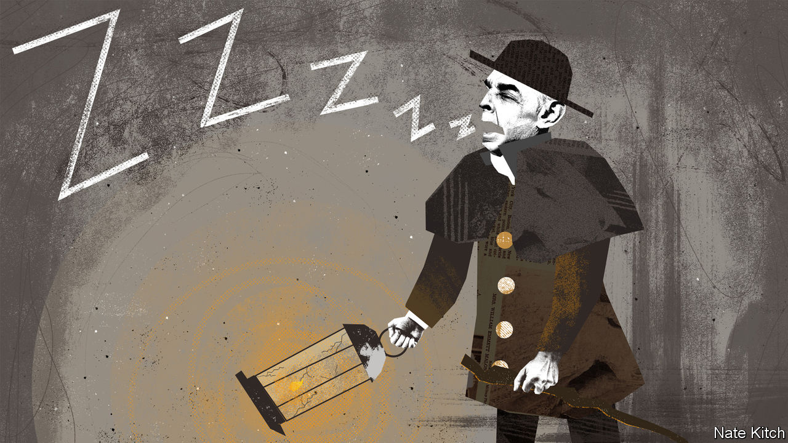
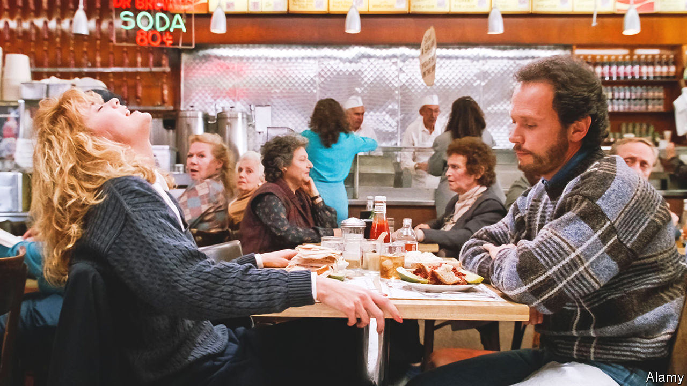

###### On Chinese students, FTX, Britain’s spending cuts, Kazakhstan, classical music, “When Harry Met Sally”

# Letters to the editor 

##### A selection of correspondence 

 

> Dec 8th 2022 


Pro-democracy students

Your article on mainland Chinese students in America and Britain who oppose communist China alluded to several factors that deserve elaboration (“”, November 19th). Widespread intimidation (threats, bullying and physical violence) against activists abroad is so common that it is scarcely remarked on by protesters. 

The recent attack on Bob Chan, a Hong Kong pro- democracy demonstrator, in the grounds of the Chinese consulate in Manchester is repugnant as well as a clear breach of both British law and international diplomatic protocol. It was unusual only because it was a video-recorded account of the sort of assault by Chinese operatives that is all too common. It reflects poorly on democratic governments that they allow the Chinese Communist Party to conduct these sorts of actions within our free societies. The failure of Britain to expel those involved in the attack will only encourage this sort of dangerous behaviour. 

Moreover, notwithstanding the reluctance of some mainland students to join protests with Hong Kongers, we are witnessing a variety of overseas groups making common cause in their fight against the Communist Party. The hundreds of thousands of new members of the Hong Kong diaspora are working with Tibetans, Uyghurs and veterans of the 1989 Tiananmen pro-democracy movement. More recently we have found that Burmese, Thais and other activists from countries neighbouring China see the Communist Party for the threat that it is and are prepared to act accordingly. Tellingly, the annual events on June 4th commemorating Tiananmen have now become an international mourning for the victims of the party.

Mark Clifford

President 

Committee for Freedom in Hong Kong Foundation

 

 


The problem with crypto

“Never before has crypto looked so criminal, wasteful and useless,” you said, after the demise of FTX (“”, November 19th). On the contrary, from the beginning the idea of financial instruments with no connection to government regulation was an obvious field day for gangsters, con artists and legions of gullible fools who thought they could get rich quickly while producing no economic benefit whatsoever.

Hopefully, some of the millionaire celebrities who assured financially illiterate fans that everything was safe and secure will also be among those who lost millions. Your efforts to suggest that there was anything at all worthwhile about this vast scam are unconvincing. 

Professor Jeffrey Herf

Department of History

University of Maryland, College Park

 


The knock-on effects of cuts

identified the ways in which a protracted squeeze on public finances is making its presence felt in Britain (November 12th). It is also worth noting that spending cuts can have an impact on other parts of the state’s activity. For example, because of a chronic lack of investment in services there is frequently a delay to assessing mental-health patients in emergency rooms. Most of these patients are escorted to A&amp;E by two police officers (under a “section 136”). These officers must remain with the patient until the mental-health team has made a formal decision about his or her treatment.

This means that the police spend a worryingly large amount of their time sitting around in A&amp;E waiting for the assessments. At one point recently there were so many police in my A&amp;E that few officers were available for that particular area of London for other activities. 

The lack of investment combined with rigorous laws on standards means that we are trying to run a gold-standard health service, but to the point where we take resources from other parts of the state.

DR Ben Russell


 


Just increasing medical-student places is not the answer to getting more doctors in Britain (”, November 5th). Foundation training has been oversubscribed for years and there is a lack of core specialty training posts. Britain has a huge dearth of consultant anaesthetists and this year sub-specialty anaesthetic training was four times oversubscribed. Even more worrying, after we train specialty anaesthetists for three years many leave for Australia, because there is a huge bottleneck to enter higher training here. This is one of many reasons why doctors will vote to strike in January 2023.

Dr Ben Evans

Core anaesthetics doctor


Bagehot’s summation of Britain reminds me of the misery of the Roman population following Attila the Hun’s ravage of northern Italy, as described by Edward Gibbons in his history of the fall of the Roman empire: “The taxes were multiplied with the public distress; economy was neglected in proportion as it became necessary; and the injustice of the rich shifted the unequal burden from themselves to the people, whom they defrauded of the indulgences that might sometimes have alleviated their misery.”

Nils Raestad


 


Election non-result

As you predicted, Kazakhstan’s presidential election was not as exciting as it should have been (“”, November 19th). Kassym-Jomart Tokayev was re-elected with 81% of the vote, sending a powerful message to Kazakhs: the wind of change is blowing, but it is not powerful enough to produce any real reform. Amanat (commitment), the party holding the majority in the lower house of parliament, is a mere wolf in sheep’s clothing. Even after the brand rename from Nur Otan (radiant fatherland) you can still sense the methodology if not the ideological presence of Nursultan Nazarbayev, the former president. It may be another decade before we will see a proper opposition candidate who actually stands out, and not one like this year’s, who made his name by karate-chopping a meat bone.

Berikuly Madiar


 


We’re only here for the beer

Standard-bearers of classical music face specific challenges (“”, November 19th). However, any genre is hampered by the fact that music may be used, even unintentionally, as an accompaniment to something else. There are many reasons other than music why people attend live concert performances. A shrewd talent buyer for a music venue once told me: “I don’t sell music, I sell beer.” 

Dan Coleman

Composer-in-residence

Tucson Symphony Orchestra

 


Orgasmic foods

I never imagined  to be a family newspaper. Still, I can’t think of any other reason why you would incorrectly recount the deli scene in “When Harry Met Sally” that ends with the line, “I’ll have what she’s having” (“”, November 26th). Meg Ryan wasn’t describing the menu. If Jewish food did have the effect you implied, my Polish and Russian Jewish grandparents would have had a much happier marriage.

Adam Smith


