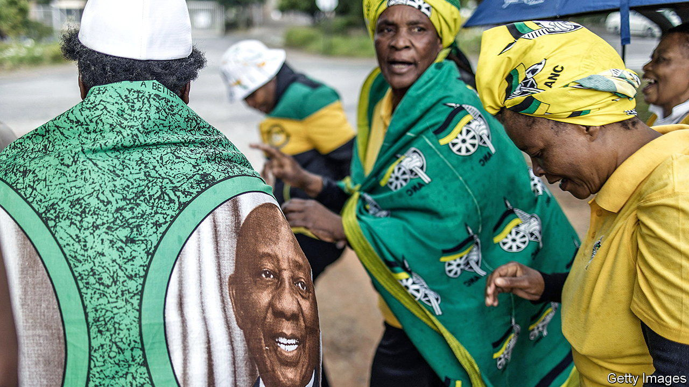

###### Sofa so good

# Cyril Ramaphosa is contesting efforts to oust him 

##### But South Africa’s president still has explaining to do 

 

> Dec 8th 2022 

Cyril Ramaphosa is an enigma; his presidency, . But if there is one thing he has consistently spoken out about, it is the importance of the , especially the constitution he helped draft as Nelson Mandela’s right-hand man. His biggest success as South Africa’s president has been  destroyed by his predecessor, Jacob Zuma. 

On November 30th the rule of law became personal. A panel of ex-judges appointed by Parliament concluded there was enough evidence of misconduct by the president in relation to an odd saga involving cash inside a sofa for MPs to consider impeaching him. Over the next 24 hours he pondered resigning, in part because he felt not doing so would be hypocritical. 

Yet bolstered by cabinet allies and provincial bigwigs within the African National Congress (ANC), Mr Ramaphosa chose to fight and stand for re-election as leader of the ruling party at its national conference, which starts on December 16th. Mr Ramaphosa also asked South Africa’s highest court to disqualify the panel’s findings on the ground of insufficient evidence. MPs may choose to wait for that ruling before their debate on the panel’s report, scheduled for December 13th. Since a majority of MPs must vote to impeach a president, and the ANC has 57.5% of the seats, it would require a chunk of his party to turn on him. 

In another twist Mr Ramaphosa’s fantastical-sounding version of the imbroglio was given a boost. Many South Africans—including the panel members—doubted his account of why there was $580,000 (or perhaps more) hidden in, and then stolen from, a sofa at his game farm. Mr Ramaphosa said it came from the sale of buffalo to a Sudanese businessman. On December 5th the hitherto mysterious ungulate shopper, Hazim Mustafa, told Sky News that he had indeed bought the buffalo, which he could not collect because of the pandemic. Moreover, “$580,000 is nothing for a businessman like me. I don’t know what the big issue is,” he added. 

Mr Ramaphosa must still overcome several obstacles in order to keep his job and his reputation. These include investigations by other agencies into the sofa saga, winning his petition to the Constitutional Court and defeating efforts to unseat him by enemies within the ANC. At least he seems game for a fight. ■

