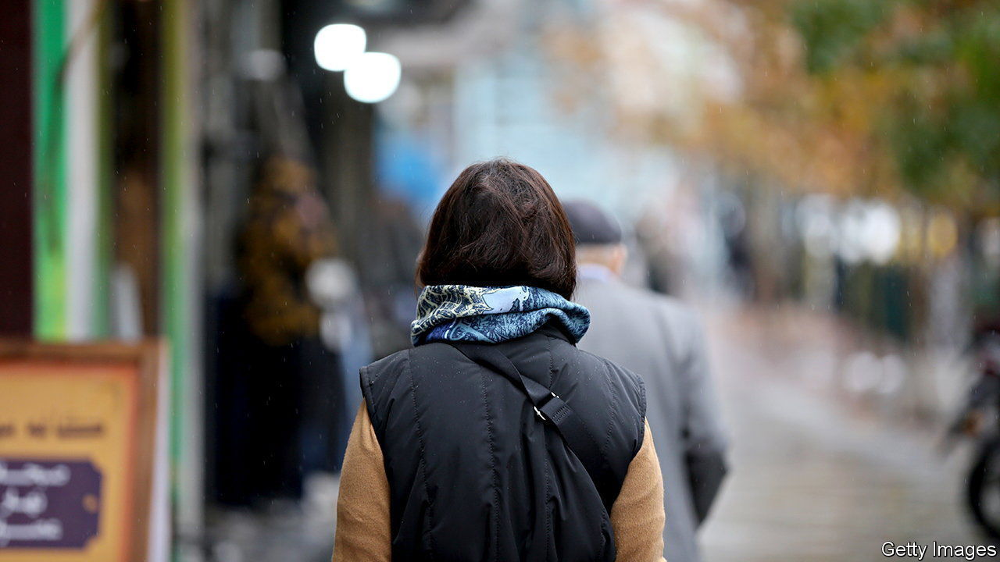

###### Off with those scarves!

# Iran’s rattled government may be backing down 

##### By curbing the hated hijab-enforcers, the ayatollahs hope to stay in power 

 

> Dec 8th 2022 

Unnerved by nearly three months of spreading , Iran’s theocratic regime seems to be dithering. In their first big concession since demonstrations erupted in September after the death of Mahsa Amini for not wearing a “proper” hijab, the clerics hinted that they are disbanding the morality police force in whose custody she died. It had been “shut down”, said the prosecutor-general, Muhammad Jaafar Montazeri, adding that unspecified “cultural” methods would be adopted instead. Come mid-December, he promised, a decision would be taken on whether to abolish the mandatory hijab altogether. 

It has already been thrown off in the streets. The morality police’s “guidance patrol”, which combed public places to capture young women and haul them off for re-education, disappeared at the start of the unrest, once protesters began torching their vans. Millions of women have discarded their veils, sometimes burning them. Celebrities previously paid to sing the regime’s praises have followed the example of rebellious schoolgirls by appearing bareheaded. For weeks unveiled women have stridden past the security forces’ scathing eyes. “It’s ,” says a teacher, who marvelled at bareheaded women boarding flights and passing through passport controls.

Now the protesters want to change or overturn Iran’s institutions and rewrite the . For 43 years, keeping women veiled has been a defining symbol of the republic, epitomising its strict enforcement of sharia (Islamic law). Ruhollah Khomeini, the Islamic Republic’s founder, called it the “flag of the revolution”. “It’s the regime’s Berlin Wall,” says a well-connected cleric. Knocking it down, he reckons, would “signal the theocracy’s collapse”.

The government’s men want to uphold the old code. Security guards enforce “proper” dress in government offices and in courts, where clerics are still sentencing scores of protesters to death. Officials threaten to shut down banks and shops that serve unveiled women. Regime voices insist that the prosecutor-general has been misunderstood. And the supreme leader, Ayatollah Ali Khamenei, says that “each rioter, each terrorist”, as he terms his opponents, must be punished. Since the protests began, rights groups say that some 470 people have been killed and at least 18,000 detained (see Graphic Detail).

But the ruling clerics, sensing that the repression has failed to crush the unrest, are divided over what to do next. The usually hardline president, Ebrahim Raisi, speaking on December 7th at a university in Tehran, the capital, accepted “fair criticism” of his administration. Yet his bully boys beat up students demonstrating outside. Some security people favour replacing the morality police with smart cameras that would link unveiled women to their mobile phones and send them text messages imposing fines. 

But leaked transcripts of official meetings call for a lighter touch. A mouthpiece for the Islamic Revolutionary Guard Corps, the regime’s praetorian guard, has suggested bringing back Muhammad Khatami, a former president censored for his reformist views, to bridge the gap between the rulers and the protesters.

Even the most reactionary clerics, the theocracy’s backbone, may be wavering. Most want to keep the veil and gender segregation but question their reimposition by force. “Khamenei is becoming a minority even among conservatives,” says one. From his seat in neighbouring Iraq, Shia Islam’s top cleric, Grand Ayatollah Ali al-Sistani, has criticised senior Iranian clerics for damning the protesters.

But it may be too late for concessions to work, anyway. Trust in the ruling clerics’ word has sunk. Many saw the prosecutor-general’s remarks as a ruse to divide the protesters. Others thought it was simply a response to the weather. The morality police normally lower their profile in Iran’s cold winters, when women cover up. Some thought the government would just give the morality police a new name. 

And many Iranians want more than just an end to the Islamic dress code. “With or without the hijab, onwards the revolution,” cried students at a polytechnic in Tehran on December 7th. Many Iranians, feeling emboldened, see the reformist clergy as a spent force and want the ayatollahs, whatever their stripe, to surrender power. 

 The call for a three-day general strike that began on December 5th was more widely observed than earlier ones. Many shops, including in the bellwether bazaars, lowered their shutters in Tehran. Officials warned that premises joining the strike would be closed down for good, but the protesters’ threats to boycott those that stayed open made a bigger impact. 

Still, Iran’s pendulum has a habit of swinging wildly. In the 1930s the last shah’s secularising father banned the veil and ordered his police to rip it off women’s heads. Today’s protesters yearn for a day when, in matters of dress and much more besides, Iranians can choose for themselves. ■

