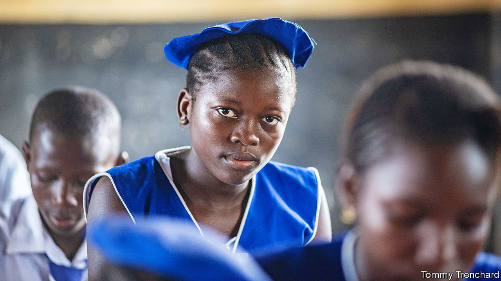

###### Lessons in Poverty

# One of the world’s poorest countries is betting big on schools 

##### Children have flocked to Sierra Leone’s classrooms. But can it make them learn? 

 

> Dec 8th 2022 

Sierra Leone is one of Africa’s poorest countries. About half of its adults cannot read. Its schools, few of which have electricity, are among the world’s worst. On any given day, perhaps a fifth of teachers are not in class as they should be. 

In an attempt to improve things, Sierra Leone is undertaking a vast but little-noted educational experiment. If it succeeds, the country could write a road map that benefits even much wealthier places. In 2018 an incoming government , which is now double what it was five years ago. The number of children enrolled in its schools has risen by more than half. With more bums on seats, it is now grappling with a problem that : how to increase the woeful amount that children learn. 

Over the past two decades, school-enrolment rates have shot up across sub-Saharan Africa. Yet as few as one in ten children can read by the time they leave primary school (in America and Britain more than 90% can). Politicians often underestimate the scale of this crisis, or waste money on headline-grabbing projects such as computers that do not push up grades. 

To boost access and quality, Sierra Leone now allocates 21% of its budget on schools, one of the world’s highest rates. Much has gone on abolishing fees for tuition, exams and textbooks that many state schools had previously charged. Now almost two-thirds of youngsters are making it to senior-secondary school, up from a third. Behind his vast desk the president, Julius Maada Bio, says he has had to pinch funding from every other ministry to pay for the reforms. But he says the need for better schooling is “existential”.

The government has also tried to squelch other problems that keep youngsters from class. David Moinina Sengeh, the education minister, admits the changes are not always popular. Religious groups resent the junking of a law that had forced schools to expel pregnant schoolgirls. Teachers and parents criticise efforts to spare the cane. But Mr Sengeh, 35, a graduate of Harvard and MIT who records rap music for fun, is adored by donors. One expert ventures that he is “the most exciting education reformer in Africa right now, and arguably around the world”.

In a push to improve crummy lessons, the government has asked five organisations to compete to improve children’s marks. Each will work with about 70 primary schools for three years. The outfits, which include Save the Children and EducAid, a British charity, will not manage schools directly and cannot hire and fire teachers. But they may spend up to $36 per child on things like coaching for teachers or catch-up classes for children who have fallen behind. Successful ideas will then spread through the whole system.

EducAid, for instance, has set up classes in two small halls in a field near Port Loko, a town about two hours’ drive from Freetown, the capital. Those attending it are not pupils. The 70 adults learning new ways of teaching maths are among the 600 members of staff at the schools it is working with. They will all spend time at this centre, sleeping in bunk beds at night.

Trials and error

This experiment has sparked interest not just in the potential innovations in teaching, but also because it offers a big trial of social-impact bonds—a fashionable form of education finance. Donors led by Britain have set aside $18m for the trial. Most of this will be paid only after the work has been done and the exact amount will depend on how successful the organisations are at improving scores. If the results are weak, private investors who are supplying some of these outfits with working capital could walk away with a loss.

The hope is that this kind of “results-based” financing can make education aid more effective—and in so doing make voters in rich countries more willing to keep supporting it. The problem is that setting up these deals, and checking to see whether pay-outs have been earned, can be slow and expensive. The trial in Sierra Leone could breed confidence for more, bigger such ventures. Until now the most notable education bond on the continent has been in South Africa. It delivered investors 14% annual returns but was worth only about $2m (and did not hit all its targets for improving learning). 

Sierra Leone’s experiments will also inform fiery debates about free schooling. Tuition fees remain common across Africa, especially in secondary schools. Abolishing them is popular. But spending a lot more money on secondary education can be regressive in places where, because of woeful teaching, the poorest pupils drop out before they get there. 

In addition, free-schooling policies that are not well funded can make weak systems worse. In nearby Ghana some free senior-secondary schools are so overcrowded that pupils must take turns going to class. Yusuf, a student in Accra, the Ghanaian capital, says that his stints at home last three months at a time. 

Mr Sengeh acknowledges that classrooms have become more crowded since fees were abolished. “I’d rather have 80 children in a classroom that is hot and a little noisy than 40 sitting in a spacious room and the rest under a bridge,” he says, exaggerating class sizes somewhat to emphasise urgency: “You have to do major…[reforms], all at the same time.” 

Sierra Leone’s gamble on schooling faces big threats, all the same. Prices of food and fuel have been rising all around the world. Its currency, the leone, has fallen by more than 50% this year. A score of people died in the capital in August, amid violence following protests sparked by rising living costs (Mr Bio claimed, implausibly, that it was an attempt to overthrow his government). The president has promised to keep education spending high. But he must face voters again in 2023. A new government might decide that it has more urgent priorities, especially as servicing the country’s foreign debts is already chewing up about 22% of state revenues. 

Amid all this, the government must show that studious youngsters gain new opportunities. This year about 100,000 teenagers passed exams qualifying them for higher education—the most ever, by some margin. But at present the country’s universities and colleges can offer places to only a fraction of them. And the reward for solving this next problem will be yet another challenge: making sure these graduates can find good jobs. Reformers’ work is never done. ■

