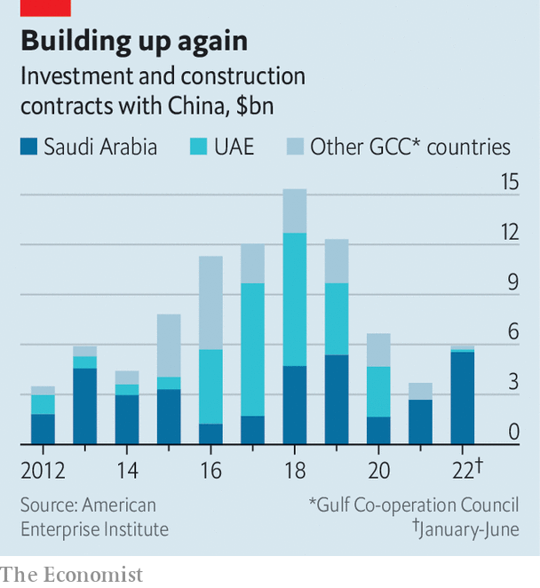

###### Arabs looking east

# The Gulf looks to China 

##### A summit in Saudi Arabia will be about energy and money—and sending a message to America 

 

> Dec 7th 2022 

The mood on the Arabian peninsula was jittery. After an abrupt surge, oil prices were sliding amid a rich-country recession. Conflict brewing in the Persian Gulf left Saudi Arabia worried about attacks on its oilfields and eager to procure ballistic missiles to deter its rivals. Rebuffed by America, a young and powerful Saudi prince turned instead to China, which signed a secret deal to supply the kingdom with the weapons it wanted.

If this story evokes a sense of déjà vu, it most certainly should. It happened four decades ago and led to the establishment of Sino-Saudi relations in 1990. Much of it has echoes today, as Xi Jinping arrived for a visit to Saudi Arabia on December 7th, his second trip to the kingdom.

Not everything is the same, of course. In contrast to the 1980s, Saudi Arabia and its Gulf neighbours now have strong commercial ties with China. Still, : the Saudis continue to treat China as a foil for America, which in their eyes has become a particularly  over the past decade.

The challenge for Gulf states is how to balance these two views of China. The first has become increasingly alluring. China is a big export market and a major source of. The second, in which China serves as a strategic hedge against an erratic America, is less compelling: China is no easy substitute. Moreover, in trying to play one power off against the other, Gulf leaders may hasten America’s abandonment of them, which they fear.

Start with the Gulf’s economic relationship with China, which is growing. Energy remains at the core. Last year 51% of China’s oil imports came from Arab states, and four-fifths of that came from the monarchies of the six-member (GCC). In November Sinopec, a state-run energy giant, signed a 27-year agreement to buy liquefied natural gas from Qatar, the longest such gas deal ever.

 


Since 2005 China has signed large investment deals and construction contracts with Arab states worth $223bn, says the American Enterprise Institute, a think-tank in Washington. Of that total, 52% has been with the GCC countries (Algeria, Egypt and Iraq took much of the rest). The pace of those deals speeded up in the late 2010s (see chart). Though it has since slowed, due to the pandemic and a slump in Chinese investment worldwide, China continues to see the Gulf as promising. In the first half of 2022 Saudi Arabia received $5.5bn in investment and contracts through China’s Belt and Road Initiative, more than any other country.

Much of this investment remains focused on energy. Trade is oily too: Chinese imports from the region are almost entirely petrochemicals and other commodities. Gulf states are keen to shift their economies away from oil and view China as a key partner in that effort. Last year it pumped money into hotels in Oman and auto-manufacturing in Saudi Arabia. Such projects are still outliers, though; non-oil investment remains sluggish.

None of this causes much angst in America. It is the Gulf’s growing ties with China in strategic sectors that worry people in Washington: telecoms, security and, increasingly, defence. GCC members are keen customers of Huawei, the telecoms giant that is under American sanctions, and are happy to do business with companies like SenseTime, an artificial-intelligence firm blacklisted by America for its role in spying on Uyghurs in Xinjiang. In September a company owned by Saudi Arabia’s sovereign-wealth fund announced a $207m joint venture with SenseTime to build an AI lab in the kingdom.

China has also sold armed drones to the UAE, among others, which has used them on battlefields across the region. In March a Saudi firm signed a deal with a state-owned Chinese defence giant to manufacture drones in the kingdom. America’s spies say China is helping Saudi Arabia build ballistic missiles as well.

Last month at the Manama Dialogue, an annual security powwow in Bahrain, American officials came with warnings. Brett McGurk, the president’s Middle East adviser, said growing co-operation with China in the region would put a “ceiling” on relations with America. Another official acknowledged the tensions in the relationship, particularly . 

Mr Xi is being more warmly received than Joe Biden, whose trip to Saudi Arabia in July, his first as president, had an air of desperation: oil prices were high, an election loomed, and he needed help. The Saudis sent him home empty-handed. After more than a year of froideur from his people, they were in no mood to be generous.

Mr Xi, by contrast, will probably go home with a stack of big investment deals and other announcements. He was due to meet the Saudi leadership, including Muhammad bin Salman, the crown prince and de facto ruler, on December 8th. Next on his schedule is a summit with Gulf leaders and a further meeting with figures from across the Arab world. Saudis joke about the prospect of the taciturn Mr Xi joining a traditional sword dance.

Saudi officials insist that none of this is meant as a snub to America: China is an important country, they say, and the kingdom treats it as such. Still, the Biden team has had a tricky relationship with Saudi Arabia and sees China as its main competitor. The chummy reception for Mr Xi—in contrast to the frosty one for Mr Biden—will not go down well in Washington.

In private, Gulf officials say they are exasperated with an America whose policy seems incoherent. Three consecutive presidents have talked of reducing America’s role in the Middle East, yet they do not want other powers to gain too much influence as they depart. Such frustrations in the Gulf are understandable.

But so too are America’s. The GCC complains that America has not done enough to protect it from the Gulf Arabs’ arch-rival Iran, with which China signed a 25-year “strategic partnership” last year. Mr Xi is one of the few leaders with real leverage over Iran. Most of the oil exported from Iranian ports, in defiance of American sanctions, finds its way to Chinese refineries. Yet he is loth to use it to bring pressure on Iran’s government. 

Buoyed by higher oil prices and growing economies, Gulf rulers feel assertive: they think this is their moment to step out from America’s shadow. Mr Biden will have to accept a greater Chinese role in the region. But both sides should recognise that, now as in the 1980s, China cannot fully replace America in the Gulf. ■

