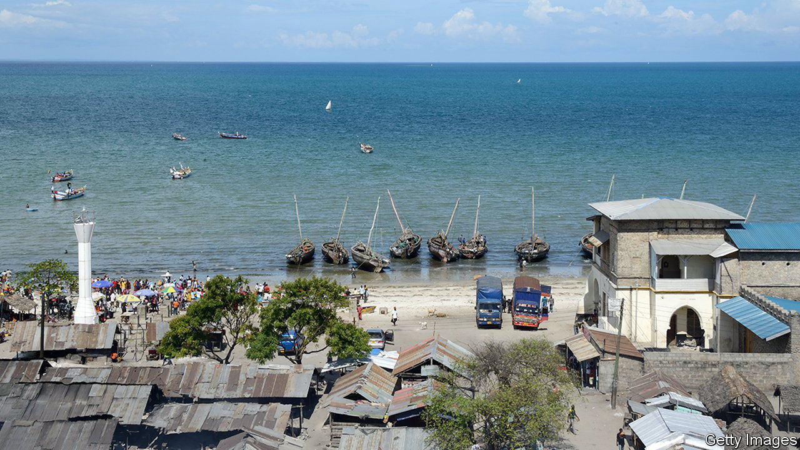

###### A lesson in incentives

# What Tanzania’s “per diem town” says about African governance 

##### When allowances are more than wages, why bother with the day job? 

 

> Dec 8th 2022 

With joints such as Funky Squids Beach Resort, Bagamoyo sounds like a party town. It is not. Hotels depend on bureaucrats from Dar es Salaam, , 50km to the south. “Bagamoyo is per-diem town,” explains the head of an NGO, in reference to “by the day” allowances claimed by civil servants for attending out-of-town events. “No meetings ever take place in government ministries,” he sighs. 

“Perdiemitis” is rife in Tanzania and many other countries in the region. In May the government announced that per diems for senior civil servants would more than double, from 120,000 shillings (about $50) to 250,000. The last detailed study, albeit from 2008-09, found that spending on allowances ($390m) was enough to pay the salaries of more than 100,000 teachers.

Per diems began as justifiable payments for extra expenses. But in the 1980s and 1990s they became a way of furtively padding pay packets while governments trimmed official wages as part of structural-adjustment programmes. They have since been taken for granted. Research by Guy Blaise Nkamleu and Bernadette Dia Kamgnia for the African Development Bank notes that it is “not uncommon” for officials’ allowances “to equal or exceed” base salaries. 

Such largesse encourages abuse. Earlier this year the boss of Uganda’s national airline was accused of claiming $12,750 for foreign trips she never made (the airline says that in some cases she did travel and in others she paid back the allowances). Gambians are angry at how the wife of the sports minister received per diems for the recent Commonwealth Games, despite not attending the event (the minister denies any wrongdoing and says the money will be repaid). In many countries there is widespread “leapfrogging”, where officials claim attendance at contemporaneous events, often with colleagues signing on their behalf.

Even legitimate per diems undermine good government. Attendance at away days is determined by allowances, not the value of the event. Senior staff attend training meant for junior employees. Donors splurge on per diems (often paid in hard currency) so that officials bless their pet projects. They also create powerful lobbies. Cash-strapped Malawi halted government meetings on the shores of Lake Malawi in June. By November it had relented.

The hoteliers of Bagamoyo faced no such hardship, however temporary. Managers say that business has boomed since Tanzania increased allowances. Funky or not, they—and local bureaucrats—are squids in.

