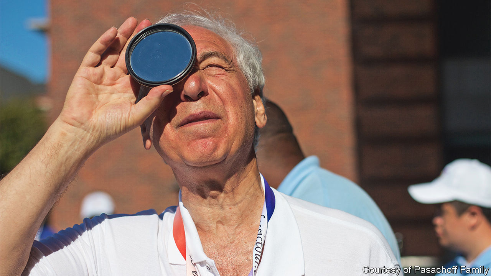

###### The shadow-lover

# Jay Pasachoff travelled the world to catch the Moon eclipsing the Sun 

##### The solar astronomer and passionate proselytiser died on November 20th, aged 79 

 

> Dec 8th 2022 

Since the very beginnings of humankind, solar eclipses have caused terror. The gradual encroaching of the Moon’s shadow between the Earth and the Sun was a sign of divine wrath, withdrawing the light that made crops grow and men and women live; it foretold the end of empires and the deaths of kings. Among the ten plagues of Egypt, one was the sudden descent of darkness in the middle of the day. In the modern world, a total eclipse is still a deeply eerie occurrence: a sudden cold darkness in daylight when the birds stop singing and begin to roost, and even know-it-all Westerners feel a strong twinge of disturbance. 

Jay Pasachoff’s reaction was completely different. To him “the perfect alignment, in solemn darkness, of the celestial bodies that mean most to us” gave a primal thrill that was indescribable. As a self-styled “umbraphile”, a shadow-lover, his greatest joy was to stand in that brief darkness cast by the shadow of the Moon. Then, although he had all manner of computers and cameras and, usually, eager student helpers to record the event, he made sure he stole at least some seconds to don his filter-glasses, raise his binoculars and admire the marvel directly, man to star.

He had observed 75 eclipses—totals, partials and annulars, where some sunlight remains as a delicate ring—thereby ranking second in the world. For 50 years, as professor of astronomy at Williams College in Massachusetts and director of its Hopkins Observatory, he saw that as his principal job. It took him all over the place. Every 18 months or so, the usual time-lapse between total eclipses, he would fly off, packing hundreds of pounds of equipment and his orange trousers, and on his return he would be planning the next excursion, scraping funds together, scanning the “paths of totality” across the globe and poring over cloudiness statistics to be sure of an unobscured view. (He became an expert on weather, writing a guide to it, as well as the Sun.) In 1970 he watched from Mexico as the stars and planets came into view in a cloudless daytime sky. In Rajasthan in 1995 he logged a dazzling “diamond-ring” effect, as the last ray of sunlight shone through a valley on the Moon’s surface. Near Bucharest in 1999, sunspots at the peak of their 11-year cycle made the Sun’s corona bristle with giant streamers. 

It was the corona, the outermost layer of the Sun’s atmosphere, that most interested him. His love of eclipses was partly because he could study the corona properly while the Sun’s disc was dark, noting its flares, its loops of ionised gas and the plumes from the polar regions. With the data he recorded he could try to discover why the corona, one millionth as bright as the disc, was 300 times hotter. Was that heat generated by thousands of constantly erupting nanoflares? Or was it caused by vibrations in the gas loops, which were held in place by the Sun’s magnetic field? Both were plausible, but there were at least a dozen other theories around.

The unadventurous wondered why he had to see so many eclipses. (He also studied the much rarer transits across the Sun of Mercury and Venus.) But no two were alike, because the Sun, he explained, was never the same twice. It was like a river, forever changing, not least because it was married to the sunspot cycle. Sceptics also asked why he did not rely on space-based telescopes, with coronagraphs that could block out the Sun’s photosphere. But those either hid too much of the corona, or failed to block the disc entirely; and even with 99% of it obscured, the sky would be 10,000 times brighter than in a total eclipse. 

Besides, his shadow-loving self was hooked. He had been entranced ever since his visits as a boy to the Hayden Planetarium in New York City, where over the entrance a triptych of paintings by Howard Russell Butler recorded the total eclipses of 1918, 1923 and 1925 as witnessed in America. At 15 he was building a telescope, even grinding and polishing the mirror: an achievement that helped him into Harvard the next year. As a freshman he was taken to view his first eclipse, from a DC-3 plane safely above the rain-clouds, off the Massachusetts coast. The corona outlined the Moon in white. There was no turning back from that wonder. 

Remembering this, he felt impelled to tell everyone to look up, be inspired, and learn. In Manitoba once, during an eclipse, he watched in disbelief as drivers simply turned their headlights on, but did not stop. People had to notice. Around the Williams campus he would give 20-minute lectures on the next eclipse to anyone who, to his amazement, hadn’t heard of it. Almost all his trips included students, his own and others’; often friends and family came too. He wanted not just to train his undergraduates in using spectrographs, but also to fire them as he had been.

The notion of citizen science pleased him greatly. He credited it to Edmund Halley, who in 1715 had asked “the Curious” to “Observe...with all the care they can” the total eclipse over London. Taking that lead, he wrote his many textbooks, field guides and magazine articles in everyday, accessible language. In “The Cosmos”, his most comprehensive work, the maths was boxed out and could easily be avoided. When teaching the public about astronomy, he preferred to stress art and history—Renaissance prints of armillary spheres, a comet-sketch by Paul Klee—rather than equations.

His greatest teaching aid, however, was eclipses themselves. In 2017 his moment came, with a path of totality that stretched from Oregon to South Carolina. In the event, 88% of adult Americans watched it either in person or electronically, almost twice as many as had watched the Super Bowl earlier that year. But his focus was on the schoolchildren, millions of them as he hoped, gazing up through their filter-glasses. Several of his own students, to his delight, had gone on to head astronomy departments. How many of those children, enthralled by the creeping Moon-shadow, might do the same? 

An even better eclipse was forecast for 2024, with totality from Mexico to the Canadian Maritimes. He wanted everyone to observe it. As for him, he was already plotting hotel reservations in Sinaloa, the place with the best view. ■

