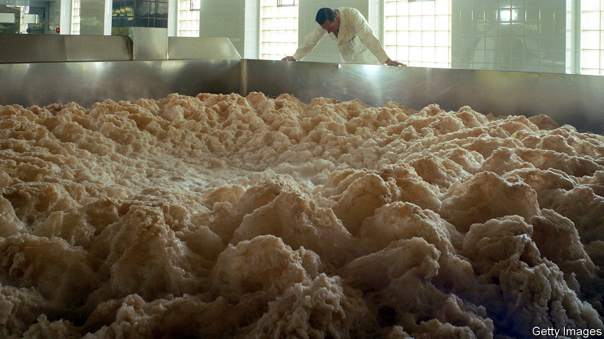

###### Beer

# A find by a student in Ireland plugs a gap in the history of lager 

##### But the trail still leads back to Patagonia 

 

> Dec 7th 2022 

In 2011 one mystery in the history of brewing was replaced by another. The solved mystery was where the specialised yeast needed to make lager came from. The new one was how it had got to lager’s , southern Germany—for the yeast in question had been .

Lager seems to have originated sometime around the 15th century. Before that, all European beers were ales. The difference is that lager ferments and ages best in cool conditions, so requires , a cold-tolerant yeast species, for its production. Ales ferment nearer to room temperature. That needs a different yeast, , other versions of which are used by bakers to leaven bread. 

 is itself, however, a hybrid of  and something else. It was that something which turned up in 2011, in the shape of , discovered by Todd Hittinger of the University of Wisconsin-Madison and Diego Libkind of the Argentine National Council for Scientific and Technical Research. And that raised the intriguing question of how this fungus had travelled from what eventually became Argentina to central Europe before Christopher Columbus’s first voyage to the Americas in 1492.

Seek and ye shall find. Since its initial discovery,  has turned up elsewhere. Though its phylogenetic tree shows that it did indeed originate in Patagonia (its preference for the cold being, perhaps, an adaptation promoting its survival there through the last Ice Age), it has also been found in North America, China and New Zealand—spread, presumably, by natural processes like blowing in the wind, or hitching rides on migrating birds and insects. 

But it had not been seen in Europe— at least, not until Stephen Allen, a student at University College, Dublin, collected samples of yeast from a wooded area of one of the college’s campuses as part of an undergraduate research project, cultured them, and did a preliminary genetic analysis. 

When the results came back, Geraldine Butler, his supervisor at the school of biomolecular and biomedical science, thought she saw ’s elusive signature. “I had a hard time convincing the other staff that we might have , it seemed so unlikely,” she says. But a full genetic sequence confirmed it. Dr Butler, Mr Allen and their colleagues published the discovery this week in.

Dr Butler says the analysis shows modern lager yeast is indeed closely related to the Irish strain, and also to a previously discovered Tibetan version. The hare set running in 2011 has not quite been caught. Neither the Irish nor the Tibetan strain is close enough to be the direct parent of lager yeast. But the hunt has now, at least, been brought to Europe. The game’s afoot.


