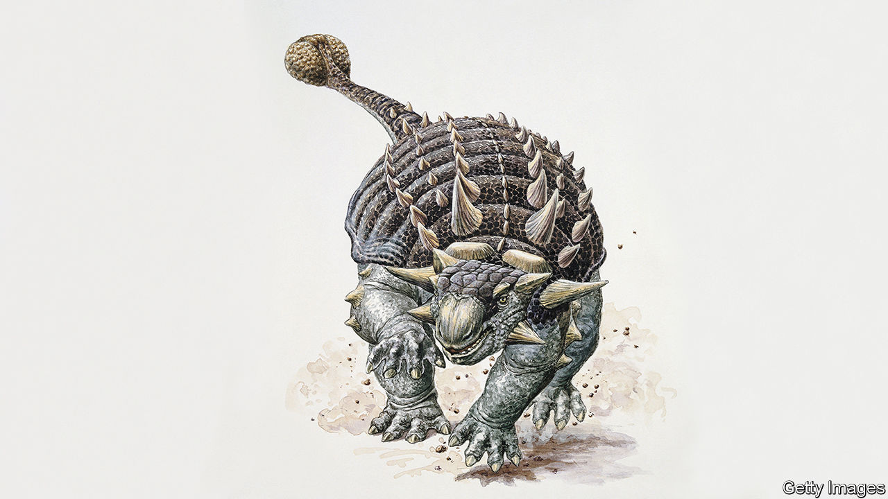

###### Palaeontology

# A new explanation for ankylosaurs’ clubbed tails 

##### They were for fighting other ankylosaurs, rather than fending off predators 

 

> Dec 7th 2022 

Few dinosaurs evoke images of dramatic battle better than . This seven-metre-long late-Cretaceous herbivore, shielded by thick bony plates and armed with a club at the end of its tail, has been depicted for decades using its weapon to batter the likes of . No doubt it did, if need arose. But a paper in  by Victoria Arbour of the Royal British Columbia Museum, in Victoria, Canada, suggests this was not a club’s main purpose. That, she and her colleagues reckon, was to bash other ankylosaurs.

Ankylosaurs came in many species.  itself was merely the first to be discovered. In 2017 Dr Arbour and her team found yet another. They called it . Zuul was a demon in “Ghostbusters”, a film from the 1980s. This demon’s head, they thought, resembled that of their find. “Crurivastator” means “destroyer of shins”—for back then, Dr Arbour accepted conventional wisdom that tail-clubs were for bashing the legs of predators.

But a closer look raised doubts. The fossil is spectacularly preserved, which let the team study its armoured plates in detail. Many of those on its flanks show signs of injury. Plates on most of the rest of the body do not. Nor was this flank-damage from the piercing teeth or slashing claws of predators. Rather, it was the result of being hit by something hard and heavy. On top of this, the damaged plates had healed to different degrees, indicating not only that the bashing had not been lethal, but also that it had happened numerous times. 

All this suggests ankylosaurs used their clubs to hit one another, did so frequently, and that (because of the local nature of the damage) such fights had a ritual quality to them—like contests between modern-day bison, rams and red deer. Those fights are over mates, which is what Dr Arbour suggests was also going on with ankylosaurs.

There is a wrinkle. Sexually selected weapons are generally restricted to males, and it is impossible to tell a dinosaur’s sex from its fossilised remains. To add to the confusion, many of the 20-25 seriously large ankylosaur tail-clubs that have been found were discovered detached from the rest of the animal. When the assumption was that clubs were for defence, it was logical to assume also that both sexes were thus armed. Now, the question is open.

In modern animals, if females are armed like males it is usually to protect resources rather than garner mates. This is why, among deer, only reindeer sport antlers regardless of sex. Females’ antlers are smaller than males’, and, unlike males’, are retained over winter. Their purpose is to aid defence of patches of ground their wearers have cleared of snow to reach the lichen beneath, at a time when they are pregnant and in need of good nutrition. Female cattle are likewise armed with horns which, though not as big as a bull’s, are sufficient to defend their feeding territories.

Whether something similar pertained to ankylosaurs is difficult to determine from the existing evidence. But, either way, the image of the sturdy ankylosaur defending itself fiercely against the unwanted attention of predators is probably the exception. Rather, males were beating up other males—and, possibly, females other females. Not quite such a heroic picture. ■


