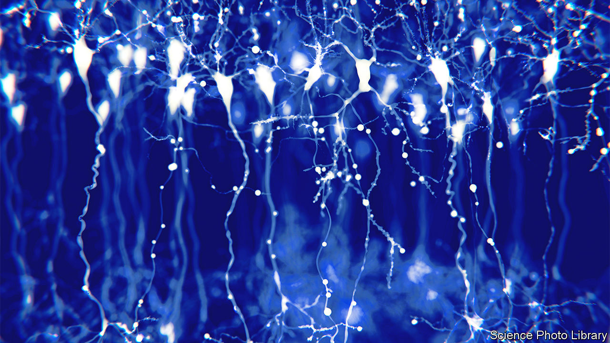

###### Silent synapses

# How adult brains learn the new without forgetting the old 

##### They keep a stock of unused synapses in reserve, to be activated as needed 

 

> Dec 7th 2022 

Learning new things is hard. Remembering what has already been learned is harder. Any successful learning system, be it a brain or a piece of artificial-intelligence software, must strike the right balance between stability and flexibility. It must be stable enough to remember important old things yet flexible enough to learn new ones without destroying old memory traces—preferably for as long as it exists.

Learning is a result of changes in the pattern of neural connectivity in the brain. Each connection between nerve cells, called a synapse, is a tiny gap between the ends of branches ramifying from such cells. Messages jump across these gaps in the form of molecules called neurotransmitters. Current estimates suggest there are 600 trillion synapses in a human brain.

How, then, to deal with the stability-plasticity dilemma—particularly as brains age and, as it were, fill up? Research by Dimitra Vardalaki, Kwanghun Chung and Mark Harnett at the Massachusetts Institute of Technology, just published in , suggests one way is to preserve into adulthood a type of memory-forming synapse found in children. These are called silent synapses. 

Silent synapses—which, as their name suggests, transmit no signal from one nerve cell to another—are often found on the ends of slender, immature protrusions from nerve cells, called filopodia. Until now, it had been thought that these disappeared as a brain matured. But Drs Vardalaki, Chung and Harnett have shown not only that they are present in adulthood, but also that they are common, at least in mice. Just over a quarter of the connections they sampled in adult mouse visual cortices were silent synapses on filopodia. And murine and human brains are sufficiently alike that something similar almost certainly applies to people. 

To carry out their search for filopodia, the trio used a sensitive microscopy technique called eMAP. They studied 2,234 synapses between cortical nerve cells of a type called pyramidal neurons (pictured), which have thousands of synapses each. Peering through an eMAP microscope is enough to determine which cellular protrusions are filopodia. But it cannot show which synapses on them are silent. 

To do that, they needed to test how the filopodia responded to glutamate, the brain’s main excitatory neurotransmitter. First, they had to deliver a controlled flow of glutamate to the particular synapse they wanted to test. To this end, they poured a soup of “caged” glutamate over the neuron under examination. This form of the molecule is inert until hit with energy from the intersection of two laser beams. 

Aiming those at the synapse under study enabled them to uncage the neurotransmitter and see, by measuring the electrical activity in that part of the neuron using an ultrafine electrode, whether the synapse responded. They found that mature pyramidal-neuron protrusions generated electrical activity when exposed to glutamate, as expected. Filopodia did not, confirming the silence of their synapses. 

Silent synapses are, however, useless unless they can be switched on at the appropriate moment. And the researchers confirmed this is possible. They were able to induce the silent versions on filopodia to turn into mature, active synapses by pairing the simulated release of glutamate with a subsequent surge of electricity inside the neuron. 

This pairing of events caused silent synapses to start, within minutes, displaying receptor molecules characteristic of active synapses. The same pairing, applied to mature synapses, did nothing. The researchers thereby show it is hard to get a mature synapse to change the strength of its connection (thus satisfying the stability side of the dilemma), but easy to unsilence a silent one (satisfying the plasticity side). 

The next thing to investigate is how, why and when new filopodia appear. The discovery of all these eager-to-learn silent synapses and filopodia, Dr Harnett says, “is a lever for us to get into understanding learning in adults and how potentially we can get access to make it not degrade over the course of ageing or disease”. ■


