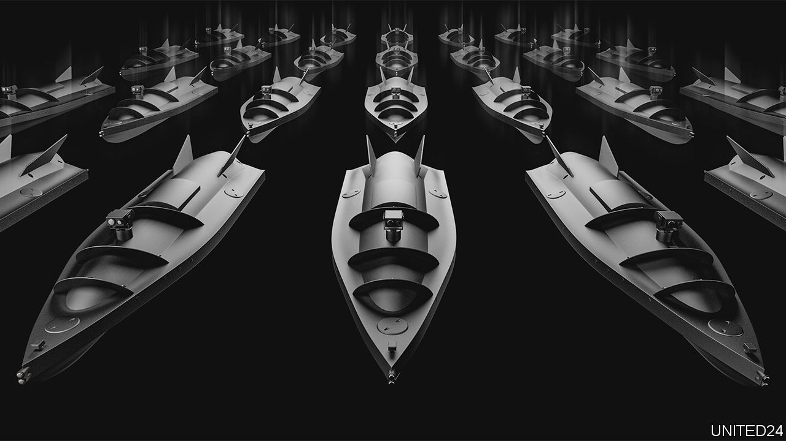
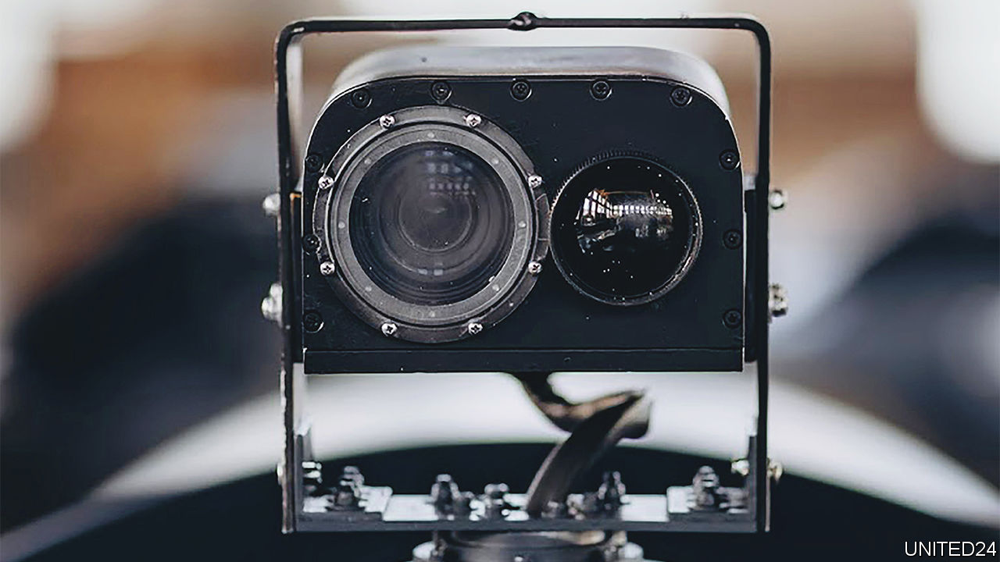

###### Naval drones

# Ukrainian ingenuity is ushering in a new form of warfare at sea 

##### Are uncrewed attack vessels the wave of the future? 

 

> Dec 7th 2022 

On September 21st an odd piece of flotsam washed up on the outskirts of Sevastopol. It was about five and a half metres long and the consensus was that it was a USV (uncrewed surface vessel, essentially a drone boat), possibly on a reconnaissance mission, that had been put together by the ingenious boffins who are to Ukraine what Q branch is to James Bond.

On October 29th reality bit. A fleet of the things, accompanied by similarly robotic air cover,  Sevastopol’s naval base, the home port of Russia’s Black Sea fleet. According to the Ukrainians, and backed up by video footage apparently shot from cameras on board one of the drones, they scored direct hits on , the fleet’s flagship, and two other vessels, damaging all three. That was followed on November 18th by a big explosion at a Russian oil terminal in Novorossiysk, also reported to have been the work of the same type of naval drones.

“For many it [these attacks] marks the start of a new age in naval warfare,” wrote H.I. Sutton, an author, blogger and naval analyst who has studied footage of the Ukrainian drone boat. That could be bad news not only for Russia, but for anyone who does business, naval or civilian, at sea. For its part, Ukraine announced on November 11th that it plans to build 100 of the vessels, paid for, it hopes, by crowdfunding. 

Enemy in sight

Until Ukraine’s attack on the Black Sea fleet, strapping bombs to remote-controlled boats had mostly been the preserve of irregular forces. Iran did test some in 2017, against a Saudi Arabian tanker. But things really got going when the Houthi movement, a group of rebels against Yemen’s Saudi-supported government, began, with apparent Iranian support, to use uncrewed speedboats stuffed with explosives. Also in 2017, one of these hit , a Saudi Arabian frigate, in the Gulf. The explosion killed two sailors. Since then, according to data compiled by Harvard Haugstvedt of Oslo University’s Centre for Research on Extremism, the group has launched more than 20 further attacks on commercial ships and shore facilities. 

Partisans’ drones are also going underwater. In 2021 Israel’s navy destroyed what it described as a bomb-carrying submersible drone minutes after its launch into the Mediterranean by members of Hamas. According to Israel, Hamas has been honing the technology for years. Each vessel, it claims, can carry about 30kg of explosive. 

Efforts by governments to weaponise uncrewed boats have generally taken a different tack. Rather than packing vessels with bombs and ramming them into their targets, the world’s navies seem more interested in mounting guns and missiles on USVs and using them like any other warship, only without sailors on board. As far back as 2012, for example, America’s navy was experimenting with a rigid-hull inflatable boat equipped with missiles and a remotely operated machine gun. In coming years, it plans to spend billions of dollars developing a colourful array of USVs, some of which may be as long as a superyacht and capable of carrying long-range missiles and other weapons.

China has sought to keep pace, with numerous programmes that mirror America’s efforts. One of these—a heavily armed vessel called the JARI—has made regular appearances at weapons shows across the world, complete with mock-up guns and torpedoes. That suggests China is interested in exporting the technology as well as using it itself.

In Israel, meanwhile, Rafael, a government-owned armaments company, has spent years perfecting a speedy USV called the Protector. In 2017 it decked one out with Spike anti-tank missiles and later demonstrated it in a NATO live-fire exercise. And EDGE, a state-owned Emirati conglomerate, is collaborating with IAI, another Israeli firm, to build a similar vessel. 

Elsewhere, Britain has, since 2019, been developing such capabilities through its NavyX project, which it describes, with refreshing honesty, as an “Autonomy and Lethality Accelerator”. Greece, Portugal, Singapore, South Korea and Turkey have also been rolling out armed USVs. 

Keeping a low profile

All these projects, though—at least, all that are known of—have a slightly unimaginative feel to them. They are to the world of naval warfare what machines like the Predator and Reaper drones made by General Atomics are to aerial combat, namely redesigned, uncrewed versions of the existing way of doing things. What Ukraine seems to have demonstrated is the naval equivalent of the quadcopter. And that may make naval warfare asymmetric in a way which governments are unprepared to deal with.

None of the Ukrainian boat’s underlying technologies would be out of reach for a small military power or a reasonably competent non-state group. According to an analysis by Mr Sutton of available images, its engine appears to be from a Sea-Doo jet ski. Its bow-mounted camera looks like a device that cyclists might strap to their helmets (it has a larger one, pictured, mounted amidships). And its satellite receiver bears a strong resemblance to the Starlink terminals supplied by SpaceX. 

In its fundraising materials, Ukraine claims that each boat costs a mere $250,000. A single anti-ship missile, by comparison, can cost millions. Ukraine will get a lot of bang for those bucks. The boat’s cargo bay can carry 200kg of high explosive to a ship’s waterline where—unlike a hole punched higher up in a hull by a missile or aerial drone—it will cause the vessel hit to ship water and possibly sink. 

Uncrewed surface vessels thus seem poised to follow the trajectory of airborne commercial drones, which caught governments flat-footed when they went from hobby-shop curiosity to deadly security threat seemingly overnight. Scott Crino, whose company, Red Six Solutions, advises governments on how to protect themselves from aerial-drone incursions, says that for years he has been telling officials that the prospect of malicious maritime-drone use is a risk. “The typical response,” he says, “is a head nod.” 

Navies should not be the only ones to worry. Commercial shipping is at particular risk, as the Houthi attacks show. Security measures on merchant vessels are usually predicated on discouraging the crews of attacking boats with non-lethal measures like long-range acoustic devices, floodlights and water cannons, together with barbed wire to repel boarders. Some ships do sail with armed guards, but their small-calibre weapons would be hard put to stop a reinforced drone boat whipping across the waves, according to Mr Crino.

Coastal infrastructure is also at risk. Six of the recorded Houthi assaults were on civilian ports and oil terminals. One of these caused “significant damage” to a Singaporean tanker, according to America’s State Department. If confirmed as the work of a boat drone, Ukraine’s attack on Novorossiysk would be ample proof that any waterfront structure, no matter how heavily secured, could be a target.

Not having a crew gives USVs other advantages. With no need for a cabin, they can be built for stealth. The Ukrainian boat rises only a few centimetres above the water’s surface, making it almost invisible to radar and cameras—but, unlike a submarine drone, still able to keep in radio contact with its controllers. (Radio waves cannot penetrate water.) This does not mean a follow-up could not dive completely underwater, for example in order to evade detection on a final attack run, like a German U-boat. The Hamas subs, which are guided on the surface by GPS, might already operate on a similar principle.

 


Skipping the crew also means vessels can be used more brazenly. A group planning a kamikaze-style maritime attack can avoid relying on a human “who may lose their nerve at the last second”, as Scott Savitz, a senior engineer at the RAND Corporation, puts it. In the footage from the attack on Sevastopol, the drone charges through a hail of gunfire with gay abandon.

How, then, do you stop a USV? The immediate response has been to rejig existing weapons. A couple of years ago Thales, a French armaments firm, thus reconfigured its supersonic Martlet missile to hit small fast-moving surface vessels. The result will be fitted to British frigates in 2024. America’s navy also recently put the finishing touches to what it calls a “Surface Warfare Mission Package”, consisting of two 30mm guns, two rigid-hull inflatable boats and a helicopter. This, it says, is specifically geared toward picking off small fast-moving boats, both crewed and uncrewed.

Moving beyond such lash-ups, both America and Britain have toyed with lasers which they claim could do the job. But it is unclear whether that technology is ready. The American test, aboard the  in the Gulf of Aden, was against a stationary target. Those British tests so far disclosed have taken place on land. 

A popular technique for bringing down aerial drones is to jam their radio links with high-intensity electromagnetic chatter, or to wrest control of the craft itself through a technique known as “spoofing”. This might work for USVs, too—though countermeasures, in the form of encrypted links and increased autonomy, are becoming increasingly effective, says Mr Crino. 

I contain multitudes

Another proposal, albeit so far imaginary, is to fight drone with drone. A retinue of uncrewed air and sea vehicles could serve as “scouts and bodyguards”, as Mr Savitz puts it, to scan the horizon for incoming USVs and attack them if needed. In June, Britain’s defence ministry awarded an urgent contract to BAE Systems, another armaments company, for an aerial-reconnaissance drone to deploy aboard frigates “to counter unmanned surface vessels”. (A spokesman noted that the navy is working to address “new threats across a range of environments”, but declined to provide specific details on any of its counter-drone boat efforts.) 

As is often the case when a new threat emerges from the technological shadows, armed forces will also look for answers in unusual places. First-world-war-style indicator nets for ensnaring submersible and semi-submersible craft could see a return to service. And Mr Savitz points to an American programme, inspired by the defensive secretions of hagfish, to develop a slime that could be used to gunk up the propellers of incoming USVs.

But no amount of firepower, nor tide of gloop, is likely to be a satisfactory response on its own. “By the time you’re getting into the range of a point defence system,” says Craig Allen, a commander in America’s coast guard, “it’s pretty late in the game to try and stop something.” Early detection will thus be crucial—though Mr Crino notes this could be hard in congested areas, such as ports or busy shipping lanes.

Also, these measures assume drone boats will come as single spies. More likely, they will arrive as battalions. “Truthfully it’s pretty hard to stop one hostile incoming target,” says Mr Allen, “and every additional target you add to that makes the problem much more complicated.”

All the more so if a flotilla’s boats can collaborate without reference to human beings. This is not a distant prospect. Such swarming capabilities have been under development in the West for a while and are beginning to proliferate. Aselsan, a Turkish arms-maker, recently unveiled the Albatross-S, a speedy USV which, it says, can operate in droves that share information about targets and objectives. Meanwhile, engineers at China’s College of Weaponry Engineering in Wuhan are building “hunting algorithms” intended to enable swarms of USVs to chase down a multitude of targets, in the manner of a pod of killer whales pursuing a bob of seals. Good luck stopping those with a net. ■


