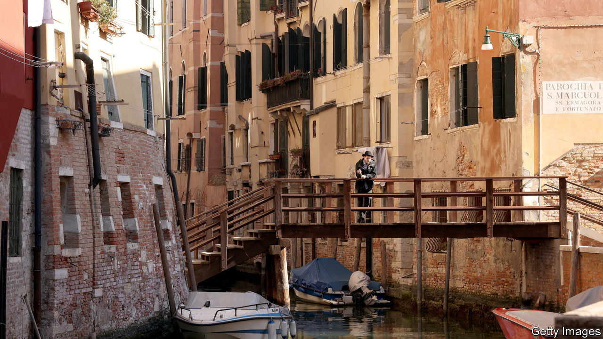
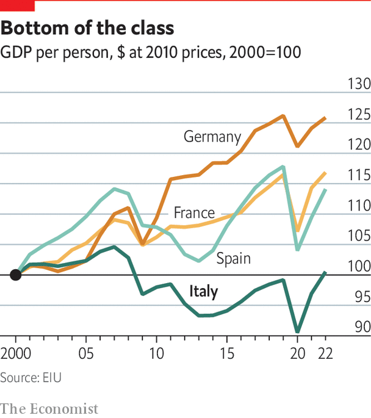

###### The cost of vulnerability

# External shocks have hit the Italian economy hard 

##### They have also exacerbated internal weaknesses 

 

> Dec 5th 2022 

Looking back, what is remarkable is how robust the Italian economy was from the 1950s to the 1990s. A large part of the story was simple catch-up. When six countries met in Rome in 1957 to sign the treaty establishing the European Economic Community, Italy was by far the poorest member, so it became a net recipient of money from Brussels. Yet it had a long tradition of high-quality (if usually small-scale) manufacturing, especially in the north. It soon turned into the bloc’s lowest-cost maker of a host of goods, ranging from cars and machine tools to refrigerators and washing machines. Migration of low-productivity farm employees (still 30% of the workforce in 1957) to higher-productivity manufacturing and services did much to pep up growth. By 1987 Italy was able, more or less convincingly, to crow about , the moment when it celebrated overtaking Britain in real GDP per head.

Yet catching up is a lot easier than forging ahead of the pack. By the late 1990s, Italy was no longer a net recipient of EU funds. Its unit labour costs had climbed towards, or even above, the bloc’s average. A country with traditionally low investment, a relatively small capital stock, a high public debt and a much diminished farm sector found it hard to sustain the high productivity growth that it had managed throughout the 1960s and 1970s. Previous advantages such as Italy’s vibrant small family-owned firms started to seem like disadvantages instead.

Into this unpromising environment came the first of a series of external shocks. One of the earliest was entry into the European single currency, the euro, in 1999. Germany had more or less designed the 1992 Maastricht treaty’s convergence criteria to keep out a profligate, chronically indebted Italy. The treaty tests of a budget deficit no bigger than 3% of GDP and a public debt converging towards a ceiling of 60% of GDP seemed impossible for Italy to pass by 1999. But when it became clear in 1997 that Spain was determined to join from the start, Romano Prodi, then Italian prime minister, decided that Italy, as a founder member of the bloc, must be there too. That Belgium also had a public debt above 100% of GDP helped, as did a special euro tax Mr Prodi introduced.

Mr Prodi remains convinced that Italy was right to join the euro. But he argues that it did not adopt the most sensible economic policies immediately afterwards. In entering the single currency, Italy was forced to jettison its traditional habit of relatively high price and wage inflation, compensated for by frequent devaluations of the lira. Because it had sacrificed its exchange-rate and monetary-policy independence, it badly needed to adopt a wholly new model if it was to remain competitive inside the single currency, making supply-side reforms that would hold down its unit labour costs in comparison with those of Germany.

Instead, under Silvio Berlusconi’s government from 2001 to 2006, it did precisely the opposite. Italy happily pocketed the gains from the single currency in the form of lower short- and long-term interest rates, but it then allowed labour and other costs to rise much as they had before. The result was a steady loss of competitiveness against other euro-zone countries, especially Germany, which had itself embarked on labour-market reforms to reduce its wage costs. 

 


The consequence was further to amplify the economy’s vulnerability to external shocks. China’s accession to the World Trade Organisation in 2001 was one such. Enlargement of the EU to include central and east European countries three years later was another. Italy’s relatively large manufacturing sector suffered disproportionately from both. And then came the financial crash of 2007-09, swiftly followed by the euro zone’s sovereign-debt crisis. The two biggest recent shocks were the arrival of covid-19 in early 2020 and the Russian invasion of Ukraine and the sharp rise in energy costs this year. In every case, Italy has tended to suffer more than most of its neighbours.

Contrary to those German worries about Italian profligacy, fiscal policy was kept under relatively tight control for most of this period. As Ignazio Visco, the Bank of Italy’s governor, points out, Italy ran a primary surplus (ie, before interest payments), albeit often a shrinking one, throughout the euro’s first two decades. He adds that the private sector is less indebted than in almost all other European countries. These are all reasons why Italy did not have to follow Greece, Ireland, Portugal and Spain in requesting an EU bail-out. However, one irony from avoiding one, notes Silvia Merler, chief economist of Algebris, an asset manager, is that these four countries have since grown faster than Italy.

Not going for growth

Indeed, it is at least arguable that, for Italy, both monetary and fiscal policies were too tight, not too loose, for much of the euro’s first two decades. This was a contributor to the economy’s main weakness, which was (and is) a near-total lack of growth. As a consequence, wages and living standards have stagnated. Italians have felt the pinch, public services have been underfunded and the south has suffered especially. It is little wonder that public opinion has shifted away from its previous unthinking support for the EU project, one of the reasons for the electoral success of Ms Meloni’s coalition.

That sentiment may have changed again since the EU’s recovery and resilience fund was established to help countries deal with the after-effects of covid-19. Italy is the biggest beneficiary of this fund, successfully snagging a promise of as much as €192bn ($197bn) in grants and loans over the period to 2026, just over a quarter of the total available and equivalent to around 10% of annual GDP. But the money is conditional on the passage of reforms in such areas as judicial proceedings, competition policy, public administration and the tax system. 

It is not clear that Ms Meloni’s government will be as eager to do Brussels’s bidding as its predecessor. The lure of a large pot of cash and the EU’s unwillingness to soften the requirements for receiving the money will be an inducement. Moreover, a similar insistence on further reforms is a key component of the European Central Bank’s new anti-fragmentation instrument that is meant to prevent sovereign-bond yields in the euro zone from diverging “excessively”. It was a sharp rise in the spread of Italian over German bonds that did much to bring down Mr Berlusconi’s last government in late 2011.

The economic climate is different now. The banks are better capitalised and less weighed down by non-performing loans. The euro zone’s architecture is stronger, with the ECB acting as a lender of last resort and bank supervisor, even if there is no system of mutual deposit insurance. Indeed, some Italians, including a few in the new government, believe that, since their country is too big to fail and too big to bail, they should not be intimidated by the EU into excessive austerity or unpopular reform. 

Yet the economic outlook has worsened. Serious inflation is back for the first time in the euro’s existence, and with it has come rising interest rates. Both will bring new tests of Italy’s vulnerability. The new government is likely to undergo a baptism of fire over the economy that would test even the most experienced policymakers. It will be especially hard for a prime minister as untried as Ms Meloni. And that puts new emphasis on the structural impediments to growth that continue to afflict the economy.■

