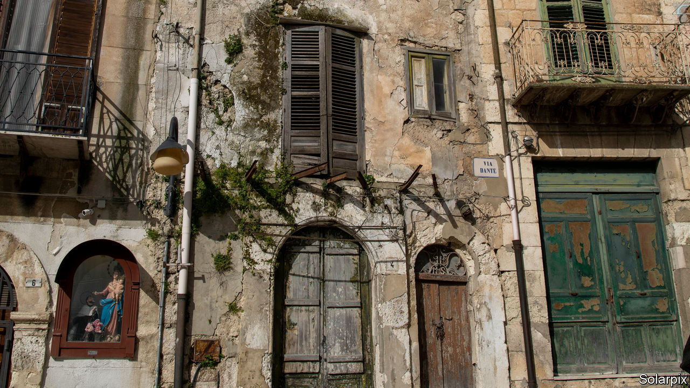
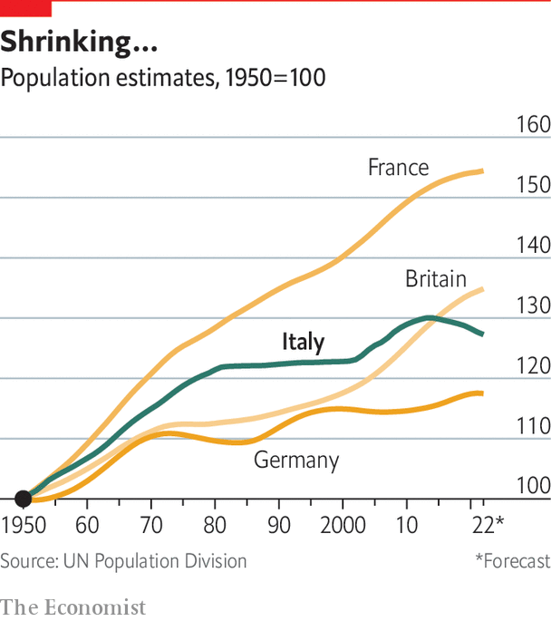

###### The houses that Giuseppe sold

# Italy is trying to deal with its demographic decline 

##### Some deserted southern towns are taking innovative approaches 

 

> Dec 5th 2022 

In relation to demography, as well as public debt, Italy is often compared to Japan. It has Europe’s second-lowest birth rate, at 1.2 babies per woman. Its population has been shrinking since 2015. Pension reform was pushed by the Monti government in 2011-13 but has been partly reversed, leaving Italy spending the highest share of GDP on pensions in the OECD. Child-care costs are high. Politicians duly fret. Giorgia Meloni’s decision to appoint as family minister a conservative Catholic, Eugenia Maria Roccella, and add “birth rate” to her ministry’s title, is telling.

By history and tradition, Italy is a country of emigration, not immigration, but that too has changed. Alfonso Giordano, a demography specialist affiliated to luiss University, says Italy is bad at integrating immigrants. It sticks to the  (“right of blood”) principle, so even immigrants’ children born in Italy can be denied citizenship. Mr Giordano suggests better co-ordinated EU action on irregular migrants from Africa could dampen resistance to regular immigration. Most economists see more immigration as essential.

 


Another effect of demographic decline is depopulation of many towns and villages, especially in the . A good example is Mussomeli, in central Sicily. Its medieval historic centre, nestled beside a ruined 14th-century castle, is picture-perfect, with narrow cobbled streets, historic crests to differentiate the districts, several churches and piazzas, and stunning views. Yet as the mayor, Giuseppe Catania, tells it, five years ago almost nobody lived there. The local population had either left or moved into newer, more convenient housing on the edge of town.

So, along with several others, the mayor signed up to a new initiative: case1euro.it, which has spread to much of Italy. Under the scheme, his office contacts owners of old empty houses, who are still subject to hefty property taxes, and offers to cancel what is owed in exchange for the title deeds. The properties are then sold to new investors for a notional one euro. Mr Catania says that, since 2017, some 330 homes in the historic centre have been sold to new owners.

There is, of course, a catch. Although not obliged to live in the property, or even to hang on to it, the new owners must renovate their homes within three years. For a typical old house with a floor area of some 50-80 square metres, the cost of renovation is around €500-900 per square metre. Covid-19 has meant delays, but Mussomeli now boasts 120 building firms ready to do the work. The big benefits for the town are a clean and spruced-up historic centre that is starting to attract tourists (though there is as yet no hotel); and an influx of new people, many able to work from home with a good internet connection. Mr Catania lists no fewer than 18 nationalities among his buyers. The only one missing? Italians, who no longer see much appeal in living in the cramped conditions of their forefathers.■

