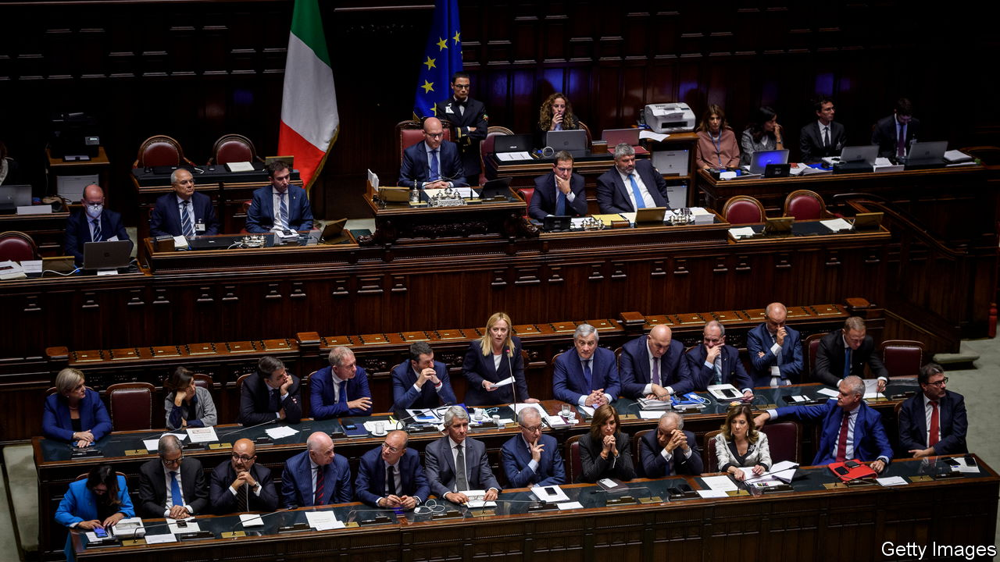

###### A new reform spirit

# Italy needs to learn from other countries on structural changes 

##### It cannot afford to retreat from them as it has before 

 

> Dec 5th 2022 

Paul Ginsborg, a leading British historian of post-war Italy who died earlier this year, once wrote that, “If there is a single, recurrent, almost obsessive theme in the political history of post-war Italy, it is that of the need for reform and of the failure to achieve it.” Now, more than ever, the country needs huge reforms to return to a path of growth. 

There are two common Italian responses to such an assertion. The first is denial. The economy seems to be doing better than it was a decade ago. Compared with other countries in Europe, Italy has plenty of well-off people. So long as you are in a protected job and can afford a property, life in such a wonderful country is comfortable enough. Is it really worth upturning the entire social order only to try to generate slightly higher growth?

The second is resignation. Italians have become used to being told that their country is the new sick man of Europe (though besides the Ottoman empire, the original sick man, Britain, France and Germany have all been garlanded with this title at different times). But they have learned from experience that structural reforms are hard to push through in a country that more or less invented medieval guilds—and that, as with pensions, they can all too easily be rolled back. If change is impossible to stick to, why waste time pressing for it?

Yet both responses are wrong. No doubt Italy and Italians will survive whatever happens. But without substantial root-and-branch reform, their standard of living is likely to fall ever further behind the rest of Europe. Being overtaken not just by western Europe but , in due course, by parts of eastern Europe should wake up even the most complacent. And what should clinch the argument is that radical structural change is clearly possible, with the right leadership. Italy needs only to look at other European countries over the past four decades to understand this.

One example was Britain in the 1980s. By the 1970s the common view was that Britain was permanently saddled with a slow-growing, strike-prone, uncompetitive economy. Indeed, it was a key reason for joining the then European Economic Community in 1973. But after 1979 Margaret Thatcher shook up a moribund economy with structural reforms that helped to make it more competitive. And Britain, for all its other self-inflicted problems, has since mostly outgrown Italy, at least until Brexit.

Going Dutch

The next case is the Netherlands, which was the victim of what became known as the Dutch disease in the late 1970s after money poured into the exploitation of gas reserves. After the Wassenaar agreement struck between trade unions and employers in 1982, the Dutch labour market was transformed, helping generate a huge growth in part-time work. Later in that decade, both Finland and Sweden, for different reasons, found themselves stuck in a deep economic hole. Determined action by the governments of both countries helped dig them out again.

An even more telling example was Ireland after 1988, when it was labelled the poorest of the rich. Tax cuts and labour reforms then helped set off what became known as the Irish miracle. A notable feature of this miracle was a huge increase in the rate of female participation in the workforce, a big shock in a country with such a fervent Catholic population.

In the early 2000s the baton of reform passed to Germany. The Schröder government, although often derided nowadays, loosened regulation of the labour market and shook up the welfare system through its Agenda 2010 reforms. As in Ireland, an important result was a marked increase in the share of women participating in the workforce. Germany was at one time not much better than Italy on this measure. Now, unlike Italy, its female participation rate is well above the OECD average.

The entry of central and eastern European countries into the EU has produced several more instances of successful structural reforms. A notable case was the three Baltic countries after 2007. Latvia in particular made wrenching changes to both public and private sectors. And then came the four main countries that were bailed out by the eu during the euro’s long drawn-out sovereign-debt crisis: Greece, Ireland, Portugal and Spain, all of which have since done better than Italy. Indeed, almost the only big European countries that have not made sufficiently large structural reforms are now France and Italy.

Many Italians, especially those happy with their lives and insulated from competition, may still find it preferable not to be disturbed. Like lots of insiders, they might share the response attributed to Lord Salisbury in the 19th century when reform was proposed: “Change?…Aren’t things bad enough as they are?” But for the sake of their country, they would do better to subscribe to the famous doctrine of Giuseppe di Lampedusa in “The Leopard”: “If we want things to stay as they are, things will have to change.” It is not too late to unleash Italy’s potential.■

