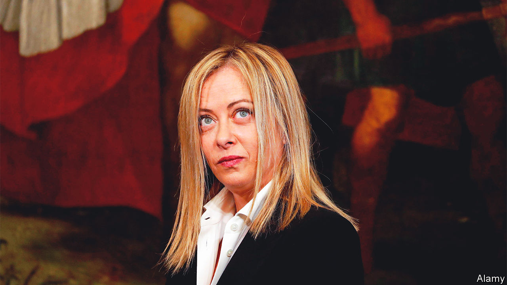
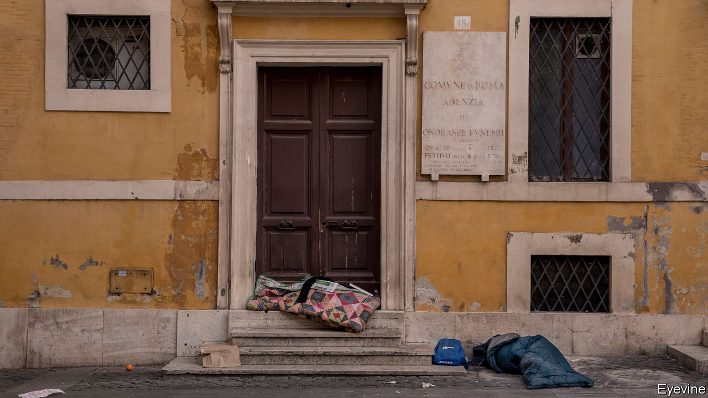

###### Wanted: an Italian Thatcher

# Italy’s new government needs to make deep economic reforms 

##### But Giorgia Meloni may not have the desire or the experience to make them, says John Peet 

 

> Dec 5th 2022 

It is surely impossible not to have a good time in Italy. It is one of the world’s most beautiful countries, with much of its best food and wine. It has an enviable climate, yet is surprisingly varied geographically. The infrastructure, especially high-speed rail, has vastly improved (and the trains usually run on time). As a destination for the discerning tourist, it is second to none.

Italy’s artistic assets are as impressive. Italians like to claim that they possess 60% of the world’s culture. The country has more UNESCO world-heritage sites than any other. No wonder it has been one of the world’s most popular destinations ever since rich Britons undertook their grand tours in the 18th century. Its glories range from Giotto’s frescoes in the Scrovegni chapel at Padua to the mosaics of Monreale Cathedral outside Palermo; from Leonardo’s “Last Supper” in Milan to the sassi at Matera; from St Mark’s Basilica in Venice to Pompeii’s Roman ruins by Vesuvius.

Even the economy seems healthier than a few years ago. The covid-19 disaster of 2020 hit Italy early and hard, but the country has since bounced back impressively. This year it is likely to have outgrown France and Germany simultaneously for the first time in 30 years. A big slug of money secured from the European Union’s next-generation fund is underpinning a new reform effort. Entrepreneurs in Italy seem happier than for several years—even if many economists remain gloomy about the future.

Sadly it is the economists who are closer to the reality. As in the rest of Europe, Italy’s immediate prospects are dire. A revival of inflation to double figures, rising interest rates, an upsurge in energy costs and Russia’s war in Ukraine are likely to tip the euro zone into recession in 2023. But what makes things worse for Italy is that its long-standing economic weaknesses always leave it more vulnerable than its neighbours to external shocks.

A list of those weaknesses is telling. The public debt is almost 150% of GDP, making Italy the third-biggest debtor in the OECD after Japan and Greece. The employment record is poor. Female participation in the workforce is the lowest in the EU, and the share of young people not in employment, education or training the highest. Education results are bad. And the demographic outlook is grim: Italy has the second-lowest birth rate in Europe, and one of the fastest-ageing populations. 

The business climate is not good, either. Italy has a plethora of small firms, but remarkably few large ones. It scores worse than any other western European country in the most recent World Bank index for the ease of doing business. Foreign direct investment is shockingly low for a G7 country. Italy spends barely 1.5% of GDP on research and development (R&amp;D), half as much as Germany does. Despite recent improvements, the public administration remains both too large and too inflexible. And Italy suffers more than most EU countries from a high level of corruption and a large black economy—especially in the south, one of Europe’s least developed regions.

The consequence of these ills is telling. GDP per head in Italy has hardly increased in real terms since 2000, the worst performance of all in the OECD club of mostly rich countries. When Europe has grown, Italy has tended to grow more slowly; when Europe has fallen back, Italy has tended to fall back more. Calculations by Andrea Capussela, an economist, in his book “The Political Economy of Italy’s Decline” found that total factor productivity, a broad long-term measure, has actually declined over most of the period. Italy has already been overtaken by Spain in real incomes per head. If current trends persist, it will be overtaken by Greece and some east European countries within 30 years.

 


The economic and administrative reforms made under Mario Draghi’s government, which took office in February 2021, have begun to ameliorate some of these chronic weaknesses—one reason why  chose Italy as its country of the year in December 2021. But implementation of the reforms has barely begun and there is a long way to go. And now the Draghi government has gone. Its replacement after the early election on September 25th is a right-wing coalition under the prime ministership of Giorgia Meloni, leader of a previously tiny party, the Brothers of Italy (FdI), which came top of the poll with a 26% vote share.

Ms Meloni’s election victory prompted much hand-wringing around the world about her far-right background, almost exactly 100 years after Benito Mussolini’s march on Rome. The FdI grew out of the post-war neo-fascist MSI party. Some members, including Ms Meloni herself, have at times waxed nostalgic about the Mussolini era. Her choices for president of the Senate and speaker of the Chamber of Deputies were controversial hardliners. She and her party have put much emphasis on the family and Roman Catholic values. They are dubious about advancing gay rights, shelter an anti-abortion wing and are markedly hostile to immigration. As Fabrizio Tassinari of the European University Institute in Florence puts it, she may be Italy’s first female prime minister, but she is not its first feminist one. And she is a longtime Eurosceptic.

Yet Ms Meloni has been careful to play down her party’s roots, insisting that she is merely a “conservative”. She says she has no plans to roll back abortion laws or gay rights. She has also assembled her government cautiously, giving the finance portfolio to Giancarlo Giorgetti, a veteran of past budget battles, and the foreign ministry to Antonio Tajani, a former European commissioner and past president of the European Parliament. And though Ms Meloni is clearly more Eurosceptic than Mr Draghi, she has dropped any talk of leaving the euro or the EU. She may instinctively support Hungary and Poland in their fights with the EU, but she is also courting Brussels, not least to keep its cash flowing.

The bigger worries about Ms Meloni’s government do not stem from her party’s origins. One is its durability. Few Italian prime ministers last more than a couple of years. She may be the first to win the job through election in 14 years, but she still needs support from two other parties: Matteo Salvini’s League and Silvio Berlusconi’s Forza Italia. The right in Italy is better at sticking together than the left, but sniping has begun. Mr Salvini wanted the interior ministry but was fobbed off with infrastructure. Mr Berlusconi has backed Vladimir Putin against Ukraine, and seemed to criticise Ms Meloni as self-important, bossy and arrogant.

Persona incognita

Ms Meloni has been admirably forceful in response, making clear that she is not to be blackmailed and that she shares Mr Draghi’s fulsome support for NATO, the Atlantic alliance and Volodomyr Zelensky, Ukraine’s president. But a second concern is her sheer lack of experience. She was a junior minister under Mr Berlusconi in 2008-11 but has otherwise done little outside party politics. Her party contains few heavyweights or well-known figures. She seems to rely on a small group of advisers who, like her, have limited experience. Roberto D’Alimonte, a politics professor at luiss University in Rome, calls her “persona incognita”.


This would matter less if Italy were in better shape. But in fact it faces a continuing need for tough and controversial reforms that can realistically be pushed through only by a government with both the ability and the will to tackle Italy’s dense thicket of vested interests. Lorenzo Codogno, a former senior Italian treasury official who has just co-written a book, “Meritocracy, Growth and Lessons from Italy’s Economic Decline”, says that what the country really needed was ten years of Draghi-led reforms, not the 21 months that it actually got. 

The EU’s recovery and resilience programme, with its milestones of legislative reforms required to release tranches of money, may box in the new government for some time. But Ms Meloni is already suggesting the programme needs to change, for instance to respond to the energy crisis and the effects of the war. And experience suggests that implementation of reforms matters more than legislation. This requires a government that understands the need for deep change, not one reluctantly pushed into it only by outside forces. What Italy needs is its own Margaret Thatcher, ready to fight for unpopular reforms against the establishment. 

Sadly, there is little sign of this. Italians may fret about their lives, but they do not feel a sense of crisis. And Ms Meloni has more often supported than challenged the privileged groups that fend off competition and hold back growth, from taxi drivers to holders of beach concessions. Instead she displays a nationalist and protectionist streak in opposing foreign acquisition of Italian assets. The watchwords of her government seem to be clientelism and corporatism, not competition and free markets.

Yet it is more competition that Italy needs, not more protection. To see why, it is worth looking at what went wrong with an economy that for the 50 years up to the 1990s was one of the fastest-growing in the OECD, only over the next 25 to become the slowest-growing of all.■

