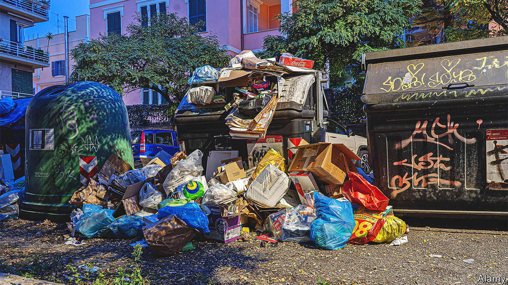

###### Structural faults

# Italy’s protected sectors need exposure to more competition 

##### Their approach to management and the labour market need a shake-up, too 

 

> Dec 5th 2022 

The macroeconomic outlook for Italy is cloudy. But it is microeconomic factors such as labour- and product-market regulation, protected incumbents and a broader lack of social trust that do most to discourage Italian firms from investing and foreign investors from coming in.

Italy has more small and medium-sized enterprises (SMEs), mostly family-owned, than France and Germany combined. Only 30% of Italians work in companies with more than 250 staff, compared with half in France and Germany. And almost half of Italians work in micro companies with fewer than ten employees, the highest share in Europe after Greece. SMEs are especially strong in manufacturing and in the north, where they are often praised as the equivalent of Germany’s Mittelstand firms.

Yet there are two big differences with Germany. The first is management. Two-thirds of German Mittelstand firms employ professional managers. In Italy, the share is just one-quarter. History and culture explain some of the difference, but so may low levels of social trust. Too many family-owned firms in Italy are reluctant to employ outsiders as managers. And this may explain another difference, which is that SMEs in Germany are willing to grow and sometimes to float on the stockmarket. Small Italian firms often see either course as a threat to the family’s control.

The next problem in Italy is its labour market. Several ministers and officials have bravely overcome vested interests and strong trade unions to deregulate parts of the labour market (indeed, two were assassinated for their pains) over the past 25 years. But the market is still a long way from the flexibility of, say, Denmark’s in its freedom to hire and fire. Getting rid of workers can be cumbersome and require proof of just cause. It is also subject to lawsuits in which judges often favour employees over employers. And the market is damagingly two-tier. As Maurizio Landini, general secretary of the CGIL, Italy’s largest trade union federation, puts it: too many young Italians are on precarious temporary contracts, while their elders have more secure permanent ones. 

The effects of a partly gummed-up labour market are lamentable. Even after relatively strong growth in 2021 and 2022, unemployment remains higher than in most other EU countries, at over 8%. Youth unemployment has long been substantially higher, at over 20%. The share of young people not in employment, education or training (NEETs) is 22%, the highest in the EU. And the rate of female participation in the workforce, around 54% of those aged 15-64, is the lowest. 

Italy’s product markets may be an even bigger structural failure. In its manufacturing sector the country has for too long displayed protectionist instincts, though these have been eroded over time. Even the giant Fiat car company, once the seventh-largest in the world, was fiercely protected in its early days. That has long gone. Stellantis, Fiat’s Dutch-based holding company, is now just another global carmaker (Exor, its biggest shareholder, is also the biggest shareholder in ). 

It is above all services, the biggest contributor to any advanced country’s GDP, that most need opening up to competition. Too many services firms make their living from rent-seeking and licence capture, not from their competitiveness in a free market. This can be seen in the preferential treatment of pharmacies and small retailers, beach-concession holders and taxi-drivers, or lawyers and notaries. All benefit from a network of privileged concessions that keep out competitors and are often handed down from father to son. The consequence is a services sector characterised by inefficiency and low productivity.

Protection of national champions has similarly deleterious effects. Italy is not alone in this, but it is notable that the likes of Enel (electricity), Eni (oil and gas) and Telecom Italia all exploit their political connections. Trenitalia’s high-speed trains benefited from private competition in the form of Italo, set up by a group led by Luca Cordera di Montezemolo, a businessman. No government has come close to daring to shut down the national airline (Alitalia, now ITA, whose planned privatisation may yet not happen) or Italy’s oldest bank, Monte dei Paschi di Siena. Instead, both have had repeated state-backed bail-outs. 

Another by-product of protectionism may be Italy’s low foreign direct investment. Foreign investors are wary of a country that tends to look after its own against outsiders. Italy also scores badly in rankings of places good to do business. In 2020 it came 58th in the World Bank’s rankings, below Serbia and even Belarus. For dealing with construction permits, it came 97th; for starting a business 98th. Startup costs are among the highest in the EU; fees to notaries alone can be 75% of the bill. Electricity is more expensive and takes longer to connect than in most other EU countries. 

Then there is the low quality and inefficiency of public administration. Long delays in receiving permits are common. Italy has too many levels of government, one reason its tax burden is high. Another is that, judging from the large gap between what should be and actually is collected in VAT, tax evasion is more extensive in Italy than in most other EU countries. This is not helped by a habit of offering amnesties, which also happens for illegal building. In both cases amnesties only encourage repetition of the offence. 

Worst of all, Italy does badly on education. Its PISA scores from the OECD for mathematics, science and reading are all below average. Although the country has some good private universities, it has no university in the world’s top 100. In 2019 the share of 25- to 34-year-olds who had completed tertiary education was the lowest in the OECD apart from Mexico. 

The low priority given to education over pensions is striking. Francesco Grillo of the Vision think-tank in Rome calculates that spending on pensions as a share of GDP in Italy, at around 15%, is five times as much as spending on education, the highest such ratio in Europe. This is evidence of a country that favours the old over the young so much that it can seem like a gerontocracy. 

Looking for the light

There are bright spots, even so. In regions like Lombardy, Piedmont and Veneto, Italy has many world-class companies, especially in food and fashion. “Made in Italy” is a valuable brand. The mayor of Milan, Giuseppe Sala, declares that his city is “booming” as never before. Luxottica, based in the city, is the world’s biggest maker of spectacles. In Veneto, Geox is one of its most successful shoemakers. Outside Brescia, Beretta is one of the world’s leading firearms manufacturers, almost 500 years after its foundation. Mr di Montezemolo says that, if they can avoid interaction with public administration and focus on exports, Italian firms can be highly successful. But that is a big “if”. 


In Turin CNH and Iveco, spin-offs from the old Fiat, are big exporters. CNH makes tractors and industrial engines, including an ingenious grape-picking machine (not coincidentally, Italy is the world’s biggest wine producer). Iveco’s trucks and buses can be found worldwide. In Emilia-Romagna, Modena has become a global car-research centre, with a motor-vehicle university, helped by the fact that Ferrari, Lamborghini and Maserati all hail from the region. Yet another example is Moncler, a fashionable puffer-jacket maker based in Milan that has expanded into America by buying a rival, Stone Island. The two biggest banks, Unicredit and Intesa Sanpaolo, are also stronger and more pan-European than they were a decade ago. 

Energy may be another unsung success story. Italy has few energy sources of its own. Like Germany, it was for too long highly dependent on Russian gas. But since the Russian invasion of Ukraine, it has moved faster than Germany to reduce that dependence. It has also done better than most other EU countries in reducing carbon emissions, though not without pushback. Any suggestion of a new role for nuclear energy is strongly resisted. And earlier this year fierce local opposition, led by the mayor, held up a new floating liquefied-natural-gas platform in the port of Piombino in Tuscany. 

Even public administration has improved. In the Draghi administration Marta Cartabia, a former judge, made several reforms to speed up Italy’s notoriously sluggish judicial system. It is not yet clear if her successor, Carlo Nordio, will be able to complete the job, as signs of delay in implementing these reforms have caused some concern. Vittorio Colao, the former technology minister, drove a programme of rapid digitisation of public services. His real ambition, he says, was to abolish cash, but the new government seems more inclined to raise the limit on cash transactions. The former infrastructure and transport minister, Enrico Giovannini, also improved Italy’s public infrastructure, from ports to railways. Perhaps Mr Salvini can keep up the momentum. 

In all such cases, from justice to infrastructure, the worst part of the country is still the south: Italy’s notorious , which continues to drag down the whole country. ■

