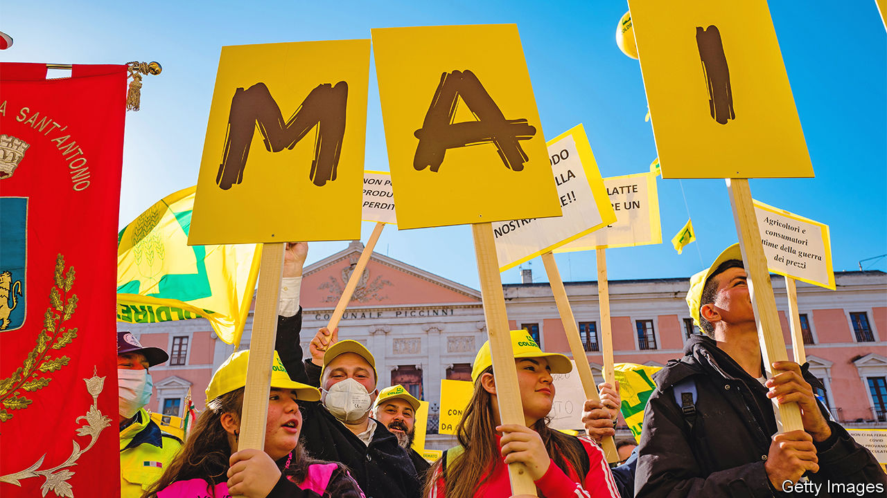
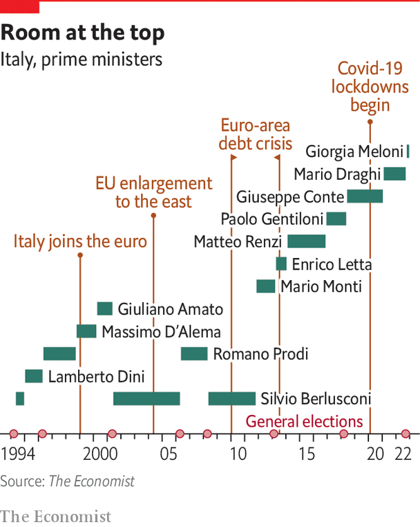

###### Italy’s bane

# Political instability in Italy has always affected reform 

##### Can Giorgia Meloni stay in power long enough to buck the trend? 

 

> Dec 5th 2022 

In few countries can there be as much disdain for the political class as in Italy, not least because of the system’s high cost. It is not just that the country has too many levels of government, though it does. It is also the excessive pay and perks attached to elected office. The bestselling book “La Casta”, published in 2007, found that members of the Italian parliament were paid more than their equivalents in almost all other EU countries. It also revealed that the public sector had access to a fleet of 72,000 cars. Such public largesse continues today.

Yet the excessive cost of parliament, at least, has been trimmed by one good thing about September’s election, which was to implement a reduction in the number of elected deputies and senators in parliament from 945 to 600. Another good thing was that, unlike the 2018 election, this one produced a clear result, handing a majority to the right-wing coalition led by Giorgia Meloni. She is the first prime minister to win the job as a direct result of the vote since Silvio Berlusconi managed the feat in 2008. 

The worst feature of the election was its turnout. At just under 64%, it was the lowest for any Italian general election since 1946. This supports the conclusion that there is a broad dissatisfaction among voters with the entire political class. Too often elections have led to protracted negotiations about forming a new government that may bear little relationship to the results. And voters are also fed up with the political instability that has become irrevocably associated with Italy.

Romano Prodi, prime minister from 1996 to 1998 and again from 2006 to 2008, links Italy’s instability to its repeated failure to pursue and implement big reforms. Soon after he first got the job, he went to Germany to meet Helmut Kohl, then the EU’s elder statesman. At the end of their discussion, which was mainly about the European single currency, Kohl simply asked who would be the Italian leader at the next meeting.

Instability is not just a product of bouts of horse-trading and coalition in-fighting. It also reflects repeated efforts by voters to search for political leaders who might actually do something about Italy’s chronic slow growth. Simplifying somewhat, ever since the collapse in the early 1990s of the old system under the first republic that had entrenched the Christian Democratic party in government since 1946, the electorate has been trying out a series of different answers—so far without much success. 

Mr Berlusconi was one early possible solution. The hope was that Italy’s richest man might protect all Italians and make them richer. Yet far from doing so, his terms in office mostly revolved around exploiting conflicts of interest to protect himself and his business empire. Voters then turned to the promise first held out by Mr Prodi of solving their troubles by signing up to the euro. When the financial crash hit and then spawned the euro crisis, a third answer presented itself: rule by a technocratic prime minister, Mario Monti, who steered Italy between 2011 and 2013.

Next came a batch of promising reformers from the Democratic Party (PD), with first Enrico Letta and then the hyperactive Matteo Renzi as prime minister. Mr Renzi had big plans to reform almost everything in Italy, but he was forced to quit in 2016 after losing a referendum on constitutional changes. This period ended in 2018 when Italy’s desperate voters turned to the disruptive Five Star Movement co-founded by Beppe Grillo, a comedian, and to Matteo Salvini’s League. 

Brothers and sisters

The bizarre, and often unstable, coalition between these two populist parties, formed under the leadership of Giuseppe Conte, was never likely to do enough to revive the economy. Predictably enough, in-fighting within the coalition ended the government early, forcing Mr Conte to form a link with the PD instead. Then Italy was badly hit by covid-19 in early 2020. And Mr Conte’s government was replaced in early 2021 by yet another technocrat, Mario Draghi, who led a broad-based team until last summer, when Mr Salvini and Mr Berlusconi contrived to bring down the government, leading to the election that brought in yet another choice: Ms Meloni’s FdI.

The victory that brought in Italy’s first female prime minister did not reflect a big swing to the right, but rather three other changes. The first was the collapse of the Five Star Movement from a 33% vote share in 2018 to 15% (even this was better than expected, mainly thanks to a strong showing in the south). Second was a redistribution of votes within the right, from Mr Berlusconi’s Forza Italia and Mr Salvini’s League to Ms Meloni’s FdI. Third was the failure of the PD under Mr Letta to form a working alternative coalition, with either Mr Conte’s Five Star Movement or the centrist parties of Carlo Calenda and Mr Renzi. This failure tipped most of Italy’s first-past-the-post seats (a quarter of the total) to the right.

 


Ms Meloni now has clear majorities in both houses. Yet this does not guarantee that her government will endure. Neither Mr Berlusconi nor Mr Salvini seems comfortable with her leadership. That may reflect her youth, her inexperience or simply the fact that she is female. Mr Salvini, in particular, has plenty of form in bringing down governments. Yet history also suggests that the right is more successful at keeping governments going than the left, which too often devotes more time to in-fighting than to confronting its opponents. 

The PD is certainly in disarray. Daniele Albertazzi, an academic at Surrey University, blames it for not forming a coalition with the Five Star Movement, which inevitably led to the right’s victory. Mr Letta retorts that, had he tried to do a deal with Mr Conte, both parties would have lost votes. He says he was also let down by Mr Calenda and Mr Renzi. Mr Calenda optimistically predicts that the Meloni government may not last a year. Mr Renzi suggests the European elections in 2024 could be a crunch test.

However enduring Ms Meloni’s government proves, what will she do? Initial fears over her foreign policy seem to have faded. Although both her coalition allies have a murky history of friendship with and admiration for Russia’s Vladimir Putin, Ms Meloni is emphatically not a fan. She is a firm Atlanticist and a supporter of NATO. She is unlikely significantly to change Italy’s policy of full support for Ukraine and continuing to wean itself off its dependence on Russian gas.

There may be more reason to worry about her attitude to the EU. She is unashamedly nationalist and, like Mr Salvini, has flirted with the idea of leaving the euro. Her party is a member of the European Conservatives and Reformists (ECR) group, which once included the British Tories (indeed, she is its president). She has often expressed support for the illiberal anti-EU Hungarian prime minister, Viktor Orban. She is hostile to immigration. She has been a trenchant critic of the Brussels bureaucracy. And she has begun her premiership with spats with both France and Germany.

Yet overall Ms Meloni, partly under the influence of Mr Draghi, has softened her tone. She knows how vital for Italy is the EU’s €725bn resilience and recovery fund. Her Europe minister, Raffaele Fitto, is seen as a pro-European. He says the party’s ECR membership shows it to be quite unlike populist far-right anti-EU parties in the rest of Europe. Mr Fitto is in charge of implementing the EU’s recovery fund, so he understands the need for good relations with Brussels. Ms Meloni’s first foreign trip after becoming prime minister was to the EU institutions.

The bigger question for the government concerns its view of liberalising reform. Here there are plenty of doubts. Broad goals of more privatisation and a reduced tax burden seem sensible enough. But when it comes to detail, the plans do not always add up. Privatisation no longer seems a first priority, especially if it means opening up to foreign investors; indeed, nationalisation of some utilities looks more likely. The notion that Italy would benefit from a flat tax is unconvincing. Although raising borrowing may be reasonable given the prospect of recession next year, the government knows it cannot emulate the example of Britain’s Liz Truss by ignoring financial markets.

Adolfo Urso, the industry minister, talks up the desirability of an EU-wide industrial policy to revive manufacturing. Although he welcomes foreign investment, he cautions against predatory acquisitions. Yet state intervention in Italy does not have a great history. And it glosses over the bigger question: does the government have the will to tackle vested interests that always obstruct reforms? Ms Meloni has a poor record when it comes to backing pro-competitive liberalisation. She is no fan of foreign investment and is instinctively protective of Italian national assets.

Her inexperience may or may not be a problem. Like any Italian politician, she must always be mindful of Machiavelli’s infallible rule: that unless a prince is himself wise, he cannot be well advised, for this is only possible if he finds one good adviser, and any such adviser soon takes over the state. But she certainly seems unlikely to be Italy’s Margaret Thatcher. More’s the pity.■

