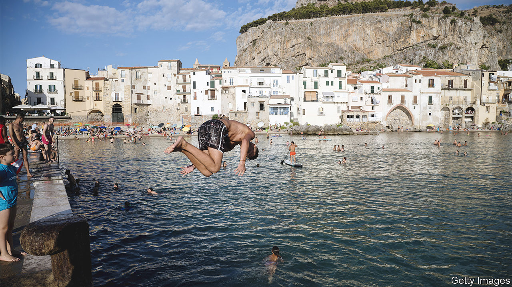
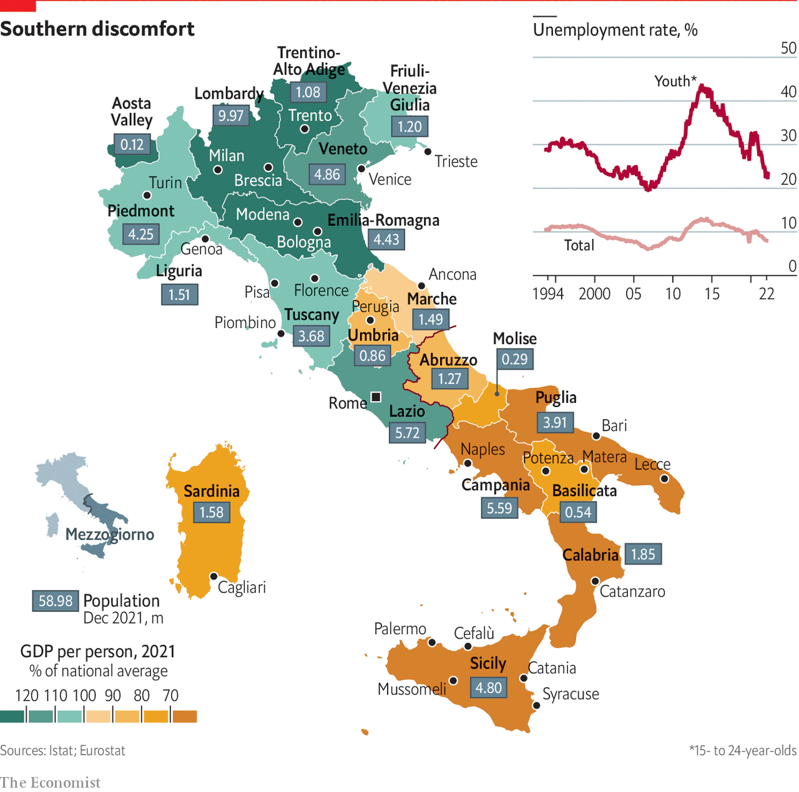

###### Sunrise or sunset?

# Southern Italy needs private enterprise and infrastructure 

##### It does not just need more public money 

 

> Dec 5th 2022 

Most European countries have regional problems. Sometimes this translates into full-blown independence movements (Britain and Spain spring to mind). But more often the issues are inequality, high unemployment and lack of development. Italy no longer has a serious independence movement, and it has devolved significant powers to city mayors and regional presidents. But in its south it has one of Europe’s most troubled regions: the .

Two things are striking about the . The first is its size: over a third of Italy’s landmass, a little under a third of its population and about a quarter of Italian GDP. The second is that, unlike most other poor European regions, it is no longer catching up with the rest of the country, as in the period immediately after the war. Instead, it has been falling further behind. It is more like the north of England than, say, the former East Germany.

The big question is why? Some cite history and culture. The semi-feudal kingdom of Naples with its absentee landlords was not conducive to fostering social trust, whereas northern Italy with its thriving city-states was the opposite. Others look at Italian unification in the 1860s, pressed by northerners but resisted by southern elites. Even today it is easy to find people who accuse Garibaldi not of unifying Italy but of dividing Africa. Yet Adriano Giannola, president of SVIMEZ, a development think-tank, says that the  caught up to almost 70% of average GDP between 1950 and the 1970s, only to fall back to 50%. 

Cultural differences doubtless persist. Yet today it is surely economic and social differences that matter more. Infrastructure such as roads, ports, rail and air links is generally worse and less extensive in the south. Educational standards are lower. And organised crime in the form of Sicily’s Mafia, Campania’s Camorra, Puglia’s Sacra Corona Unita and, most oppressive, Calabria’s ’Ndrangheta, casts a dark cloud over all aspects of life. The results are apparent in less investment, fewer jobs, lower levels of participation in work and a greater reliance on the public sector.

Over the years, the people of the  have tried different approaches. In the 1950s and 1960s the answer was emigration, of farmworkers to the north but also of the young to America, Britain and West Germany. Yet this translated into a brain drain that left behind the old and less well-educated. Another plan was subsidised investment through state-owned funds, often in manufacturing plants. Yet these were later disparaged as “cathedrals in the desert”. Even so, Mr Giannola argues that the abandonment of industrial policy and the habit of the north to look to Germany not its southern hinterland have been unhelpful. 

As in the rest of a country that is already lagging behind in productivity growth, wages tend to be low in the south. But this is not always true in the public sector. The ’s failure to converge with the north suggests that differential public-sector pay could help create more jobs. In contrast the citizens’ income (a welfare benefit), championed by Giuseppe Conte’s Five Star Movement, may be unhelpful. Too many people proved keen to take the benefit but not to work legally, instead supplementing their income in the black economy. The government is now proposing to cut the benefit sharply.

South working

Even in the , not all is gloom. Puglia has been a recent success story, with both tourists and businesses lured to Bari and Lecce. The mayor of Naples, Gaetano Manfredi, says his city has hugely improved, the climate is buzzing and the quality of life for incomers is high—even if there is still too much rubbish in the streets. Apple launched its first European “developer academy” in Naples in 2016, and it has since expanded. The film industry has taken off, many small textile and engineering firms have sprouted around the region and there are thousands of students. Tourism has bounced back from covid-19. Neither the mayor nor the regional president, Vincenzo De Luca, expect much help from the Meloni government, however.

In the Sicilian capital, Palermo, too, tourism is booming, restaurants are full and student life is busy. The mayor, Roberto Lagalla, who is a member of the FdI, hopes for more from the new government. He is not an admirer of the citizens’ income. But like many southerners, he is enthusiastic about the prospect of a new bridge to link Sicily to the mainland and optimistic that Mr Salvini will make it a priority. Sceptics see it as just another southern boondoggle that would benefit few beyond organised crime.

Leoluca Orlando, a former mayor of Palermo, says the Mafia has lost much of its grip on Sicily since he and some brave magistrates fought it in the 1990s. Yet other organised-crime groups in the south remain powerful. And anti-Mafia prosecutors in Naples and Rome note that, although old-style extortion and murders may now be less common, organised crime has moved on to broader business corruption, often on an international scale.

 


Elsewhere in Sicily, Catania has several high-tech firms built around what is known as Etna Valley, including STMicroelectronics, a chipmaker. Like other southern regions, the island hopes that working from home post-covid, or “south working”, will bring back departed people. The switch in the region from being a place of  into the reverse is yet another striking change. But the Meloni government is strongly anti-immigration from abroad, especially irregular immigration from Africa; it has even turned away from Italian ports rescue ships that pick up migrants in the Mediterranean. 

 

One more big change is the expansion of tourism. Yet here Italy, which has fallen from the top two to fifth as a global tourist destination over the past 50 years, could do better. The newish mayor of Rome, Roberto Gualtieri, says tourism arrivals to the eternal city have hit new records, and hotels are full. Yet too many hotels and restaurants in the capital have failed to reopen after the covid-19 shock. And the challenge of running one of Europe’s least governable cities remains huge.

The south also does not do as well as it could in tourism. Too many arrivals at Naples airport head straight for the Amalfi coast and the island of Capri. Yet 200 years ago Naples was one of Europe’s most appealing destinations. Besides its beautiful bay around Mount Vesuvius, it boasts two of Italy’s finest museums, the archaeological museum and the Capodimonte. On a recent visit by this writer, both were mostly empty (except for the salacious cabinet of erotic mosaics from Pompeii). Across the Mediterranean, Barcelona, with fewer historic assets, attracts twice as many tourists as Naples every year. 

A similar story can be told of Sicily. The island ought to be the jewel of the Mediterranean, with Greek temples, medieval cathedrals and such historic cities as Palermo, Cefalù and Syracuse, as well as some of Italy’s best food, wine and beaches. Yet Spain’s Balearic Islands draw more visitors than the whole of the , including Sicily, every year. The comparison with Spain is instructive. The Meloni government, like many predecessors, needs a better southern strategy. But politics may get in the way, for the south is not that keen on the right-wing coalition.■

