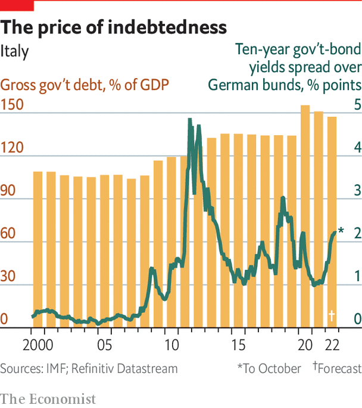

###### Spreadeagled

# Why is Italy’s public-debt burden so big? 

##### It is the denominator, not the numerator, that is the real problem 

 

> Dec 5th 2022 

One thing everyone knows about Italy is its huge public debt. At almost 150% of GDP, it is admittedly smaller than Japan’s. Like Japan, Italy has mostly run a current-account surplus, making it less dependent than, say, Britain, on the kindness of strangers. But Japan’s debt is mostly in its own currency, a chunk is owned by its central bank, and much of the rest is held by domestic savers (only 7% is foreign-owned). Many rich Italian savers also hold its debt, but some 45% of the stock is foreign-owned. And it is denominated in what is, in effect, a foreign currency: the euro. Hence the interest in —the difference in yields between Germany and Italy.

 


The natural assumption of northern Europeans is that Italy’s public debt reflects a failure to raise enough taxes to finance public spending. That may have been correct when most of the debt was incurred in the 1970s and 1980s, and it may explain why Germans feared before the euro began that they might have to pick up the tab for Italian extravagance. But the fiction of Italian fiscal profligacy has not reflected the reality since 2000.

It was Germany and France, not Italy, that first breached the euro zone’s stability-pact rules for budget deficits. When the financial crisis hit, Italy tipped into larger deficit. But for three decades it has usually run primary budget surpluses (ie, before interest payments). Until covid-19 blew it off course in 2020, Italy kept its public debt broadly steady as a share of GDP. Now rising inflation and interest rates may cause further problems. Although unexpected inflation reduces nominal debts, higher interest rates raise the cost of borrowing and may make primary surpluses impossible to sustain. 

Nor is it fair to accuse Italy of not collecting enough taxes to finance public spending. The tax take hovers at around 43% of GDP, less than in France but more than in Germany or Britain. Italy’s gdp per head has fallen behind, and it is not clear Italians draw commensurate benefits in public services.

So why is Italy’s public-debt burden still so notable? The best answer is to look not at the numerator (the debt) but the denominator (GDP). Before the euro, Belgium also had a high debt ratio. Since then it has grown faster, one reason why its ratio has fallen to just over 100% of GDP. Lorenzo Codogno, a former treasury official, has tried to model what might have happened to Italy’s ratio had it matched France’s (pedestrian) growth over the past 25 years: he finds it would have fallen to 60% of GDP. The best solution to Italy’s debt problem is unlikely to be more fiscal austerity, but rather renewed growth.■

