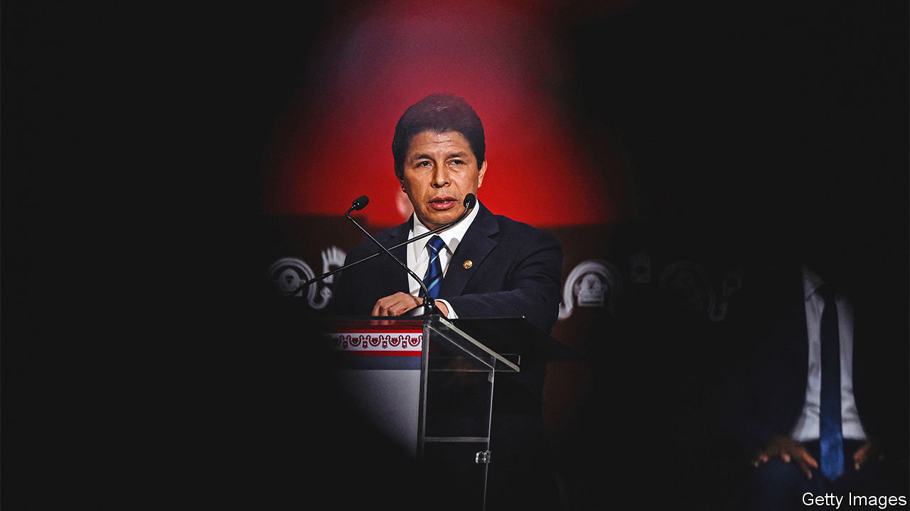

###### Castillo the brief

# After a bungled coup attempt, Peru’s president falls 

##### Pedro Castillo tried to shut down Congress. Instead, he was impeached 

 

> Dec 7th 2022 

In Marx’s hoary phrase, history repeats itself as farce. In 1992 Alberto Fujimori, an elected president, sent tanks to shut down Peru’s Congress and governed as an autocrat for the following eight years. Three decades later Pedro Castillo, the  of the job since July 2021, tried to do the same. On December 7th he announced that he would close Congress, convene a new one with powers to write a new constitution, and “reorganise” the judiciary and the prosecutor’s office. The effort collapsed within hours. 

Instead Congress voted by 101 votes to six, with ten abstentions, to dismiss him. After an emergency meeting of the high command, the police decided to arrest him for rebellion as he was being driven to the Mexican embassy to seek asylum. His vice-president, Dina Boluarte, has now taken over from him. 

Mr Castillo, a  with no previous political experience, was elected president with a margin of just 50,000 votes (out of almost 18m). Despite coming from the hard left he won against Mr Fujimori’s daughter, Keiko, who is abhorred by many Peruvians and who tried to overturn the election results with unfounded allegations of fraud. 

In just 16 months in office Mr Castillo has shown himself to be unfit for the job. He has got through five cabinets and around 80 ministers; they came and went almost weekly, many of them as unqualified as the president himself. According to the chief prosecutor he and several members of his family corruptly conspired to award public contracts. He denies all allegations, and claims political persecution.

Peru’s constitution allows Congress to impeach presidents for “permanent moral incapacity”; two of Mr Castillo’s predecessors were booted out under this clause. Twice Congress tried to remove him under it, too. But they acted too soon, and lacked the necessary 87 votes out of the 130 legislators. The left-wing block in Congress remained solid. Others were scared to lose their well-paid jobs if impeachment were to be followed by a fresh general election, as many Peruvians would like. A third motion, with more support, was due to be put to a vote on December 7th, hours after Mr Castillo’s ill-fated announcement.

Mr Castillo’s move was “a desperate gambit by a scared and incompetent man”, says a former minister. Unlike Mr Fujimori, Mr Castillo lacked support from the army and the streets. No tanks rolled in to shut down Congress. No angry mobs swarmed the chamber. Even his supporters condemned him. The armed forces, some of whose commanders went to jail after Mr Fujimori’s regime ended, said in a joint statement with the police that they would not back the president. Instead, Mr Castillo provided Congress with the incentive it lacked to remove him if they want to keep their jobs. Similarly, the left would have suffered by associating itself with a move so similar to Mr Fujimori’s.

There exists another precedent for Mr Castillo’s actions. In 2019 Martín Vizcarra, then president,  when it appeared to deny him a confidence motion. That was ill-advised, but there was a difference. He did not seek to tamper with the judiciary and he called an immediate election for a new Congress.

Ms Boluarte becomes Peru’s sixth president since 2016. She is not widely known by the general public, but neither was Mr Vizcarra when he took office. He went on to become one of Peru’s most popular presidents, only to be impeached himself in 2020. The new president is another leftist but appears to be a more competent one. Ms Boluarte would do well to form a broad-based government if she wants to see out the rest of Mr Castillo’s term until 2026. Most Peruvians are relieved that this time the coup attempt failed. ■

