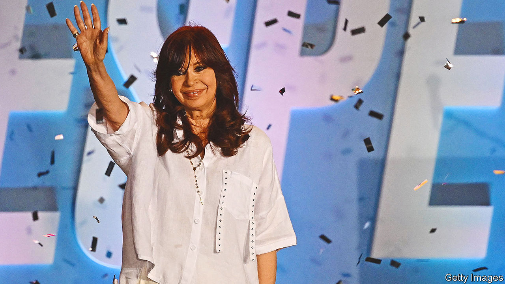

###### Peronist in peril

# Cristina Fernández de Kirchner is found guilty of corruption 

##### Argentina’s former president, now vice-president, steered public works contracts to a family friend 

 

> Dec 7th 2022 

It was not your average Zoom call. On December 6th a panel of three judges sentenced Cristina Fernández de Kirchner, Argentina’s, to six years in jail and imposed a lifetime ban on holding public office. When their meeting ended, Ms Fernández responded through her own livestream on Twitter, denying all allegations and arguing that the judiciary was “a parallel state”. “This is what you want: me jailed or dead,” she thundered. 

The judges found Ms Fernández guilty of steering public-roadworks contracts to Lázaro Báez, a family friend and business associate, during her tenure as president from 2007 to 2015. The judges also convicted eight other officials and businessmen in the case, including Mr Báez and José López, Ms Fernández’s former public-works minister. The ruling is a first in Argentina. A sitting executive has never been convicted for corruption before.

The trial was closely followed by Argentines and led Ms Fernández’s followers to rally in her support in front of her house for weeks. During one such protest in early September a man tried to assassinate Ms Fernández, but the . 

Ms Fernández is expected to appeal against the conviction. The case could reach the Supreme Court, which could take several more years. She is free to run in next year’s presidential elections. A seat in Congress would provide her with immunity from arrest. But Ms Fernández surprised many when she announced on December 6th that she would not run for any public office next year. Instead, she dared officials to arrest her. 

Ms Fernández has already been investigated in a dozen cases, mostly for corruption, though she has been acquitted in four and two others have been dismissed. 

Since she entered politics in the 1990s Ms Fernández has been Argentina’s most influential and polarising politician. Together with her late husband, Néstor Kirchner, who was president from 2003 to 2007, she built a leftist movement that has the support of a little less than a third of the electorate. Her supporters praise her for increasing welfare payments to the poor and nationalising the state airline and oil company. Critics see her as a populist who contributed to Argentina’s ruin by expropriating foreign businesses, introducing a dizzying number of price controls and overseeing . 

Mr Báez, a former bank employee from Santa Cruz, the remote Patagonian province which was the Kirchner family’s political stronghold, formed a construction company days before Néstor Kirchner became president. Between 2003 and 2015 Mr Báez’s companies won 51 public-works contracts in Santa Cruz, almost 80% of all public-works contracts in the province over that period. Only 27 projects were ever finished and another 24 were abandoned. Prosecutors estimated that the fraudulent contracts cost the state around $1bn. 

Videos in 2012 showed Mr Báez’s son in an office, counting wads of cash with other apparent associates of the Kirchners. Mr López, who was public-works minister during the 12 years of Kirchner rule, was caught on camera flinging duffle bags stuffed with $9m in cash and Rolex watches into a convent in 2016, shortly after Ms Fernández left office. Mr Báez and Mr López, both of whom have been convicted in unrelated cases, were both also sentenced to six years in jail on December 6th. 

When the conviction was read out, Ms Fernández’s supporters protested outside the courts. Some of them have compared her to Luiz Inácio Lula da Silva, Brazil’s leftist former president, who was jailed on corruption charges in 2018 only to be released 19 months later when his conviction was annulled on a technicality by the Supreme Court. He won the presidential election in Brazil in October. Ms Fernández’s supporters hope that she, too, can have a political future. ■

