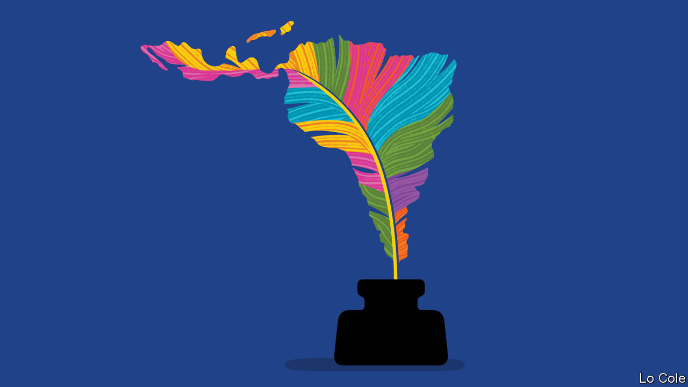

###### Bello

# Latin America is in a mess. But it still has strengths 

##### In his final column, Bello says adiós in troubled times 

 

> Dec 8th 2022 

In his mind’s eye as he writes, Bello can see the limitless expanse of the Pacific at Lima, the tiny fishing boats that plug across the bay in search of  and , the pelicans skimming inches above the waves, the vultures circling on the clifftop. He can glimpse, too, the sinuous roads that snake beside heartstopping abysses as they endeavour to connect towns in the Andes, landslides permitting. He can feel the clammy heat of the dark floor of the Amazon rainforest and the arid scrub of the . He can see the flat emptiness of the Argentine pampas with their solitary  trees, and the soaring volcanoes of Mexico and Central America. Latin America has always been, first and foremost, about geography—stunning, bountiful, impossible and treacherous.

The books that offer a single explanation—dependency, colonialism, Iberian culture or institutions—of Latin America’s relative failure are invariably wrong. Its difficulties stem from the interplay of all these factors and more. But geography, often ignored, is one, as Sebastián Mazucca, an Argentine political scientist, explained in a book published in 2021. It conspired against strong states that control their territory, obliging governments to strike pacts with local potentates at the expense of the rule of law and impartial administration.

Latin America’s rich endowment of natural resources has powered booms and busts, attracted covetous foreigners and provided the broth for the red meat of populism—a blame game about why people are poor if the earth is so rich. Another geographical factor, remoteness from the main centres of the world economy, has hurt trade and investment.

When  almost nine years ago Latin America was advancing. Poverty was falling steadily and so was (still wide) income inequality. The lower-middle classes were expanding and democracy seemed to be putting down roots. 

But this progress was flattered by a commodity boom. It soon waned. Over these past nine years the region has seen no growth in GDP per person. Investment has fallen, productivity languishes and poverty has risen again. . Political instability is increasing while seemingly immovable dictators rule Venezuela, Nicaragua and now El Salvador. Organised crime has extended its bloody tentacles, from Mexico to Chile and Paraguay.

Take a longer view, and not everything is as gloomy. Your columnist began to live in Latin America exactly 40 years ago and has done so for almost half of the period since then. Over these decades the region’s societies have in some ways become more egalitarian. Nowhere else in the developing world is the idea of human rights now so widely shared. 

Culturally Latin America thrives. The world is swaying its hips to Latin music. Latin American literature has moved into the mainstream, led by a cohort of young writers, many of them women. Latin American food, from  to Mexican , has carved its way onto menus around the word.

The region is more resilient than headline-writers allow. Socially that owes much to the strength of family networks and to the informal economy, although this is a drag on productivity. Macroeconomically the reforms of the 1980s and 1990s produced lasting benefits. Inflation-targeting and independent central banks have proved their worth. The region has bounced back from the pandemic slump much more quickly than, for example, Europe, even if social scars remain. 

As always, the prospects are tantalising, shimmering like the mirages on the salt flats of the Bolivian Altiplano. Latin America, so vulnerable to natural disasters, will be one of the main theatres in the battle against climate change. It is set to be a key supplier for the green economy, with two-thirds of the world’s lithium reserves and 40% of those of copper. It is an abundant source of food and fresh water. Nearshoring of supply chains offers plenty of opportunities. Some of geography’s obstacles could now be overcome, digitally. And those imposing landscapes form identities and attract tourists. 

Despite everything, Latin America remains the developing region where democracy is most widespread. Missing still are the virtues that geography has hindered and that Andrés Bello stood for: the rule of law, better public education, openness and regional co-operation. That is where the battle lies. With a heavier heart than when he picked it up, Bello is replacing his pen in its inkwell. 


