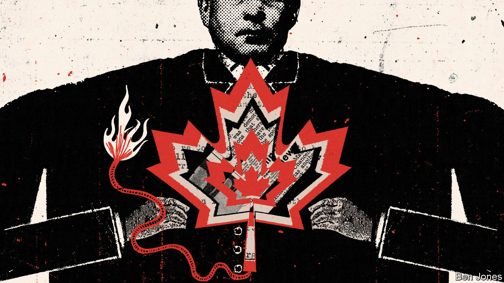

###### Fights over citizens’ rights

# The ticking bomb under Canada’s constitution 

##### The obscure-sounding “notwithstanding clause” is actually rather dangerous 

 

> Dec 8th 2022 

In November Doug Ford, the premier of Ontario, Canada’s most populous province, got into a brawl. The trade union representing 55,000 janitors, teachers’ assistants and other support staff in schools wanted an above-inflation pay rise of 11.7%. Mr Ford’s government passed a law to impose a settlement of just 2.5% on the provincial government’s lowest-paid workers. Anyone who walked off the job would be fined C$4,000 ($3,000) a day. 

To make sure he got his way Mr Ford resorted to constitutional hardball. The imposed contract looked like a violation of workers’ rights to bargain collectively, which is protected by the constitutional right to freedom of association. That opened it to legal challenge. In response Mr Ford’s law invoked the constitution’s “notwithstanding clause”, which allows Canada’s legislatures to override basic rights for up to five years (and to keep renewing the measure).

After thousands of workers took to the streets and unions threatened the province with a general strike, Mr Ford backed down. But his attempt to use the “notwithstanding clause”—Section 33 of Canada’s Charter of Rights and Freedoms—set off shock waves that are still reverberating. The charter “cannot become a suggestion”, thundered Justin Trudeau, the prime minister. Yet the clause invites norm-bending politicians to make it just that.

Canada’s bill of rights was adopted in 1982 under the government of Mr Trudeau’s father, Pierre, as part of the “patriation” of Canada’s constitution from Britain, the final step in claiming its independence. Fearing that a written charter would empower judges at their expense, provincial premiers demanded Section 33 as a way of preserving politicians’ autonomy. Constitutional scholars see it as a way of reconciling the principle of parliamentary sovereignty, inherited from Britain, with the introduction of a written charter.

Under Section 33 federal, provincial and territorial parliaments may suspend such rights as freedom of religion and speech, as well as protection from torture and unreasonable searches and seizures (but not the right to vote), if they specify what right they’re overriding. A prime minister or premier with enough votes in the legislature could use it to muzzle the press, subject people to arbitrary arrest or shut down houses of worship. Brian Mulroney, prime minister from 1984 to 1993, said that Section 33 meant that the charter was “not worth the paper it is written on”. No other country has such a constitutional get-out clause in Canada’s expansive form.

Not withstanding?

During Section 33’s 40-year life Canada has not become a police state. Governments, thinking that voters would deem its use to be a nuclear option, have invoked it rarely. The main exception has been that of French-speaking Quebec. In 1988, after Canada’s Supreme Court struck down Quebec’s ban on non-French shop signs and public advertisements, the province used the clause to override the decision.

But lately the clause has been invoked more often. In 2019 Quebec’s conservative premier, François Legault, used Section 33 when enacting a law that bars public servants from wearing religious symbols, which seems to be aimed at hijab-wearing Muslims. He followed up this year with a law restricting the use of English in courts and public services. The law also authorises the Office québécois de la langue française, a sort of language-enforcement agency, to conduct searches without a warrant to ensure that businesses are using French in the workplace. That, too, came with the support of Section 33.

Mr Ford, a Progressive Conservative by party and a populist by inclination, was poised to use it in 2018 to reduce the number of seats on Toronto’s city council. (He didn’t have to; a court said he had the authority to do that.) In 2021 he invoked Section 33 for the first time in the province’s history, and for a worrying purpose: seemingly to boost his chances of re-election. Facing criticism for his government’s response to covid-19, he pushed through a law that tightened restrictions on campaign advertising by organisations other than political parties. The intent appears to have been to curb hostile adverts by trade unions. When a court struck down the law as unconstitutional Mr Ford enacted a new version, clad in Section 33 armour. That may have helped him win re-election in June this year, though it was probably not the decisive factor.

“For a long time it was thought that the political costs of invoking Section 33 would always be really big,” says Hoi Kong at the University of British Columbia. “Governments are now testing that.” Mr Ford has said that the clause is just another “tool”, and that a good premier will make full use of his “toolbox”.

It is not the only tool that politicians have lately used to push their powers to the limit. In February Mr Trudeau, of the centre-left Liberal Party, invoked (for the first time in the law’s 34-year history) , which empowers the federal government to override laws and seize authority from provincial and local governments. The emergency in question was the blockade of central Ottawa, the capital, by a “freedom convoy” of truckers opposed to vaccine mandates and by thousands of sympathisers. Many Canadians thought Mr Trudeau was abusing his power by using the act to disperse a protest that was illegal but no threat to the state. He ended the order after nine days; in November he testified at the parliamentary review that by law must be held after the act is invoked. 

And on November 29th Alberta, a western province often at odds with the federal administration, introduced a bill that would authorise its Conservative government to refuse to enforce federal laws if the legislature finds that they are unconstitutional or cause “harm to Albertans”. The first draft of the bill allowed the cabinet to amend provincial laws unilaterally, but this clause is likely to be removed.

All this alarms civil libertarians. Robert Leckey, dean of the law school at McGill University in Montreal, worries about the “creeping populism” of Mr Ford and Mr Legault. What makes Mr Legault’s use of Section 33 especially worrying is that he invoked it pre-emptively, suspecting that courts would rule against him otherwise. 

Canada has yet to , but it may have weaker constitutional defences than the United States if such a person appears. Section 33 “creates a vulnerability to the democratic backsliding that is occurring elsewhere”, says Peter Biro, founder of a group that lobbies for its repeal. To many Canadians, the freedom convoy was a sign that populism could move north of the border. It had the support of a significant minority, and cash and encouragement from Trumpist Americans. (Right-wingers claim that the real danger to personal liberties comes from Mr Trudeau, who they say has the freedom-trampling instincts of the left.) 

The repeal that Mr Biro wants is unlikely. It would require the approval of seven of Canada’s ten provinces, representing at least half of the population. A more realistic possibility is that Canada’s Supreme Court will put in place “guard-rails”, which would bar governments from invoking Section 33 pre-emptively. Civil libertarians are hoping that when the court eventually considers a challenge to Quebec’s religious-symbols law it will ban future pre-emptive uses, though it is unlikely to strike down the law itself. That might lessen, but would not eliminate, the danger that a political malefactor could use Section 33 to crush Canadians’ rights. For decades they largely ignored the bomb lodged in their constitution. Now they must anxiously hope that no one sets it off. ■

