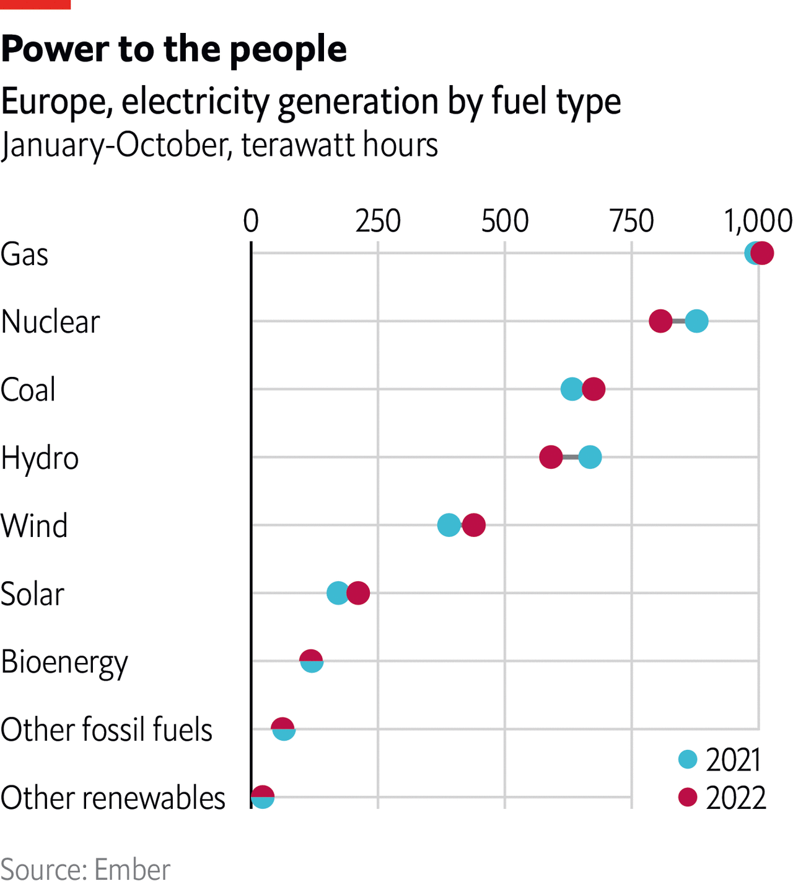

###### The Economist explains

# Can hydropower help ease Europe’s energy crisis? 

##### After a parching summer, reservoirs were depleted—but the outlook for 2023 is more promising 

 

> Dec 5th 2022 

The Loire, France’s longest river, was an apocalyptic sight this summer. Parts of the river network had dried up completely by mid-August; the rest was reduced to a trickle. It had happened before but this year the timing was particularly bad. Energy prices had soared in the wake of Russia’s invasion of Ukraine. Nuclear-power production in France was hampered by maintenance, repairs and low water levels in rivers used for cooling. And in mid-August hydro plants powered by France’s rivers generated just half the electricity they would normally produce in August (based on an average of the three years before). That pattern played out across much of the continent. In 2023 gas prices will almost certainly stay high and Europe’s energy crisis will continue. Could hydropower ease the problem next year?

There are three types of hydropower plants. Run-of-river plants use the flow of water to drive generators. They normally provide a constant flow of energy but because they do not store water for long periods they can only provide power broadly in line with the flow of the river. The other two types of hydropower plant are more flexible. Reservoirs tucked into hillsides provide storage that can be drawn upon when needed. And pumped-storage plants are reservoirs that act as rechargeable water batteries: they push water up to a reservoir when power is cheap, usually during the night, and let it down when demand is high. Reservoirs and pumped storage can thus help to reduce peak prices by replacing gas-fired power plants when the need arises.

 


Europe’s hydro plants generated 712TWh in 2021, roughly 16% of total electricity generation (see first chart). But so far in 2022, hydropower generation has fallen short by more than 112TWh to date, compared with the same period last year, as droughts hit the continent. Over the past 12 months rainfall has been low in large parts of France, Spain, Italy and southern Norway. In Italy the shortfall has been particularly severe. Run-of-river plants did not have much water to play with, and reservoirs were not filled to their usual levels (see second and third charts). 

 


But it is not just the weather that has restricted power generation in 2022. Reservoirs began the year with lower levels than usual. When deciding how much water to release, storage hydropower plants take current and future electricity prices into account. In the second half of 2021, electricity prices started to rise sharply across the continent as gas prices spiked. That may have prompted plant operators to generate more electricity to make a profit, draining reservoirs below their normal level and leaving less potential to generate power over the course of 2022. 

 


Thankfully, the outlook for 2023 is better. The last couple of weeks have been uncomfortably wet. That has helped to refill reservoirs in most countries, although Italy, Spain and Portugal still have some way to go. The three-month forecast for Europe predicts a slightly warmer and only slightly drier winter than usual. That should help too. And policymakers have also responded. Switzerland for example has bought parts of the water in reservoirs so that it has a backup power source in case gas is in short supply over winter. Portugal ordered 15 dams to suspend electricity production to refill reservoirs; recent rains have allowed some of them to restart. Even the Loire and its tributaries are slowly regaining their typical water levels, to help generate as much electricity as possible in 2023. ■

