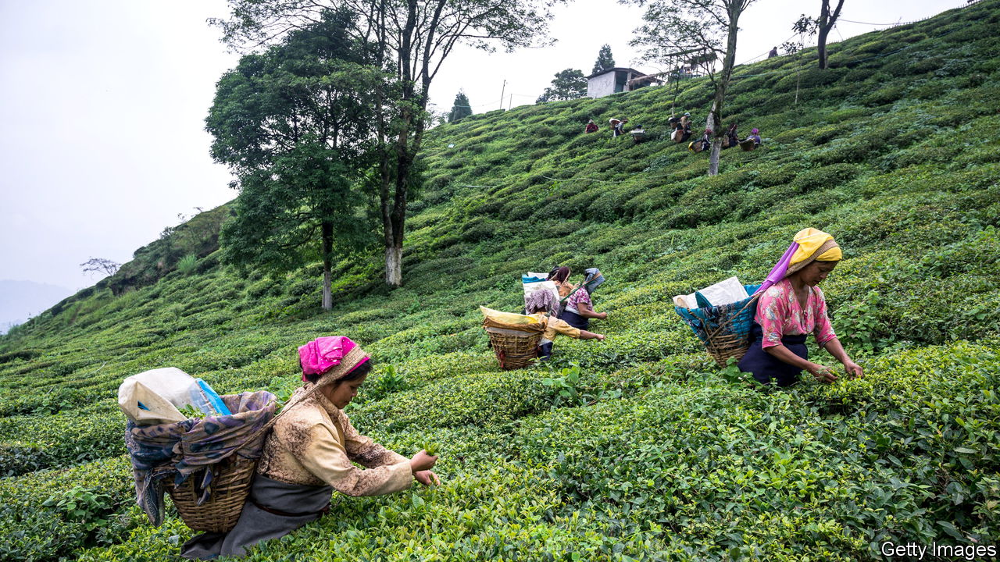

###### The Economist explains

# Why Darjeeling tea may face extinction 

##### Knockoff teas from Nepal are stealing global demand and climate change is shrinking supply 

 

> Dec 6th 2022 

On December 7th tea estates in Darjeeling, a hill station in West Bengal straddling India’s border with Nepal, will carry out the final full-moon harvest of the year. Illuminated by fire-lit torches and moonlight, pickers will collect leaves and buds for a special white tea. They believe that the planetary alignment during a full moon ensures a perfect harvest. Darjeeling, known as “the champagne of teas” and beloved of the late Queen Elizabeth II, encompasses black, green and white teas, all picked from the same bushes. Black teas are most common. The fine white tea picked by moonlight can fetch up to $2,000 per kg from connoisseurs in Europe and East Asia. 

The estates were created in the 19th century by the British Raj, which was desperate to reduce its dependence on Chinese tea. They were sold to Indian families after independence. Now tea growers in the region worry that trouble is brewing. Almost half of Darjeeling’s tea gardens face bankruptcy, and the rest are haemorrhaging cash. The Tea Board of India, a regulatory body, requested a $120m rescue package for the industry from the government in November, highlighting the acute crisis facing Darjeeling tea. “We don’t know if our estate will survive another three to five years,” says Sparsh Agarwal, the owner of the Selim Hill Tea Garden. How have things got so bad?

Growers face two big problems. First, cheaper teas from Nepal have lured away customers. The state of West Bengal enforces stricter worker protections and minimum wages for tea pickers than Nepal does. As a result, production costs are considerably higher. Since 2017, when region-wide strikes in Darjeeling caused tea production to plummet briefly, inferior tea from Nepal has been illegally sold as Darjeeling at rock-bottom prices, according to an Indian parliamentary report. Some is smuggled into India and relabelled or mixed with genuine Darjeeling; yet more is exported directly from Nepal, but labelled as an Indian product. Around 20m kg of Darjeeling-labelled tea is sold each year; genuine Darjeeling estates produce less than half that much.

Darjeeling tea is supposed to be protected by a geographic indication tag: it must be grown in the Darjeeling and Kalimpong districts of West Bengal at an elevation of between 600 and 2000 metres. Only 87 of India’s tea gardens (which number more than 10,000) are licensed to produce the stuff. The Indian government wants to step up checks at the porous Nepalese border to ensure that Darjeeling-labelled packages actually contain pure Darjeeling tea. But geopolitics complicates enforcement. Officials in New Delhi, India’s capital, do not want to violate a free-trade agreement with Nepal, says an official from the Tea Board of India. That deal protects the flow of Nepalese teas into India. It also helps India keep Nepal under its influence, amid intense .

The second problem is that climate change is  from tea harvests. Over the past two decades the annual harvest season has shortened by about a month, which means fewer leaves to pluck and sell. In Kurseong, a district in Darjeeling, average temperatures have risen by 0.5°C and rainfall has dropped by 152cm in the same period, according to a study by the Darjeeling Tea Research &amp; Development Centre. Freak weather events, including summer-time hailstorms and , have made yields still more unpredictable. The chances of crop-killing pest infestations also goes up with rising temperatures. The average yield per hectare in Darjeeling is about 350kg today, compared with 542kg in 2000, according to the Indian Tea Association, an industry group.

Tea growers are desperate for a lifeline. Mr Agrawal worries that the government isn’t interested in saving the industry. “They would rather let real-estate and hospitality investors convert our estates,” he laments. The loss of Darjeeling tea would end a way of life for 55,000 growers and pickers. Tea enthusiasts may want to stock up. ■

