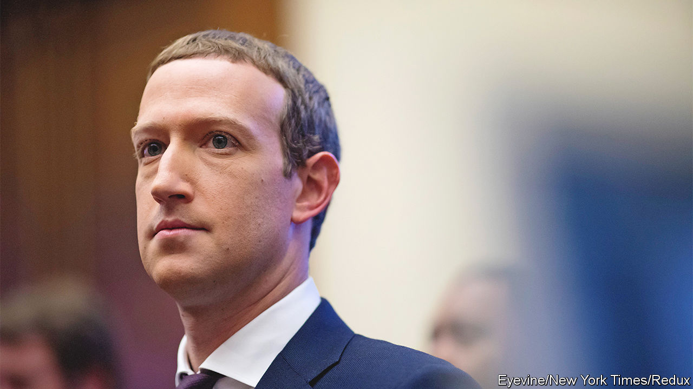

###### The world this week

# Business 

#####  

 

> Dec 8th 2022 

 oversight board recommended that the company review its procedures on handling content from celebrities and politicians, following revelations that harmful content that is posted by the rich and famous is often allowed to stay online, contravening the rules for other users. The board told Facebook’s owner that it “should prioritise expression that is important for human rights”. Separately,  threatened to remove news content from its American site if legislation demands that it pay news organisations for the use of their material. Facebook prefers to make its own deals. 

Foxconn on the run

 reported a sharp drop in revenue for November, which is normally a boom time for the electronics contract manufacturer. It noted the impact that covid-19 restrictions have had on its hub in Zhengzhou, where workers have clashed with security guards over their conditions and walked out after being told they would be locked in.

In what it described as one of the largest-ever foreign direct investments in the United States,  announced that it would build a second chip factory in Arizona, taking the amount it is spending on both plants to $40bn. TSMC makes Apple’s semiconductors for the iPhone and other devices, which can now “be proudly stamped Made in America”, said Tim Cook, Apple’s chief executive. 

As it accelerated plans to guarantee the supply chain for its chips, Apple’s ambitions to build an  went into reverse. The company has reportedly pushed back the launch date to 2026, and has encountered technical problems that mean the car will only be able to handle self-driving tasks on motorways. 

The International Energy Agency said that the expansion of  will happen at a much faster rate over the next five years than was thought likely a year ago, and that Russia’s war in Ukraine marks a “turning point” for the transition to clean energy in Europe. It forecast that renewables as a whole will overtake coal in 2025 to become the biggest source of the world’s electricity generation. Half of the new renewable capacity will be in China. 

The market for renewables is growing, but so is demand for coal as countries look for short-term fixes to tackle an energy crunch. Britain has approved the first deep  in 30 years, to supply coking coal to steelmakers. Germany recently boosted its coal-power capacity to secure energy supply over the winter. 

 agreed to keep oil output levels steady, but said it was ready to take immediate action to “address market developments” should they arise. The meeting was held the day before a price cap and embargo on Russian oil came into force and was the last scheduled full gathering of the oil cartel until June next year. 

The global  should return to profitability in 2023, according to the International Air Transport Association. It reckons total net profits will come in around $5bn, still some way below the $26bn racked up in 2019. Net losses this year will be some $7bn, a big improvement on the $42bn lost by airlines in 2021 and the $138bn in 2020. 

An activist investment fund with a small stake in  has called for Larry Fink to step down as chief executive, over his “contradictions” on environmental, social and governance investments. BlackRock is a pioneer of ESG policy in the financial industry, but has been accused of greenwashing for withholding support from many ESG shareholder proposals. 

, one of Elon Musk’s ventures, is being investigated by the American government for violating animal welfare, according to reports. The secretive firm uses monkeys, pigs and sheep in the development of its brain-computer interfaces. Many are killed, but employees are concerned that some testing is rushed, leading to unnecessary suffering for the animals. 

Bankman-Fried to be grilled

, the founder of FTX, said he will testify to Congress about the collapse of his crypto exchange, but that he hadn’t finished reviewing the events that led to its bankruptcy and might not be ready to attend a hearing on December 13th. The crypto industry continues to feel the after-effects of FTX’s collapse. Orthogonal Trading, a crypto hedge fund, was the latest to default on a loan.

Microsoft’s president, Brad Smith, said his company had made an offer to Sony to allow on PlayStation consoles if Microsoft wins approval to take over Activision Blizzard, which owns the game series. Microsoft also signed a deal with Nintendo to allow the game on its consoles. Mr Smith noted that Sony is the “loudest objector” to its takeover: “It’s as excited about this deal as Blockbuster was about the rise of Netflix.” 

