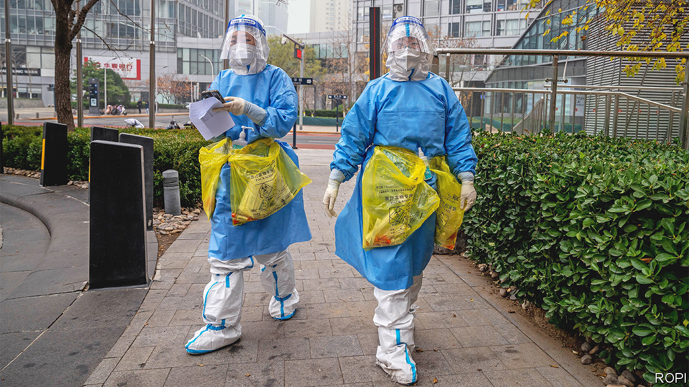
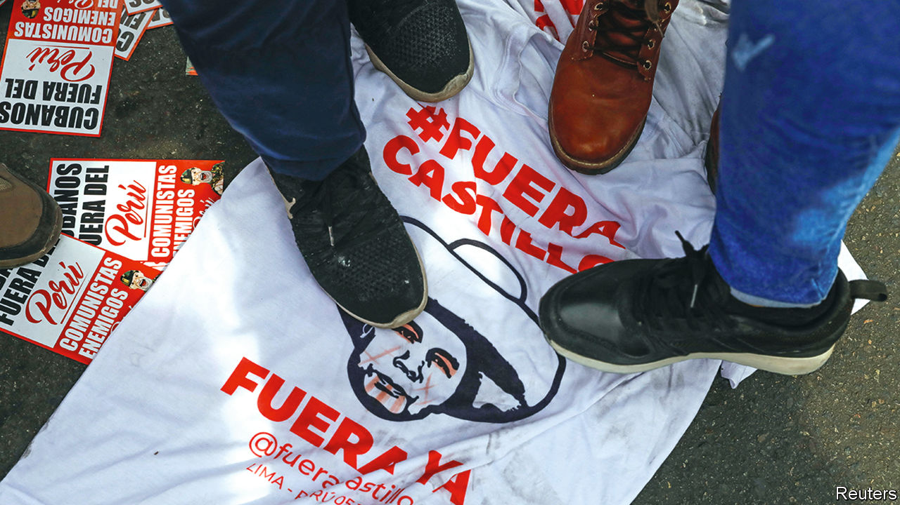

###### The world this week

# Politics 

#####  

 

> Dec 8th 2022 

 began  its “zero-covid” policy, which was struggling to contain the Omicron variant and had become a source of widespread frustration. The state will no longer force people with mild cases to enter government-run quarantine centres. They can now isolate at home. It also lifted many testing requirements and said lockdowns should be more targeted. The changes come as the official number of new cases is falling. That is probably because fewer people are being tested. Anecdotal evidence suggests that the Omicron variant is spreading.

Unsafe sex

 legislature passed a sweeping new criminal code that , making it punishable by a stiff prison sentence. President Joko Widodo has not signed the new code into law, but has suggested he will. It applies to foreigners as well as locals. It also makes it illegal for Indonesians to leave their religion or persuade anyone to be a non-believer.

The Taliban regime in  carried out its first public execution since returning to power last year. A man was shot for murder (by the victim’s father) in front of a stadium crowd that included the government’s justice minister. Judges have recently been ordered to adhere closely to sharia law. Human-rights groups fear a return to the public mass executions and floggings of the 1990s. 

As Russia pounded  with more missiles, aiming to knock out critical infrastructure as winter deepens, Ukraine struck back. Two large explosions were reported at a pair of Russian air bases several hundred kilometres from the border. It is thought that the attacks, which damaged aircraft, were carried out by Ukrainian drones, but it is unclear why Russia had been unable to stop them.

Volodymyr Zelensky, Ukraine’s president, said that the price cap set by the G7 and EU on  was too high to inflict real damage on the Russian economy and called for tougher action. The allies have imposed a cap of $60 a barrel, about the same as the price paid anyway for oil pumped from the Urals. 

 media regulator ordered TV Rain, an independent Russian channel that operates from Latvia, to shut down. TV Rain was fined for depicting Crimea as part of Russia and criticised for being too sympathetic to Russian conscript troops. It says it is against the war. Most of its viewers watch it on YouTube anyway, where it will continue to operate. 

Police in  arrested around 25 people who are suspected of planning to carry out an armed coup and replace the government with a council headed by a minor aristocrat. Far-right extremism has become a significant problem in Germany in recent years. 

 prime minister-designate, Binyamin Netanyahu, clinched the support of enough parties in the Knesset to form a government. The emerging coalition is likely to include two far-right parties, including one led by Itamar Ben-Gvir, who may get a newly created post as national security minister.

China’s leader, Xi Jinping, arrived in  to meet the leaders of the kingdom and a string of bigwigs from across the Arab world.  that China, which is investing heavily in the Gulf, is seeking to displace it as the region’s key partner. 

Meanwhile, an American federal court dismissed a lawsuit against Saudi Arabia’s crown prince and de facto ruler, , who had been accused of ordering the murder of a Saudi dissident journalist, Jamal Khashoggi, in 2018. It said he had immunity as a head of government, a decision that came as a relief to the American administration. 

 military rulers reached a deal with pro-democracy leaders to establish a civilian-led government that will manage a transition to democracy. A previous power-sharing agreement struck after a coup in 2019 fell apart after a second putsch last year.

 president, Cyril Ramaphosa, asked the country’s highest court to  of a panel appointed by Parliament, which alleged enough evidence of misconduct to consider impeaching him. The panel was investigating the source of at least $580,000 that had been hidden in, and then stolen from, his sofa.

Ndambi Guebuza, the son of  former president, Armando Guebuza, was sentenced to 12 years in prison over a $2.2bn debt-and-corruption scandal.

 


Pedro Castillo was removed from office as president of  by Congress, just hours after he tried to . The 16-month term of Mr Castillo, a leftist, was marked by chaotic government and corruption. Dina Boluarte, the vice-president, was sworn in as president. She referred to her former boss’s attempt to dissolve Congress as a coup attempt, though the army did not support him. Mr Castillo was nevertheless arrested. 

, the vice-president of , was found guilty of corruption and sentenced to six years in jail. Ms Fernández denies that she steered public contracts to a family friend. She called the judiciary “a mafia” and dared officials to arrest her. She is unlikely to go to prison; the case will probably end up in the Supreme Court.

 president, Andrés Manuel López Obrador, came a step closer to realising his pet project when the lower house of Congress approved proposals to slim down the country’s electoral body. Opponents say the changes, which will probably be approved by the Senate, will weaken democracy. 

Raphael Warnock held on to a Senate seat in  for the Democrats in a run-off election. His victory means the party will have a 51-49 advantage in the Senate when Congress convenes in January. 

Happy Christmas!

During December  is expected to lose the most days to strikes in a month since 1989. Railway workers are walking out for several days; an overtime ban will be in force over the holiday period. Nurses, postal workers, ambulance drivers and airport staff are among those downing tools. The disruption may spread further, as the cost-of-living crisis bites and more unions reject below-inflation pay deals. 

It is not just Britain that is experiencing a winter of discontent. Staff at the  rejected a pay offer that fell well short of inflation and are considering industrial action. The ECB is at least consistent. It has argued in favour of pay restraint to keep inflation subdued. 

