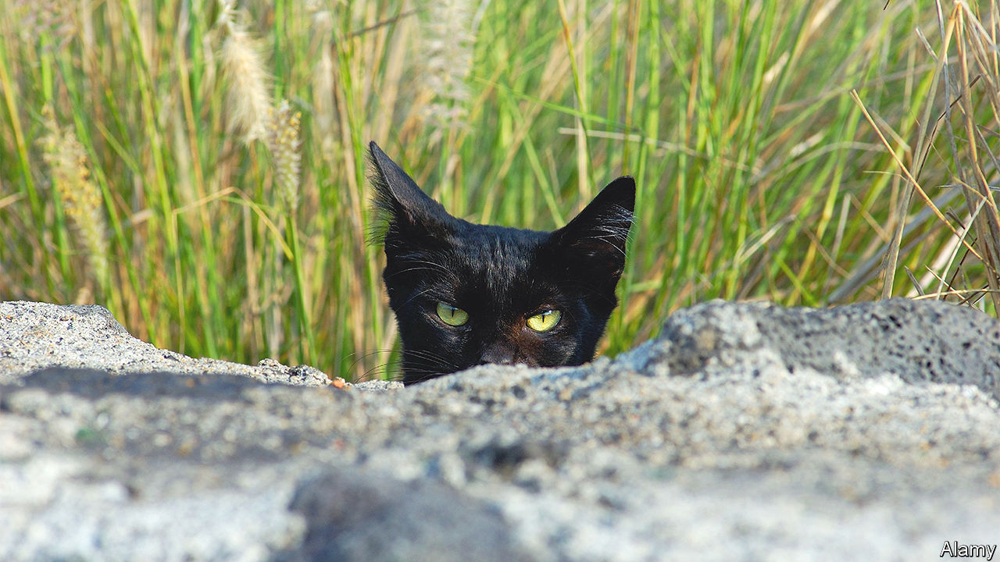

###### Cat got your tern

# Feral house cats have invaded Hawaii 

##### They are killing the state’s native species. Some Hawaiians want to cull them instead 

 

> Dec 8th 2022 

WHEN MARK TWAIN first set eyes on Honolulu in 1866, he observed that the trees were so dense that they blocked the sunlight, lava from past volcanic eruptions covered the corals—and cats were everywhere. In a dispatch for the , Twain reported seeing “tame cats, wild cats, singed cats, individual cats, groups of cats, platoons of cats, companies of cats, regiments of cats, armies of cats, multitudes of cats, millions of cats, and all of them sleek, fat, lazy, and sound asleep”. 

Nearly 160 years later, however, the descendants of the cats that so delighted Twain are now widely seen as a menace to the islands. The feral cat, explains the Hawaii Invasive Species Council (HISC), has become one of the state’s most “devastating” predators. 

Cats were first brought to Hawaii aboard European colonists’ ships, where they preyed on rats and mice. As their number in their new home grew during the 19th century, birds started to disappear. At least 30 types of native bird became more scarce or went extinct between 1870 and 1930 as they were exposed to their new whiskered foes, according to the US Geological Survey. 

Birds are not the only casualty of Hawaii’s feline invasion. Toxoplasmosis is a disease caused by a parasite that reproduces in the digestive systems of cats, and then contaminates soil and water through their faeces. A new study determined that two spinner dolphins found stranded off the Hawaiian coast died of toxoplasmosis. From these findings the authors suggest that at least 60 spinner dolphins have died of the parasite over the past 30 years. 

The overwhelming majority of the whales and dolphins included in the study were killed by other means. But “if they do become infected, this study suggests that they die and they die quickly”, says Kristi West, one of the authors and director of the Health and Stranding Lab at the University of Hawaii. Hawaii’s endangered monk seals have also been killed by the bug. 

Feral cats are not just a problem for Hawaii. A study published in  suggests that, globally, they are responsible for the extinction of at least 14% of bird, mammal and reptile island species. Toxoplasmosis has also been found to kill sea otters along the California coast. 

What can be done? A bill that could have directed the HISC to cull cats using poisoned bait, as Australia has done, died in the state legislature earlier this year. Animal-lovers prefer to focus on capturing, neutering and releasing wild cats so that they have no kittens. But HISC contends that such programmes do not actually help curtail cat numbers. Ms West suggests that people are too quick to blame the cats, when there is another culprit. “People have to stop abandoning these poor cats,” she says. “It’s not really a cat problem. It’s a human problem.”■


