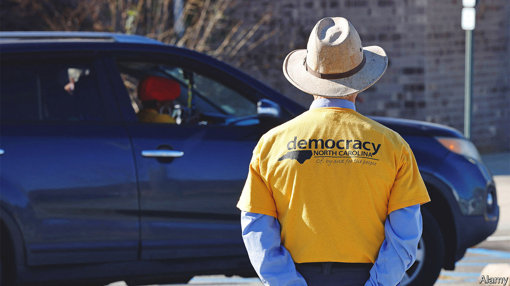

###### A SCOTUS double feature

# The Supreme Court searches for a middle way 

##### Two cases address free speech and state legislatures’ power over elections 

 

> Dec 8th 2022 

HAVING CLEANED away abortion rights, clean-air regulations, the church-state wall and many gun restrictions last June, the justices have taken up two more aspects of society that may need rejigging.

December 5th featured a clash between gay rights and free speech, an issue that has been simmering since the court recognised same-sex marriage as a constitutional right seven years ago.  poses the seemingly premature question of whether Lorie Smith, a web designer, has a First Amendment right to refuse to create wedding websites for gay couples. Ms Smith has yet to actually make any such websites. She wants assurances from the Supreme Court that if she steps into the e-nuptials market, Colorado—despite its law requiring shops to keep their doors open to customers without regard to their sexual orientation—will respect her belief opposing gay marriage and allow her to work with straight couples only. 

Both sides agree that Ms Smith cannot turn away clients based on their identity. They disagree as to whether refusing to make gay-wedding websites amounts to what Justice Neil Gorsuch called an objection to a “who”. No, Ms Smith’s conviction concerns a “what”, insisted Kristen Waggoner, her lawyer. Her client “believes opposite-sex marriage honours scripture and same-sex marriage contradicts it”. Justice Amy Coney Barrett built on this idea by leading Ms Waggoner to say that Ms Smith would refuse to make wedding websites for some straight couples, too—such as those who met by cheating on their former spouses. 

But Ms Waggoner was flat-footed when faced with queries from the liberal justices. Would a win for Ms Smith (Justice Ketanji Brown Jackson wondered) mean that an old-fashioned mall Santa could opt to pose for photos with white children only? Can vendors (Justice Sonia Sotomayor asked) turn down work at a wedding of people with disabilities because they don’t approve of such marriages?

There were no good answers to these questions. But the two lawyers arguing against Ms Smith faced a rough go, too. Shaking his head, Justice Alito noted Colorado’s acknowledgment that Ms Smith could include “a denunciation of same-sex marriage” in every wedding website she creates, as long as she sells them to gay and straight customers alike. Doesn’t that make the state’s position “kind of a sliver of an argument” that may not make “any difference in the real world as a practical matter?” After all, how many gay couples would patronise a graphic designer who insists on such messages? 

The six conservatives seemed to think that a win for Ms Smith would save other businesses from, in Justice Alito’s words, “espous[ing] things they loathe”. But they had only a wisp of an argument to stem the slippery slope concern from the other side. Why wouldn’t allowing Ms Smith to stay away from gay weddings unleash discrimination based on race, religion or disability? Justice Alito suggested that those kinds of animosity have nothing in common with the “honourable” views of religious people who oppose same-sex marriage. 

A more complex lineup seemed to emerge on December 7th in , a case that could re-engineer the way federal elections are conducted. Moore arises out of a dispute over congressional maps. A year ago in North Carolina, which is closely split between Republican and Democratic voters, the state’s Republican-held legislature drew a congressional map giving Republicans a virtual lock on ten of the state’s 14 House seats. When the state’s supreme court found this inconsistent with North Carolina’s constitution, it replaced the map with fairer lines drawn by experts. Republican legislators balked at this, running to the federal Supreme Court to complain that North Carolina’s high court was not authorised to question a map that the legislature had duly adopted.

Speaking in favour of the “independent state legislature” theory that animated North Carolina Republicans’ appeal, lawyer David Thompson pointed to Article I of the constitution specifying that the “times, places and manner of holding elections” for Congress “shall be prescribed in each state by the legislature thereof”. This means no state entity may constrain a state legislature performing the “federal function” of election regulation, he said.

Scepticism came quickly from liberal justices. Justice Jackson noted that state legislatures are creatures of state constitutions and must, logically, be bound by their terms. Justice Sotomayor pointed to the 10th Amendment, which affords powers to states that federal courts must respect. Emphasising the broader stakes, Justice Kagan warned that granting unfettered authority to state legislatures would discard “the normal checks and balances” at “exactly the time when they are needed most”. Politicians have incentives to “prevent voters from having true access and true opportunity to engage in the political process”, she said, and unchecked legislatures will tend to indulge those tendencies. 

The three liberals were offset by Justices Alito, Gorsuch and Clarence Thomas who warmly received the North Carolina lawmakers’ claims. A third troika—Chief Justice John Roberts and Justices Barrett and Brett Kavanaugh—may be the decisive bloc. None jumped to praise the most extreme aspects of the legislators’ argument but all groped for a third way whereby neither state legislatures nor state courts are fully autonomous. For Carolyn Shapiro, a professor at Chicago-Kent law school who has testified to Congress on the theory in , the centre of the court is “trying to find a balance”.■


