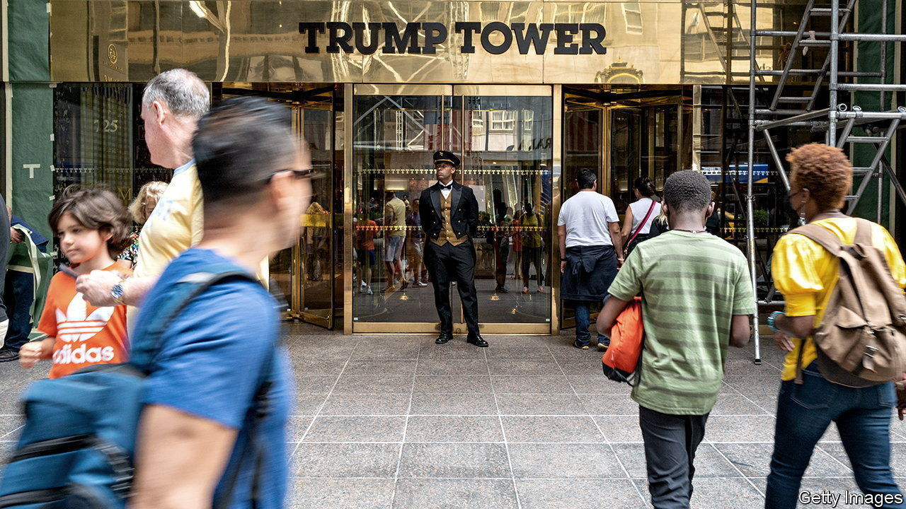

###### The elephant not in the room

# Two Trump Organisation companies are found guilty of tax fraud 

##### Donald Trump himself was not on trial, but is thought also to be under investigation 

 

> Dec 7th 2022 

Two mercedes-benz saloons, apartments, private-school tuition, furniture for a Florida home, flat-screen televisions, carpet and cheques stuffed into Christmas card envelopes. These untaxed, off-the-book perks were among the items paid by two entities of the Trump Organisation, Donald Trump’s real-estate company, to a handful of its top executives, including Allen Weisselberg, the company’s former chief financial officer who was Mr Trump’s long-serving lieutenant. After a long criminal trial, on December 6th a New York jury swiftly found Trump Corporation and Trump Payroll Corporation guilty of a host of crimes, including conspiracy, tax fraud and falsifying business records. 

There is no question that fraud was committed: Mr Weisselberg admitted as much in court. He said he received $1.76m in such perks. But “did Weisselberg do it for Weisselberg alone? Or did he intend at least some benefit for the corporation?” asked Joshua Steinglass, an assistant district attorney, during the closing statements.

Mr Weisselberg was the prosecution’s star witness. He pleaded guilty to tax fraud and will serve five months in jail. Before the trial, which was brought by Manhattan’s district attorney, he was granted leniency in exchange for testifying for the prosecution. During his summation Michael van der Veen, one of the defence lawyers (who also represented Mr Trump during his second impeachment trial), urged the jury to treat Mr Weisselberg’s testimony with scepticism because “the prosecution have him by the balls.”

The jury did not buy it. After less than two days of deliberation, they decided that the two Trump entities were guilty on all 17 charges. Sentencing will take place on January 13th. The maximum penalty the companies face is $1.6m, a paltry sum for them. But a criminal conviction could interfere with the firms’ ability to access finance. The companies intend to appeal against the decision. Mr Trump, meanwhile, is still said to be under investigation. 

Tax trials are rarely gripping. This one, which began in October after a three-year investigation, has been—notwithstanding pages of spreadsheets, excerpts from ledgers presented on two enormous screens in the courtroom and hours of testimony given by accountants. Mr Weisselberg testified that he knew he owed taxes on the perks and that his tax filings were false. He admitted that the scheme benefited both himself and the companies. But he also claimed the Trump family was not aware of his wrongdoing. He said “personal greed” had driven him to “betray” the family who had employed him for five decades. 

The jury did not believe that Mr Weisselberg was a “rogue” employee, as the defence portrayed him. They saw him, as the prosecution hoped they would, as a “high managerial agent” who committed crimes “in behalf of” the companies—expressly for their benefit—rather than merely “on behalf of” them. The scheme falsely reduced the size of their payrolls, meaning they paid less in payroll taxes.

Donald Bender, who managed the companies’ taxes for 35 years, as well as Mr Weisselberg’s personal accounts, said during his testimony that if he had known about the tax avoidance he “probably would have had a heart attack”. Mr Bender’s firm cut ties with the Trump Organisation earlier this year because the company’s statements could “no longer be relied upon”. Mr Trump blames Mr Bender for the mess. He wrote on his Truth Social platform last month, “The highly paid accounting firm should have routinely picked these things up—we relied on them. VERY UNFAIR!” Yet he does not seem to harbour ill-will towards Mr Weisselberg, who has remained loyal and is still drawing a high salary as a senior adviser. A birthday party was held at Trump Tower in Mr Weisselberg’s honour last summer, at around the same time he took the plea.

Throughout the trial the defence reminded jurors that Mr Trump and his family were not on trial and that they neither knew about nor benefited from the tax-avoidance scheme. During his closing statement Mr Steinglass pushed back. “This whole narrative that Donald Trump is blissfully ignorant is just not true,” he argued. It emerged during the trial that until Mr Trump became president, he had signed every company cheque over $2,500.

The defence objected to the prosecutors’ suggestion that Mr Trump sanctioned tax fraud, and the judge sided with them. After the jury had been excused they requested a mistrial—a move given short shrift by the judge. Mr Steinglass asked the jury to “put aside the elephant that’s not in the room”. This case was not about politics, he said, but about “just two corporations helping its executives cheat on their taxes”. But one of Mr Steinglass’s closing’s zingers must have resonated with the jury: “It is not that the folks at the Trump Organisation didn’t know what they were doing was illegal, it was that they didn’t care.” ■


