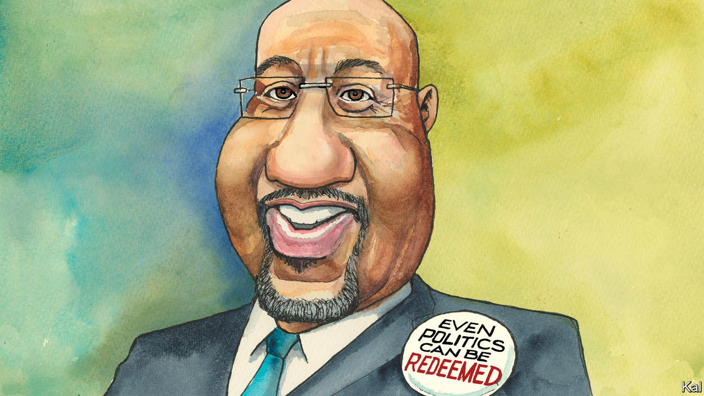

###### Lexington

# What Democrats—and Republicans—can learn from Raphael Warnock 

##### He is drawing on old sources to create a wiser politics 

 

> Dec 8th 2022 

Democrats are celebrating Senator Raphael Warnock’s victory in Georgia’s run-off election because, with 51 votes in the chamber, they will have an easier time confirming judges and other appointees. Republicans should be sighing with relief they will not spend six years dreading confounding disclosures about Mr Warnock’s opponent, Herschel Walker.

But the real reason to welcome this result is that Americans will get to learn what Mr Warnock might be capable of. Mr Walker was never going to be a leader of his party. Mr Warnock just might.

Mr Warnock likes to say that he is “not a senator who used to be a pastor” but “a pastor in the Senate”. He is a different sort of national politician than either party has produced in a long time, heir to a spiritual tradition at odds with the politics of this era. Loving your enemies was “pressingly hard”, Martin Luther King Junior acknowledged back when he was urging people to do so. Today, when Mr Warnock holds Mr King’s old pulpit in Atlanta, it is heretical, if not, among progressives, downright uncool. 

Mr Warnock is sometimes compared to Barack Obama, but that comparison does not penetrate far: they are both black male Democrats who speak eloquently about change. Mr Obama grew up in Hawaii and trained to be a lawyer. He is a Protestant and has sat in the pews of various denominations. 

Mr Warnock grew up in the pulpit in Savannah, Georgia. He was 11 when he preached his first sermon, “It’s Time I Be About My Father’s Business,” urging young people to do the work of faith and service. His earthly father was hauling junk cars during the week and preaching in a Pentecostal church on Sundays. By high school Mr Warnock was borrowing recordings of King’s sermons from the public library and practising King’s musical style. He began preaching at Baptist churches in Savannah and was drawn to their emphasis on fighting bigotry and poverty.

Mr Warnock trained in the theology of the black church, writing his dissertation on the tension between pursuing individuals’ salvation—the focus of his father’s church—and promoting worldly change. In “The Divided Mind of the Black Church”, which grew out of his dissertation, he concludes there is no “authentic black piety that is not connected to liberation” and “theology that is not lived is not theology at all”.

That is the foundation from which Mr Warnock approaches politics, and it places him at a different altitude from his colleagues. He likes to say that “democracy is the political enactment of a spiritual idea, the sacred worth of all human beings”; that “a vote is a kind of prayer for the world we desire”; that “legislation is a letter to our children.” “And if we ask ourselves what we want that letter to say,” he told rapt students at the Georgia Institute of Technology the day before the election, “we might actually get it right.” It all sounds better when he says it, with his elongated southern vowels and commanding enunciation. He generally speaks without notes, and he radiates an unusual calm. 

The only southern black Baptist minister to progress so far in politics, and a more nuanced point of comparison, is Jesse Jackson, who grew up in South Carolina, ran twice for president and served for a term in the 1990s as the “shadow senator”, or nonvoting representative, from Washington, DC. If Mr Jackson imported King’s message to electoral politics, Mr Warnock has updated Mr Jackson’s politics with lessons learned from Mr Obama’s success at not scaring white people. Mr Jackson could roar from the pulpit and podium; Mr Warnock’s style is no less passionate but more gentle. In his first run for Senate, in 2020, Mr Warnock, who is 53, appeared in campaign ads as a suburban dad, walking a leashed beagle down a tidy sidewalk, loaded poop bag in hand. (It is perhaps evidence of the politician in the pastor that the beagle, Alvin, was not his dog.)

Descending from one of America’s most successful radical movements puts Mr Warnock somewhat out of tune with today’s progressives. The question is whether he is a throwback or the forerunner of a more inclusive, patriotic and mature politics. There is no doubting his commitment to social justice. But though he shares progressives’ urgency he knows accomplishing change in America can be the struggle of generations. And while polls show many Democrats take a dim view of America, he speaks often of his love for it and his faith in its perfectibility. 

One imagination, indivisible

Many Democrats also give less scope than Mr Warnock to love. Hillary Clinton dismissed some supporters of Donald Trump as “deplorables”, and President Joe Biden has condemned “MAGA Republicans”. That is not Mr Warnock’s way. He was drawn to King, he told the students at the Georgia Tech rally, partly because “he used his faith not as a weapon to crush other people, but as a bridge to bring us together.”

Mr Warnock remains pastor at Ebenezer Baptist Church, King’s old church, and his first sermon after his last election came after Mr Trump’s followers stormed the Capitol on January 6th 2021. He chose to try to understand them. He preached that day about what he called the violence of poverty, “a kind of violence that crushes all the humanity of poor people”. Many who had embraced “the ideology of anger and old resentments and hatreds” suffered from such violence, “and somebody has convinced them that it’s somebody else’s fault.” 

It was the old strategy of divide and conquer, he continued, raising his voice and drawing out select words as he built toward his core message. “There’s a kind of of poverty, a failure to recognise that there is enough in God’s world for of God’s children,” he said. “There’s no of possibility. There is a of .” Now, for the fourth time in two years, Mr Warnock’s moral imagination has lofted him to victory in a Republican state in the heart of the old Confederacy. ■


 (Nov 17th)


