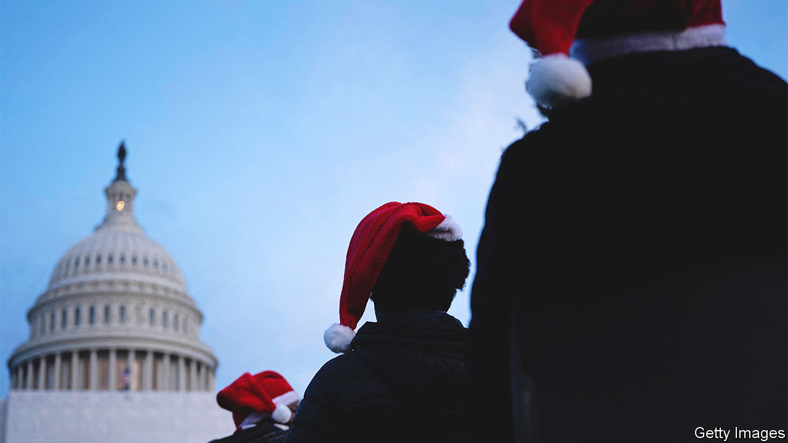

###### Last-minute bargains

# What to expect from Congress’s lame-duck session 

##### The legislature has set itself a long to-do list before it can decamp for the holidays 

 

> Dec 8th 2022 

Ray bradbury, an American science-fiction writer, has a short story called “The Last Night of the World” about a husband and wife on the last night of existence. It is an unforgettable anticlimax. Rather than satisfy any unfulfilled wishes, the couple choose to spend a quiet night in just like any other—even doing the washing-up before getting cosily to bed. Congress does the opposite. It is only when opportunities are closing, when awful consequences are nigh, that the frantic dash to do things begins.

Such things are often left to the last minute. But the results of the recent midterms add urgency to this lame-duck session. Democrats will soon face divided government, rather than the unified control they have enjoyed over the past two years. No one expects much bipartisan dealmaking if Kevin McCarthy becomes the new House speaker. Mr McCarthy’s incoming majority is so narrow that he may be bullied by the right of his caucus—indeed, he is already being pushed about—making him less able to cut deals. “Any Republican that’s out there trying to work with [Democrats] is wrong,” he told Fox News, the conservative broadcaster.

After a period of election-induced stasis, Congress has a daunting to-do list in the lame-duck session between the November election and the start of the next legislative session in early January. Money must be appropriated so that the government does not shut down on December 16th, when current funding lapses. Passage of this year’s iteration of the National Defence Authorisation Act, which sets the Pentagon’s budget and policy, is still pending. However bad the partisan bickering, Congress has managed to pass one every year since 1961. The little-noticed but important annual housekeeping exercise to renew or modify expiring tax provisions, cryptically referred to as “tax extenders”, still needs to be passed too.

Only a few trains will leave the station before the new regime arrives, says Molly Reynolds of the Brookings Institution. Most left-behind Democratic provisions and darling ideas—a much-needed reform of permitting rules for energy projects, a more generous child-tax credit, modest immigration reforms—are angling to hitch a ride on one of them. “We’re talking about a grab bag of miscellaneous pet priorities,” said a frustrated Mitch McConnell, the Republican leader in the Senate. “If Democrats wanted these controversial items so badly, they had two years to move them across the floor.”

To get anything through, Democrats will need Mr McConnell onside. They have not taken the necessary steps to pass legislation through a procedure known as reconciliation, which avoids a filibuster in the Senate and therefore requires only a simple majority. This means that at least ten Republican senators must sign on to the last-minute legislation, and many of them are balking at the extras that Democrats are trying to attach to must-pass legislation. So far, negotiations have been plodding. The option to punt decisions away remains in the form of a “continuing resolution”, which keeps the federal government running at previously approved levels. But hardly anyone is hopeful that the next Congress will be more generous. The Pentagon is incensed at the prospect of being funded through a continuing resolution, which would limit its funding to last year’s lower levels and also bar the armed forces from starting new weapons programmes.

As though it were another planet, legislative time is much slower than calendar time. Arcane rules, particularly in the Senate, mean that even when a deal is agreed to, ultimate passage can take days unless there is unanimous consent (and often there is not). There are many lengthy mandatory debate periods in which no debate takes place. For that reason, even pieces of legislation that command sizeable majorities are not making their way out. One example is a much-needed reform of the Electoral Count Act, a badly written law about how presidential elections are certified that Donald Trump tried to exploit to remain in office after he lost, which has the necessary Republican support to pass, but has had some trouble finding the right train to join itself to. “This business of 30 hours of debate when there’s no debate is just preposterous,” says Angus King, a senator from Maine who was one of the lead drafters of the bill. “No organisation in the world would run themselves that way.”

Other worthy efforts may fall by the wayside. Kyrsten Sinema, a Democratic senator from Arizona, struck a last-minute deal with Thom Tillis, a Republican senator from North Carolina, to trade a pathway to citizenship for 2m “Dreamers”, undocumented immigrants brought to America as children, for more border-security spending. Whether this can be turned into legislative text—and get enough Republicans on board—is unclear. Michael Bennet, a senator from Colorado, is pushing for a more generous child-tax credit, a policy which substantially reduced child poverty when it was in temporary effect in 2021. (Mr Bennet’s brother is ’s Lexington columnist; he had no involvement in this story.)

His idea is to trade it with Republicans for other tax breaks, such as one allowing businesses to deduct their research and development expenses. “I’ve been here, many times it feels like, in the middle of the night or two o’clock in the morning on Christmas Eve or New Year’s Eve when we have figured out how to pass tax extenders for the wealthiest people in the country,” says Mr Bennet. (One of those, an enhanced tax deduction for the hard-up owners of racehorses, recently expired.) “That makes it imperative that if we’re going to do these other extenders, we should do the child-tax credit as part of that.” 

He is not the only senator expecting to be snowed under with work while most Americans are dreaming about a snowy holiday. “I’ll be pleasantly surprised if we aren’t,” says Mr King. “I think we’re going to be here the week of Christmas.”■


