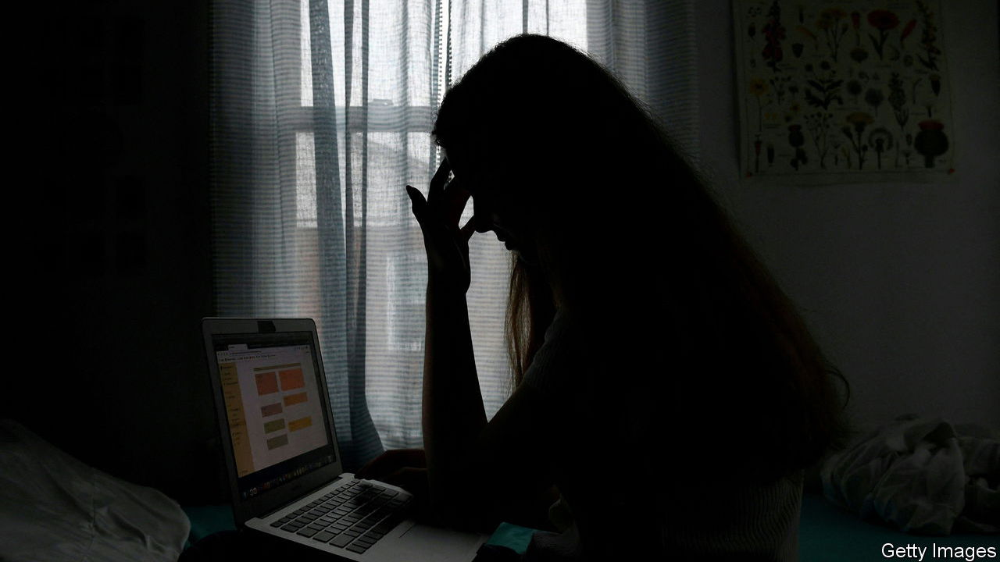
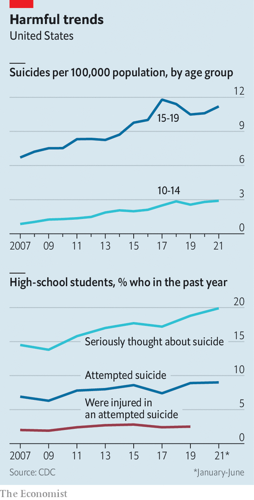

###### The weight of the world on their shoulders

# Young Americans increasingly end their own lives 

##### Suicide is now the second-biggest killer of ten- to 18-year-olds 

 

> Dec 3rd 2022 

In the 1950s, when the term “teenager” was first popularised, it brought to mind trouble. Spotty youths who engaged in risky behaviour outside the house—getting drunk, pregnant or into car crashes—were “the number one fear of American citizens”, wrote Bill Bryson in his memoir, “The Life and Times of the Thunderbolt Kid”. Today, the risks American teenagers face come from themselves. Boys are more likely to kill themselves than to be killed in a motor crash. Girls are nearly 50% more likely to injure themselves in a suicide attempt than to face an unplanned pregnancy.  is the second-biggest killer of ten- to 18-year-olds, after accidents.

 


The rise in youth suicide is part of a broader increase in  problems among the young. This preceded the pandemic, but was probably accelerated by it. In 2021 nearly half of American high-school students said that they had experienced persistent feelings of sadness and hopelessness in the past year, up from 26% in 2009; one in five seriously considered suicide, up from 14%; and 9% attempted to end their life, up from 6% (see chart). Although the rates for 15- to 19-year-olds are not unprecedented (there was a similar peak in the early 1990s), the rates for ten- to 14-year-olds are higher than ever before.

The fact that it has become more acceptable for young people to discuss their feelings has surely contributed to some of the changes, such as the rise in self-reported sadness. Better screening may also play a role. But neither explains the most alarming data: suicide rates. Attempts, injuries and deaths have all risen among young Americans over the past decade. Last year, no age group saw a steeper rise than men aged 15 to 24, according to the Centres for Disease Control and Prevention (CDC). 

The causes are only starting to be understood. The usual suspects (childhood poverty, parental substance abuse or parental depression) have not changed that much; indeed, childhood poverty has fallen. What has shifted is how teens live their lives and relate to their environment and each other. Greater isolation and loneliness are probably important. 

Experts have a reasonable understanding of how to help prevent suicide and protect against such thoughts. Not all young people are equally at risk. Although girls in America are much more likely to contemplate ending their lives, or injure themselves in attempting to do so, teenage boys are nearly three times as likely to die from suicide. Young people who identify as lesbian, gay or bisexual are three times as likely to feel suicidal. During the covid-19 pandemic children who had faced abuse or neglect were 25 times as likely to try to kill themselves as their peers with happier childhoods were.

Geography matters, too. Children who live in rural settings are at heightened risk, in part because they have less access to care. Tribal communities suffer more than other groups. Alaska’s youth suicide rate—at 42 annual deaths per 100,000 young people, the highest of any state—is four times the national average.

Australia, England and Mexico have also seen big rises in youth suicide over the past decade. A recent National Health Service study found that, in England and Wales, more than one in six children between the ages of seven and 16 now has a probable mental-health disorder. . Between 2012 and 2018 teenage loneliness increased in 36 out of 37 countries studied, according to the . 

Bad exceptionalism

But America stands out for its absolute rates of youth suicide. Although in England and Wales suicide among 15-to-19-year-olds has grown faster, in 2021 6.4 young people per 100,000 there took their own lives, as against 11.2 young Americans.

America is also exceptional for the availability of guns. Use of a firearm is the most common method of suicide for boys, which helps explain why they are more likely to die from an attempt than girls. Easy access to a lethal method is one of the biggest risk factors for someone in despair. In Switzerland, suicide rates among men of military-service age dropped sharply after the country halved the size of its army, which often requires soldiers to take weapons home. During the pandemic, sales of firearms increased in America. That exposed an extra 11m people, half of whom were children, to a gun at home. Suicides by gun accounted for the entire rise in American suicides between 2019 and 2021, according to an analysis by researchers at Johns Hopkins University.

But guns are only part of the story. Speculation over other causes has ranged from earlier puberty to the effects of social media and even to climate-change despair. Some of the more compelling evidence points to a change in how young people relate to their surroundings. Children who say they feel close to people at school were much less likely to suffer from poor mental health, and 50% less likely to have attempted suicide, the CDC found. 

This protective layer may be fraying. “The types of adolescent activities that would be indicative of that social connection, or of building a sense of meaning or place in your social circle, are fundamentally shifting,” says Katherine Keyes at Columbia University. Teenagers spend far less time on traditional social activities, such as playing sports or going on dates, than in the past. In the late 1970s over half of 12th-graders met up with friends almost daily; by 2017 just over a quarter did.

One of the fiercest debates is whether social media alienates young people or offers a new avenue for connection. Just as a school environment can help or harm a child, the same is the case online. Feeling virtually connected to peers, family or other groups during covid had a similar (if smaller) protective effect as feeling connected to people at school, found the CDC. Young people from sexual minorities are likely to say social media helps them feel less alone and more supported. But it can also make things worse, as a recent inquest into the suicide of Molly Russell, a British 14-year-old, found. Harmful social-media content probably “contributed to her death in a more than minimal way”, it concluded. 

Evidence of the harm to development and mental health done by school closures is increasingly compelling. Covid appears to have hurt the mental health of younger people disproportionately, says Richard McKeon at the Substance Abuse and Mental Health Services Administration. This was “superimposed on a longer-term upward trend in youth suicide”, he adds. For teenage girls, average weekly emergency-department visits for suspected suicide attempts were 50% higher in February 21st-March 20th 2021 compared with the same period in 2019. 

Even if the causes are not fully understood, solutions are. “This is not rocket science,” says Jane Pearson from the National Institute of Mental Health. “We know what helps kids develop healthy trajectories that make it less likely they develop mental disorders or suicidal thoughts and behaviours.” Most important are a focus on improving family communication and support, family and community attachments, as well as children’s attachments to school, so they feel safe and connected. 

Programmes that train children to cope with emotions and social problem-solving have had impressive results. The Good Behaviour Game, first tried out in Baltimore in the 1980s, teaches first-graders how to work in teams and behave well in class. Compared with the control group, pupils who took part in the original programme were half as likely to think about, or attempt, suicide later in life.

Doctors’ offices are important, too. Nine out of ten children who died by suicide had some contact with the health-care system in their final year of life. If paediatric practices were better prepared and incentivised to address behavioural problems, this could make a huge difference, reckons Richard Frank at the Brookings Institution, a think-tank. 

Lastly, educating schools and communities in preventing suicide “contagion” is essential. Between 1% and 5% of teenage suicides are part of “clusters,” more so than for adults. The playbook for schools is clear: deaths should be commemorated but not mawkishly; suicide should be discussed but not normalised; pupils should be encouraged to seek help. Just as important is work with staff members, who can become “numb” or even “disengaged” after too much tragedy, says Sharon Hoover from the National Centre for School Mental Health, who often gets called in once a school has suffered multiple deaths.

And yet it is important not to overreact. “Suicidal thoughts have always been common. They peak in teens and diminish in prevalence with age,” says Christine Moutier from the American Foundation for Suicide Prevention. “The vast majority of young people having suicidal thoughts are not imminently about to act on them, or even at risk of dying of suicide,” she adds. Rather, it is a sign of distress and a reason to discuss their feelings. “It’s crucial that caregivers and providers across the board do not panic when they hear the word ‘suicide’,” warns Dr McKeon. A child brave enough to open up about such thoughts, but who is then rushed to hospital against their will, is unlikely to trust an adult again. That is the last thing they need. ■


