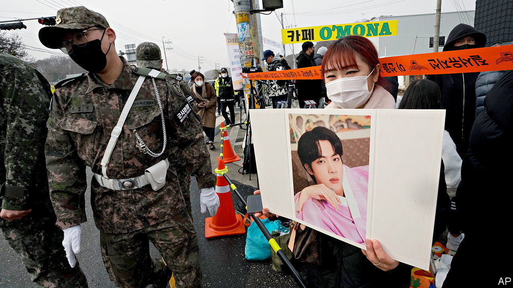
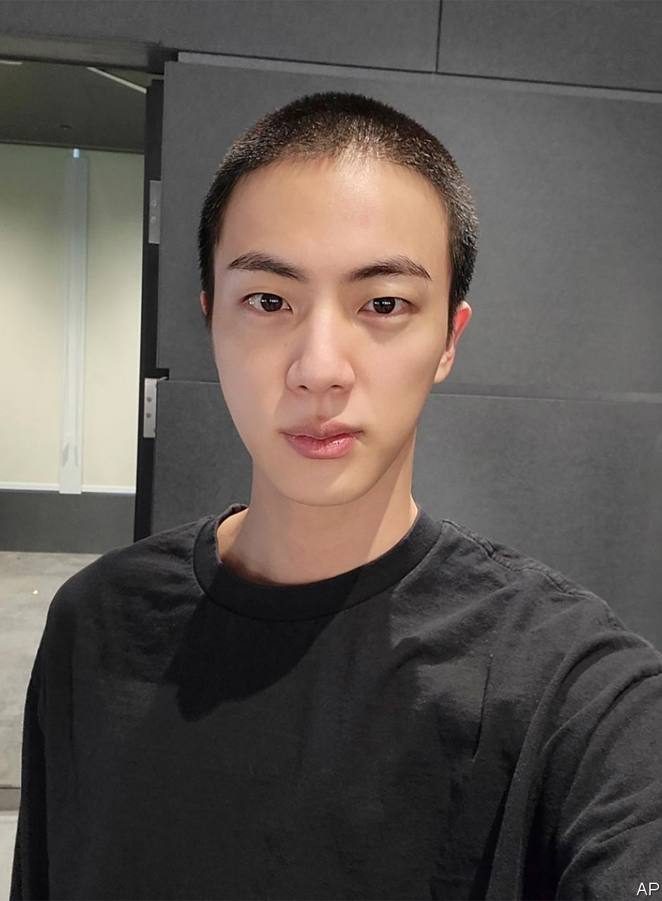

###### Boy band of brothers

# BTS takes on­ Kim Jong Un 

##### Serving South Korea may be a bit duller than stardom for Jin 

 

> Dec 13th 2022 

Kim Seok-jin is in the globally trendsetting, fabulously lucrative prime of his career. As a member of , the 30-year-old has topped charts in many countries, been nominated for several Grammys, addressed the United Nations and met President Joe Biden. Along with “Parasite” and “Squid Game”, his band is the go-to example of South Korean soft power. 

Yet on December 13th Mr Kim, or “Jin” as he is called by the many million members of the ARMY, as the septet’s fans are known, undertook the same dull rite of passage as most . He became the first BTS member to begin military service.

Unless they have extenuating circumstances, all South Korean men must serve at least 18 months in the country’s 550,000-strong armed forces, starting before they turn 28. BTS’s megastardom is arguably such a circumstance (notwithstanding the useful capability its members boasted of in their hit, “We are bullet-proof”). South Korea’s parliament therefore passed a law in 2020 to allow those who “excel in popular culture and art” to postpone their service.

The BTS boys could probably have done so indefinitely. The government had been mulling giving them an exemption similar to that enjoyed by top athletes and classical musicians, who are allowed to do basic training and no more. There was also talk of the pop stars being allowed to carry on making music as part of their service—just as those proficient in science and mathematics may continue their studies in a government-approved research department or company. Yet Mr Kim and his colleagues appear to have concluded, like Elvis Presley in 1958, that dodging the draft would be more damaging to their reputations than military service would be dreary. “It’s curtain-call time,” Mr Kim, now sporting a crewcut instead of his usual stylish hairdo, told his fans on social media.

 


The opportunity cost of military service, exorbitant in his case, is a general burden on South Korean men. The country’s education system is highly competitive; a larger proportion of school-leavers go to university in South Korea than in any other country. This makes its graduate jobs market extremely tough, and the enforced career interruption that military service represents—most conscripts take time out to serve in the middle of their degree course—commensurately painful. 

Military service also tends to be boring. Fighting across the demilitarised zone (dmz) that separates South Korea from the communist dictatorship to the north is very rare. Suicide is by far the biggest cause of death among conscripts. The only thing 28-year-old Han Seung-joo recalls battling at his station close to the dmz in Yeoncheon, where Mr Kim will do his basic training, was the weather. “There was a lot of snow-shovelling,” he recalled. “We would shovel the snow and look back and there would be more snow.”

Many never get near the front. The closest Kim Young-cheol, a 28-year-old software engineer who served in the auxiliary police, came to action was overseeing, generally uneventful, political protests. He reckoned each 12-hour shift his squad served amounted to 180 hours of wasted labour. “All these men were sitting on the bus and just doing nothing,” he said.

Those medically unfit to serve also tend to be assigned humdrum labour. Lee Sang-yup, who has scoliosis, was posted to a primary school to help serve lunch. “It always felt like a waste of time,” he recalls. “I would do everything to get out of it.”

The fact that Korean women need not serve strikes many men as unfair. Some believe it gives women an advantage in the job market. If so, it is cancelled out by other factors. Many firms are alleged to give men preferential treatment to reward them for their service. The gap between male and female wages in South Korea is larger than in any other country in the oecd, a club of mostly rich countries. Still, conscription is a persistent male grievance, which politicians shamefully exploit. Yoon Suk-yeul, South Korea’s president, won election this year in part by vowing to abolish the country’s gender-equality ministry. He is trying to make good on that promise.

There are compensations for the enforced tedium of service, including camaraderie and a sense of duty fulfilled. Nearly half of men in their 20s purport to believe that military service is beneficial to them. Park Jong-tae, a 29-year-old engineer whose main responsibility was guard duty, is proud of his “small contribution” to national security. He nonetheless suggests that most conscripts could do with being given more “meaning and a common goal”.

With luck, Mr Kim will find some of that in Yeoncheon. Anyway, he can at least look forward to resuming megastardom in due course. Asked whether his impending service would kill his career, Elvis replied: “That’s the $64 question. I wish I knew.” If the King is any guide, Mr Kim and his fellow band members should be OK.■

