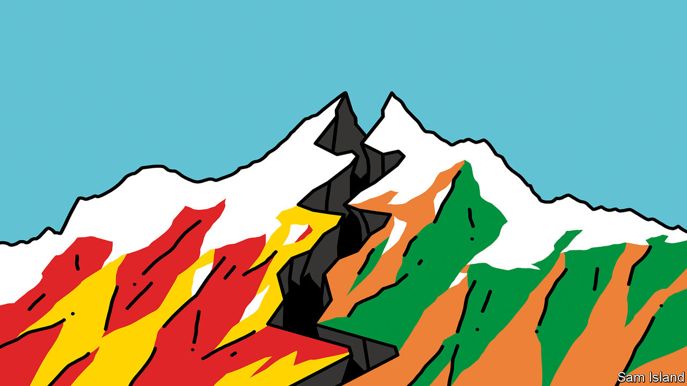

###### Banyan

# China’s frontier aggression has pushed India to the West 

##### Brawling on the roof of the world 

 

> Dec 15th 2022 

The most likely flashpoints in Asia are generally thought to be the Taiwan Strait, the South China Sea and the Korean peninsula. This week, though, attention turned to the Himalayas and the 3,440-km (2,150-mile) border, much of it disputed, between the world’s most populous powers. News of a high-altitude brawl on December 9th has trickled down from the mountains.

The border disputes date back to the early 20th century when Britain demarcated spheres of influence between British India and Tibet (not in those days under Chinese subjugation). At the western end of the frontier, India claims Aksai Chin, an area under Chinese control in the Xinjiang region. In the eastern sector, China claims the whole of the Indian state of Arunachal Pradesh as a historical part of Tibet: an earlier Dalai Lama was born in its Tawang monastery. Sixty years ago India and China fought a nasty war over the disputed line. It ended with India humiliated by the People’s Liberation Army (pla).

In the decades since, confrontations have often taken place. But thanks to protocols agreed between the two countries—including a ban on using firearms when patrols clash—most have been tokenistic. Until recently, both sides tacitly acknowledged the other’s patrol routes along the contested Line of Actual Control (lac). When rival patrols met, warning banners were raised and sharp words exchanged, but little worse.

That changed in 2020 when the remote Galwan valley, in Ladakh in the western sector, saw a terrible mêlée that left 20 Indian and four Chinese soldiers dead. They were the first fatalities along the frontier since 1975. The latest incident was in the eastern sector near Tawang, and resulted in no deaths; yet it appears to have been similar to the one in Galwan. Several hundred pla soldiers—many times the usual patrol size—are said to have charged across to the Indian side of an “agreed disputed area”, in the frontier jargon. They carried tasers and spiked clubs, and were swinging “monkey fists”, steel balls on lengths of rope. Well-prepared Indian troops pushed them back, India claims, but with injuries on both sides. China says the Indians “illegally” crossed the lac and sought to block a Chinese patrol. It was the first clash in the eastern sector in years.

Though the details of such incidents are always contested, and neither side’s account is reliable, the Galwan fracas appeared to represent a direct Chinese challenge to the status quo. It occurred after China had built new roads along the border and reinforced it with troops and equipment. It is now doing much the same in the eastern sector and India, as ever, is scrambling to keep up. “Unpredictability” along the frontier, writes Sushant Singh of the Centre for Policy Research in Delhi, “has become structural”.

To manage the tensions that it has done so much to increase, China may well propose to establish buffer zones in the east, just as the two sides have done in the west. Given that such zones often mean India being shut out of areas that it had previously patrolled, they are tantamount to an Indian retreat. Narendra Modi, India’s prime minister, would be extremely reluctant to submit to this. India’s political opposition senses that he is vulnerable on the issue.

Mr Modi once invited President Xi Jinping to his home state to celebrate the Indian prime minister’s birthday. Such chumminess is long gone. China says the border dispute should be isolated from the two countries’ broader relationship. But India considers a peaceful border a precondition for normal ties, says Tanvi Madan of the Brookings Institution, a think-tank in Washington. Since Galwan, India has blocked a lot of Chinese investment and banned Chinese apps. Official visits are curtailed. The two leaders have had one brief exchange in three years, at the G20 summit in Bali.

It is hard to see how this advances China’s interests overall. Indian policymakers used to be sullenly averse to India being seen as part of an anti-China bloc. Now, Ms Madan argues, China has “lost” India. Where it was once hostile to trade deals that might hurt Indian firms, farmers or workers, India is seeking or doing deals with Australia, the eu and others. Deeply alive to the Chinese threat, it is also co-operating much more on defence with America and its friends. Last month Indian and American armed forces even held a two-week exercise in Uttarakhand, a state bordering China. India is still not in the Western camp. But the more Himalayan trouble it faces, the further it tilts towards it.■


