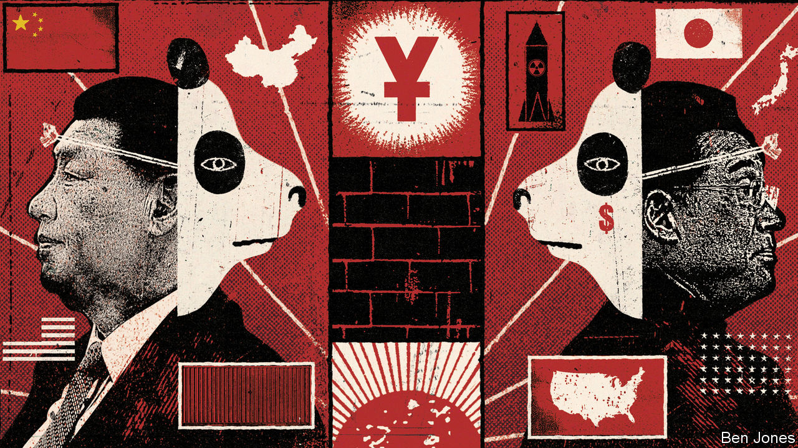
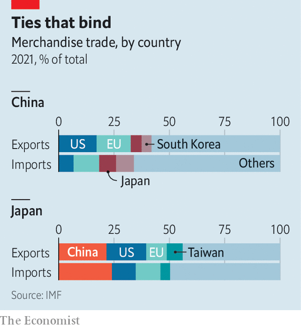

###### Sino-Japanese relations

# East Asia’s big beasts are getting on badly 

##### Security gripes are increasingly undermining Chinese-Japanese economic ties 

 

> Dec 12th 2022 

Xiao xiao and Lei Lei, two baby pandas at Tokyo’s Ueno Zoo, have a weighty diplomatic lineage. Their predecessors, Kang Kang and Lan Lan, were presented to Japan by China’s rulers in 1972 to celebrate the normalisation of relations between the former foes that year. They were probably the first pandas to set paw in Japan; the queue to see them stretched a kilometre through the zoo’s leafy grounds.

In some respects, the relationship between Asia’s two economic heavyweights has since been . Japanese aid and investment helped China modernise; the growing Chinese market helped fuel Japan’s growth. Last year China was by far Japan’s biggest trading partner, and Japan was China’s second-largest: bilateral trade hit a ten-year high of $391bn. Yet the disagreements over territory and history that still strained the relationship half a century ago—chiefly, over the status of the , and of Taiwan, and the memory of Japan’s wartime aggression—are unresolved. And under Xi Jinping, China’s aggrieved, nationalistic leader, they have been exacerbated.

Both countries now view the other primarily as a . Nearly 90% of Japanese have a negative view of China; more than 60% of Chinese feel the same way about Japan. By stopping people-to-people exchanges, China’s zero-covid policies have made a difficult situation worse. The 50th anniversary of normalisation, on September 29th, elicited little fanfare in either country. Their leaders, Kishida Fumio and Mr Xi, were not on speaking terms at the time. Even Japanese panda-huggers are concerned. “I wish the leaders would make more effort to get along,” said a man who had come to see Xiao Xiao and Lei Lei in Ueno one recent wintry Tokyo afternoon.

To try to keep the mutual suspicions in check, there has been a recent flurry of diplomacy. The two countries’ national security advisers, Akiba Takeo of Japan and China’s Yang Jiechi, met in August for seven hours of talks. That led to a brief meeting between Mr Kishida and Mr Xi on the sidelines of the Asia-Pacific Economic Co-operation summit on November 17th. It was their first conversation, save for a 30-minute phone chat after Mr Kishida took office in October 2021. 

Chinese aggression is the main new source of tension.  landed in Japan’s exclusive economic zone during the military drills China staged in August in response to a visit to Taiwan by Nancy Pelosi, the speaker of America’s House of Representatives. Those shots, says Yun Sun of the Stimson Centre, a think-tank in Washington, were a signal from China’s rulers. “They are warning Japan against getting involved militarily in a potential Taiwan contingency: ‘You really want to go all-in with the Americans? This is not even a taste of what will be coming.’” Days after Mr Kishida and Mr Xi met, heavily-armed Chinese coastguard vessels sailed into Japanese territorial waters near the Senkaku/Diaoyu islands. 

Japan is taking major steps to beef up its armed forces. Earlier this month Mr Kishida pledged to raise defence spending to the equivalent of 2% of gdp within five years, up from around 1% now. A new national-security strategy to be released this week will call China a “challenge”, replacing a formulation that stressed possible co-operation. “Japan was trying not to antagonise China in the past,” says Aoyama Rumi of Waseda University in Tokyo. “Now the language is catching up with the reality.” Japan has also become more vocal about its interest in protecting Taiwan.

Behind the scenes, both sides are making efforts to avoid a worse deterioration. After clashes between Japanese patrol boats and Chinese fishing vessels around the Senkaku/Diaoyu islands in 2010-12, China banned exports of rare-earth metals to Japan and Chinese consumers boycotted Japanese products. China has not taken or incited such action in response to the latest friction. Signals from Beijing suggest “China wants to cool down the hot temperature,” says Kawashima Shin of the University of Tokyo. During their meeting, Mr Xi and Mr Kishida agreed to accelerate the creation of a hotline between their respective armed forces.

China considers Mr Kishida less provocative than his more nationalistic predecessor, Abe Shinzo, who was assassinated in July, notes Ms Sun. It might also prefer to keep its relations with Japan relatively calm, given how bad they are with America. As its economy emerges from zero-covid, China will need the foreign investment and technology Japan can provide.

Japanese businesses remain committed to the Chinese market. “The world cannot thrive without China, and China cannot decouple itself from the world,” declares Tokura Masakazu, chairman of Keidanren, Japan’s big-business federation. Last year China accounted for 24% of Japan’s imports and 22% of its exports. (America takes 18% of Japan’s exports; only 9% of America’s exports flow to China.) 

 


Yet the strains on the relationship are likely to increase. China believes it can press its territorial claims, while still courting Japanese investment. Japan wants to deepen its security ties with America and deter China from taking action on Taiwan, yet keep trade flowing. “There has never been a time when it was as hard to separate economics and politics as today,” Yamaguchi Hirohide, a former deputy governor of the Bank of Japan, said last week in Tokyo at the Tokyo-Beijing Forum, an annual summit for Japanese and Chinese bigwigs.

Earlier this year, Japan’s parliament passed an “economic security” law aimed at protecting sensitive technologies and supply chains for critical goods. More than half of Japanese firms are planning to reduce dependence on China in their supply chains, according to a survey by , a business daily. Concerns about a possible conflict over Taiwan are a big reason why. Honda, for example, is reported to be secretly studying what it would take to assemble its cars without parts from China.

America’s trade war with China, including its recent ban on , is another complicating factor. Japan is firmly on America’s side when it comes to security, but Japanese firms “must play both sides when it comes to trade”, gripes a Japanese official. Many in Tokyo consider America’s approach to China heavy-handed. “America is far away and can survive a war with China—our interests don’t align exactly,” says a Japanese government adviser. China reckons that it can “create incentives for Japan to restrain the extent to which it co-operates” with America’s policies, says Robert Ross of Boston College.

Even reviving a proper dialogue between the two countries will not be easy. Japanese diplomats are finding it hard to have frank conversations with their Chinese counterparts. Leader-level summits have thus become more important. Before the pandemic, Mr Xi was set to visit Tokyo. China’s ambassador to Tokyo recently called for that plan to be revived. Yet even if it is, there is little prospect of bonhomie in the relationship. A more realistic hope is that it does not get worse. ■

