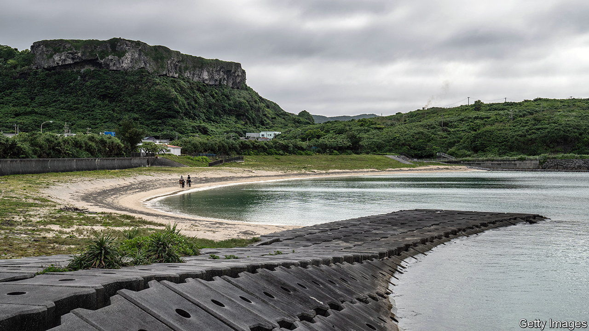

###### Forgetting your parents

# Japan’s most endangered languages face extinction 

##### Ryukyuan tongues are as distinct from Japanese as English is from German 

 

> Dec 15th 2022 

Ikema Ryuichi stands in the museum his mother built on Yonaguni, a coral-reef-fringed tropical island and south-western outpost of Japan. Large clay vessels, intricate baskets and lavish flower-print textiles fill the shelves. In one display case is a worn book: a dictionary the woman assembled to preserve her local language, known as Dunan. Mr Ikema is one of a dwindling number of people who can still speak it. 

Yonaguni’s is one of half a dozen indigenous languages spoken on the Ryukyu Islands. The island chain, which includes Okinawa, stretches thinly almost from Kyushu to Taiwan, and was once an independent kingdom. That precarious position has long made the Ryukyus a battleground for the chain’s bigger neighbours. Its languages are among their victims. 

Though Ryukyuan languages and Japanese belong to the same family, linguists reckon they have about as much in common as English and German. But when Japan annexed the islands in the 1870s, it declared the Ryukyuan languages mere dialects of Japanese. They were banned in schools. Students who persisted in speaking them were forced to wear demeaning placards around their necks. 

Ryukyuan families kept the languages alive at home. Then, after the second world war, America occupied Okinawa and encouraged a return to Ryukyuan languages in a bid to distance the islanders from the rest of Japan. By associating the local languages with its unpopular occupation, however, America probably hastened their demise. “Speaking Japanese became a tool to free the Ryukyus from the Americans,” says Patrick Heinrich of Ca’ Foscari University of Venice. 

The decades of neglect took a toll. In 2009 unesco declared all six Ryukyuan languages (which are almost mutually unintelligible) severely or critically endangered. Ryukyuan activists have since made some progress in revitalising their use, especially on Okinawa. Yet the languages are still in peril. And the activists are not helped by Japan’s continuing reluctance to recognise them as distinct tongues. To do so, notes Mr Heinrich, would involve acknowledging how recently, and in what circumstances, the Ryukyus became part of Japan: “It takes you to the history.”

Dunan is probably the most threatened language. Only around 100 people speak it fluently. Yonaguni’s government has therefore made optional Dunan courses available in schools. Muramatsu Minoru of the local education board, who is from Honshu but has learned the island language, has led an effort to assemble new Dunan dictionaries. There is a Dunan saying that sums up the stakes: “If you forget the language, you forget the island; if you forget the island, you forget your parents.” Yet it is hard to imagine such modest steps saving Dunan. Mr Ikema is not hopeful. “Dunan will eventually disappear,” he says.■

