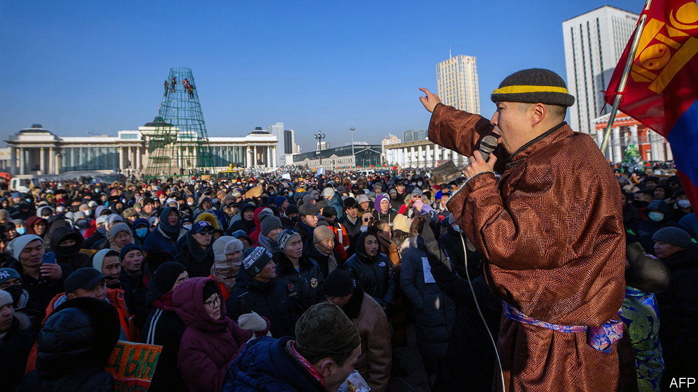

###### At the coal face

# Mongolians brave the cold to decry corruption 

##### The government says it is investigating a massive coal heist 

 

> Dec 15th 2022 

The temperature in Ulaanbaatar, the world’s coldest capital, has hit minus 30°C. This has not deterred thousands of Mongolians from taking to the city’s vast Sukhbaatar Square in a remarkable series of protests against corruption. As  went to press, the spontaneous demonstrations looked to be about to enter their third week.

Almost a third of Mongolia’s 3.3m people live below the poverty line. But the continent-sized country’s mineral-extraction economy has created a lot of wealth. Hummers are the Mongolian elite’s vehicle of choice. A Mongolian copper mine under development, Oyu Tolgoi, or “Turquoise Hill”, will be the world’s fourth biggest. Yet for now coal is king. To the northwest of Oyu Tolgoi are some of the world’s biggest deposits of thermal and high-quality coking coal. They are dug up and trundled in fleets of lorries (and latterly by a new railway) across the Gobi desert to China. This operation is managed by a state-owned entity, Erdenes Tavan Tolgoi (ett). It has long been a byword in Mongolia for callousness and mismanagement.

The spark for the protests was an alleged massive theft of coal from the state-owned firm’s stockpiles near the border with China; 385,000 tonnes may have gone missing. Crowds of mostly youngish Mongolians flocked to Sukhbaatar Square to show their disgust. After an initial attempt to storm the main government building adjacent to the square, the protests have been peaceful. An upbeat, almost studious atmosphere permeates them. Participants debate new issues each day, such as the pros and cons of non-violent protest. The scene recalls the demonstrations in the same square in the 1990s that toppled Mongolia’s erstwhile communist regime.

A well-connected “coal mafia” is alleged to be behind the theft. The names of its reputed members, including politicians, are circulating on social media. Many are familiar. More surprising is the response of President Ukhnaagiin Khurelsukh and his ruling Mongolian People’s Party (MPP). Several former ett executives have been arrested over the scandal. On December 13th Mongolia’s anti-corruption body declared that a former president, Khaltmaagiin Battulga, was among nearly two dozen people being investigated.

It will take more than this to appease the protesters, suggests Oyungerel Tsedevdamba, a former minister who visits Sukhbaatar Square every day. The anti-corruption body is not independent. Court-imposed fines and sentences for those convicted of corruption are often desultory. Besides, the grievances being aired in the square, from the capital’s pea-soup smog to high inflation, go beyond the coal heist.

Mr Khurelsukh may feel the need to offer the protesters a sacrificial lamb, perhaps even his prime minister, Luvsannamsrain Oyun-Erdene. Or the protests might peter out, smothered by the cold. A third possibility, Julian Dierkes of the University of British Columbia cautions, is that the so-far leaderless movement could get hijacked by those seeking to bypass the political process altogether. That would send Mongolia down the path of protest and revolution that has harmed other Asian countries, notably Kyrgyzstan. A cold wind is blowing across the steppe.■

