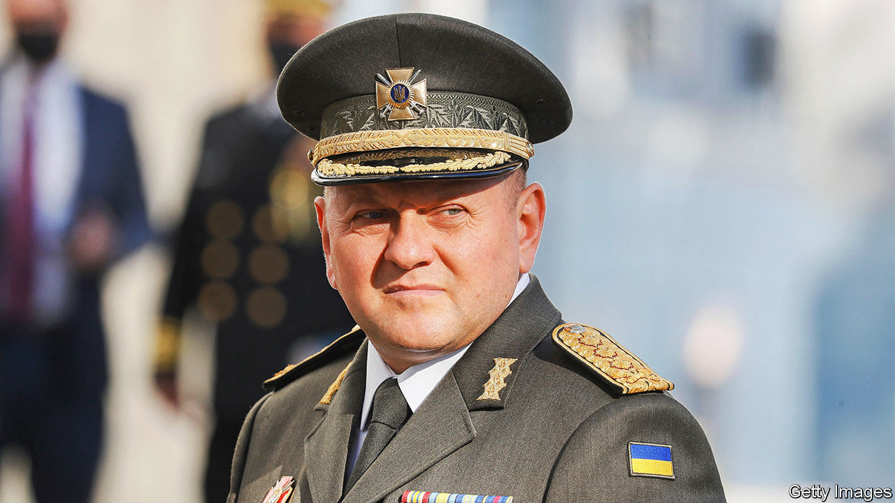

###### Restraint under fire

# Ukraine’s top soldier runs a different kind of army from Russia’s 

##### Valery Zaluzhny wants to encourage initiative and devolve authority 

 

> Dec 15th 2022 

The office of , the head of Ukraine’s armed forces, has few personal touches bar a framed photograph on his desk, of a soldier in uniform. “When I am at ease, when things are going well, this picture is lying face down, I don’t need to look at it. When I have doubts about something I put it up straight,” he explains. 

The picture is currently upright. It shows the late General Hennady Vorobyov, who commanded Ukraine’s ground forces from 2009 to 2014. He rejuvenated the top ranks, instilled a culture of respect for subordinates and refused to deploy troops to suppress public protests in 2013-14. “I look at the photograph trying to figure out what Hennady Vorobyov would do,” General Zaluzhny says.

It is no wonder that the general’s choices weigh heavily on him. Few people have as much power and responsibility. His decisions may determine not just the course of the , but also the fate of hundreds of thousands of soldiers and civilians. Yet dressed in a fleece, with a brick-wall build and a shy but sly smile, he has the air more of a wily farmer than a domineering officer. Then again, in , where Cossacks used both to work the land and defend it, the two callings are not so far apart. “I am not doing anything extraordinary. I am just doing my job—the one I love most,” he says.


General Zaluzhny is too young to have served in the Soviet army and was never indoctrinated in its culture of “commandership”, which rewarded obedience and suppressed initiative. “It is always possible to be normal…to remain human in any situation—that is the most important thing.” But that does not mean he is not forceful: “Since the start of the war I fired ten [generals] because they were not up to it. Another shot himself.” He is even more ruthless, naturally, about the invaders he has been fighting since 2014: “Russians and any other enemies must be killed, just killed, and, most important of all, we should not be afraid to do it.”

That resolve was crucial in the early days of the war, when outsiders assumed that the Ukrainian state and armed forces were at risk of complete collapse. “Americans told us to prepare for entrenched defence. But we had one chance and we took it…Our task was to distribute our smaller forces in such a way as to use unconventional tactics to stop the onslaught.”


General Zaluzhny is not dismissive of the Russian forces: “They are not idiots.” Like Volodymyr Zelensky, Ukraine’s president, he grew up speaking Russian and reading Russian literature. But the army he leads is the antithesis of its Russian counterpart, just as Mr Zelensky could scarcely be more different from Vladimir Putin. “With all due respect to Mr Surovikin [the commander of Russian forces in Ukraine] if you look at him, he is an ordinary Petrovite commander from Peter the Great’s time, shall we say, a [a brutal martinet in Gogol’s play, “The Government Inspector”]. You take one look at him and understand that either you complete the task or you’re fucked.”

This approach, General Zaluzhny says, simply does not work in Ukraine. After protests toppled the government in 2014 and Russia invaded eastern Ukraine, “21-year-old lieutenants came to command men who were in their 50s and 60s”. For his part, he says, “I certainly don’t think I am the smartest one here. I must and do listen to those who are in the field. Because the initiative is there.” 


General Zaluzhny is among the most popular people in Ukraine, however, thanks to his successful prosecution of the war. He has never displayed any interest in politics but, inevitably, his popularity has generated insecurity in the president’s office, which has actually polled Ukrainians to ask if they would vote for the general’s political party, even though he does not have one. Officials close to Mr Zelensky are quick to point out that General Zaluzhny has not visited the front line. That, say the general’s defenders, is because the same officials have barred him from doing so. Some in the president’s circle would like to replace him with General Oleksandr Syrsky, who commands Ukraine’s land forces, over whose head General Zaluzhny was promoted last year.

At best, these petty rivalries are a distraction. Worse, says a senior foreign soldier, they could undermine Ukraine’s unity and weaken Western confidence in its leaders. “This is not the time for politicking or undermining trust between political and military command,” he warns. General Zaluzhny, after all, is not short of pressing problems, as the upright photograph of General Vorobyov attests. ■


