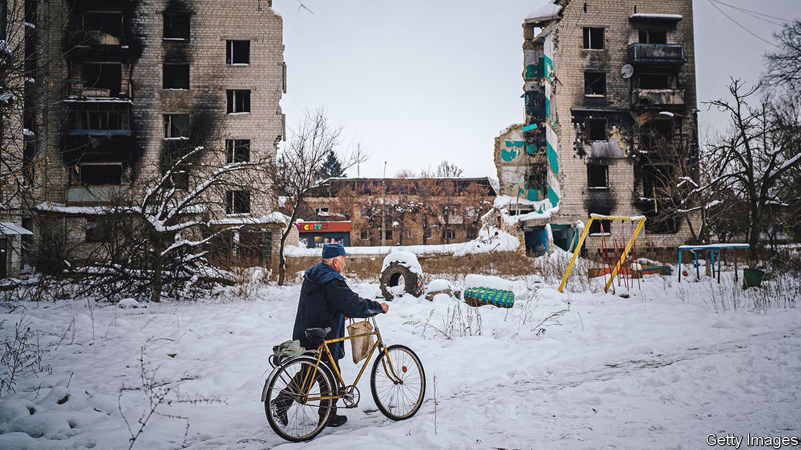
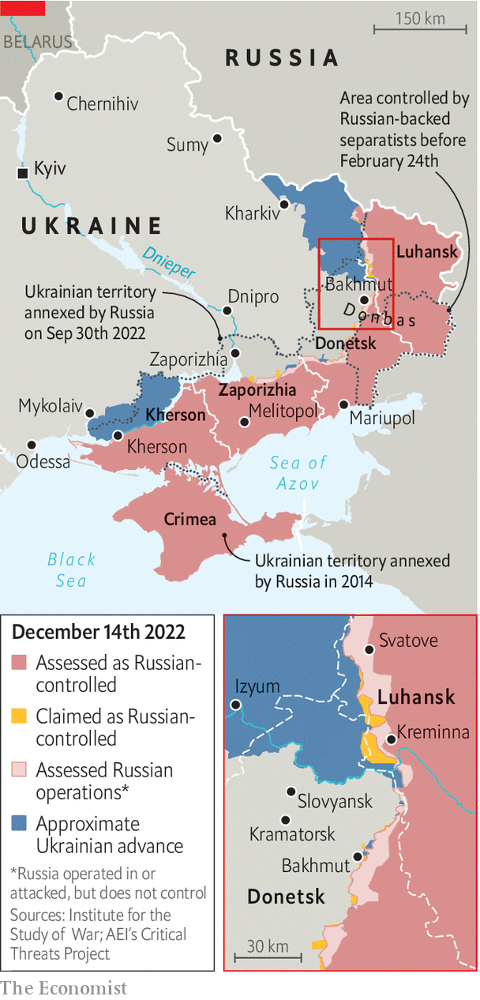
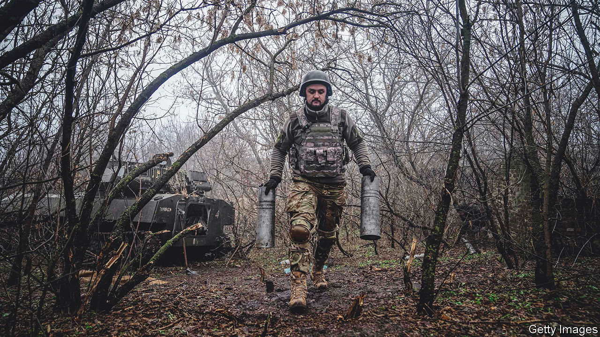

###### Ukraine’s fateful winter

# Volodymyr Zelensky and his generals explain why the war hangs in the balance 

##### Our interviews with the men shaping Ukraine’s response to Russia’s aggression 

 

> Dec 15th 2022 

TWO BOOKS stand out in the stacks resting on the desk of , Ukraine’s president. One is a collection of essays on Ukrainian history by Mykhailo Hrushevsky, a 19th-century thinker who helped forge the country’s national identity. The second is “Hitler and Stalin: the Tyrants and the Second World War”, by Laurence Rees, an English historian. The books hint not only at the president’s outlook, but also his changed circumstances. 

When  last spoke to Mr Zelensky, in March, the conversation took place in a situation room. He was living in a secret bunker full of instant noodles and a sense of existential peril. Now he is back in his old wood-panelled office in central Kyiv. An Oscar statuette, lent for good luck by Sean Penn, a Hollywood actor, stands on a shelf. Though sandbags and tank traps remain, gone is the adrenalin of those early weeks. Mr Zelensky’s routine typifies the change. At 6am each morning he dons his reading glasses and flicks through 20 or so pages of each book. 

Mr Rees’s study of Hitler and Stalin, two men who swallowed swathes of Europe, hints at how Mr Zelensky views Vladimir Putin, his Russian counterpart. Hrushevsky’s writing emphasises the importance of popular forces in Ukrainian history.  reflect both thoughts. “People do not want to compromise on territory,” he says, warning that allowing the conflict to be “frozen” with any Ukrainian land in Russian hands would simply embolden Mr Putin. “And that is why it is very important…to go to our borders from 1991.” That includes not just the territory grabbed by Russia this year, but also Crimea, which it seized and annexed in 2014, and the parts of the Donbas region overrun by Russian proxies at the same time. 


In recent days  has interviewed the three men at the crux of Ukraine’s war effort. One is Mr Zelensky. The second is , who has served as the country’s top soldier for the past year and a half. The third is , the head of Ukraine’s ground forces, who masterminded the defence of Kyiv in the spring and Ukraine’s spectacular counter-offensive in Kharkiv province in September. All three men emphasised that the outcome of the war hinges on the next few months. They are convinced that Russia is readying another big offensive, to begin as soon as January. Whether Ukraine launches a pre-emptive strike of its own or waits to counter-attack, how it garners and distributes its forces, how much ammunition and equipment it amasses in the coming weeks and months—these looming decisions will determine their country’s future.

Ukraine enjoyed a triumphant autumn. General Syrsky’s lightning advance through Kharkiv prompted Mr Putin to appoint a new commander and conscript 300,000 soldiers. So precarious was Russia’s position in October that its generals began discussing nuclear options. In November Ukrainian forces walked into Kherson city. “This is the beginning of the end of the war,” declared Mr Zelensky as he strolled through the newly liberated city. “We are step by step coming to all the temporarily occupied territories.”

But neither General Zaluzhny nor General Syrsky sounds triumphant. One reason is the escalating air war. Russia has been pounding Ukraine’s power stations and grid with drones and missiles almost every week since October, causing . Though Russia is running short of precision-guided missiles, in recent weeks it is thought to have offered Iran fighter jets and helicopters in exchange for thousands of drones and, perhaps, ballistic missiles.


“It seems to me we are on the edge,” warns General Zaluzhny. More big attacks could completely disable the grid. “That is when soldiers’ wives and children start freezing,” he says. “What kind of mood will the fighters be in? Without water, light and heat, can we talk about preparing reserves to keep fighting?” On December 13th American officials said that they were nearing a decision to give Patriot air-defence batteries to Ukraine, which, unlike the systems sent so far, are capable of shooting down ballistic missiles.

 


A second challenge is the fighting currently under way in Donbas, most notably around the town of Bakhmut. General Syrsky, who arrives at the interview in eastern Ukraine in fatigues, his face puffy from sleep deprivation, says that Russia’s tactics there have changed under the command of Sergei Surovikin, who took charge in October. The Wagner group, a mercenary outfit that is better equipped than Russia’s regular army, fights in the first echelon. Troops from the Russian republic of Chechnya and other regulars are in the rear. But whereas these forces once fought separately, today they co-operate in detachments of 900 soldiers or more, moving largely on foot. 

Bakhmut is not an especially strategic location. Although it lies on the road to Slovyansk and Kramatorsk, two biggish cities (see map), Ukraine has several more defensive lines to fall back on in that direction. What is more, Russia lacks the manpower to exploit a breakthrough. The point of its relentless onslaught on Bakhmut, the generals believe, is to pin down or “fix” Ukrainian units so that they cannot be used to bolster offensives in Luhansk province to the north. “Now the enemy is trying to seize the initiative from us,” says General Syrsky. “He is trying to force us to go completely on the defensive.”


Ukraine also faces a renewed threat from Belarus, which began big military exercises in the summer and more recently updated its draft register. On December 3rd Sergei Shoigu, Russia’s defence minister, visited Minsk, the Belarusian capital, to discuss military co-operation. Western officials say that Belarus has probably given too much material support to Russian units to enter the fray itself, but the aim of this activity is probably to fix Ukrainian forces in the north, in case Kyiv is attacked again, and so prevent them from being used in any new offensive.

The third challenge is the most serious. Russia’s mobilisation effort has been widely disparaged, with countless stories of inadequate kit and disgruntled conscripts. Ukraine’s general staff and its Western partners are more wary. “We all know that the quality is poor and that they lack equipment,” says Kusti Salm of Estonia’s defence ministry. “But the fact that they can mobilise so fast is an early-warning dilemma for Ukraine and ultimately for NATO.” Schemes run by Britain and the European Union can train around 30,000 Ukrainian troops in 18 months, he says. Russia has been able to conjure up five times as many new soldiers in a fraction of the time.

“Russian mobilisation has worked,” says General Zaluzhny. “A tsar tells them to go to war, and they go to war.” General Syrsky agrees: “The enemy shouldn’t be discounted. They are not weak…and they have very great potential in terms of manpower.” He gives the example of how Russian recruits, equipped only with small arms, successfully slowed down Ukrainian attacks in Kreminna and Svatove in Luhansk province—though the autumn mud helped. Mobilisation has also allowed Russia to rotate its forces on and off the front lines more frequently, he says, allowing them to rest and recuperate. “In this regard, they have an advantage.”

But the main reason Russia has dragooned so many young men, the generals believe, is to go back on the offensive for the first time since its bid to overrun Donbas fizzled out in the summer. “Just as in [the second world war]…somewhere beyond the Urals they are preparing new resources,” says General Zaluzhny, referring to the Soviet decision to move the defence industry east, beyond the range of Nazi bombers. “They are 100% being prepared.” A major Russian attack could come “in February, at best in March and at worst at the end of January”, he says. And it could come anywhere, he warns: in Donbas, where Mr Putin is eager to capture the remainder of Donetsk province; in the south, towards the city of Dnipro; even towards Kyiv itself. In fact a fresh assault on the capital is inevitable, he reckons: “I have no doubt they will have another go at Kyiv.” 


That means that the war has become a race to re-arm. For Ukraine, that sets up a painful trade-off between the present and the future. Fighting will slow down over winter, but it will not stop. A rocket attack on barracks used by the Wagner group in the city of Melitopol on December 10th was a reminder of how Ukraine can use HIMARS launchers supplied by America to wear down Russian forces in the coming months. But in Donbas the war remains one of muddy trenches, relentless shelling and bloody infantry combat.

The temptation is to send in reserves. A wiser strategy is to hold them back. “I know how many combat units I have right now, how many combat units I have to create by the end of the year—and, most important, not to touch them in any way now. No matter how hard it is,” says General Zaluzhny. His agonising decision is redolent of the British commanders who held back Spitfire fighter planes as France suffered a German onslaught in 1940. “May the soldiers in the trenches forgive me,” says General Zaluzhny. “It’s more important to focus on the accumulation of resources right now for the more protracted and heavier battles that may begin next year.” 

Ukraine has enough men under arms—more than 700,000 in uniform, in one form or another, of whom more than 200,000 are trained for combat. But materiel is in short supply. Ammunition is crucial, says General Syrsky. “Artillery plays a decisive role in this war,” he notes. “Therefore, everything really depends on the amount of supplies, and this determines the success of the battle in many cases.” General Zaluzhny, who is raising a new army corps, reels off a wishlist. “I know that I can beat this enemy,” he says. “But I need resources. I need 300 tanks, 600-700 IFVs [infantry fighting vehicles], 500 Howitzers.” The incremental arsenal he is seeking is bigger than the total armoured forces of most European armies.

Ukraine’s partners are speeding up efforts to repair and refurbish old and damaged equipment to return it to the field faster, in part by teaching Ukraine to fix it as close to the front lines as possible. They are also accelerating the manufacture of weapons to meet growing demand from Ukraine and their own armed forces.

On December 6th America’s Congress agreed in principle to let the Pentagon buy 864,000 rounds of 155mm artillery shells, more than 12,000 GPS-guided Excalibur shells and 106,000 GPS-guided GMLRS rockets for HIMARS—theoretically enough to sustain Ukraine’s most intense rate of fire for five months non-stop. But this will be produced over a number of years, not in time for a spring offensive.

Russia has similar problems. It will run out of “fully serviceable” munitions early next year, says an American official, forcing it to use badly maintained stocks and suppliers like North Korea. Its shell shortages are “critical”, said Admiral Tony Radakin, Britain’s defence chief, on September 14th. “Their ability to conduct successful offensive ground operations is rapidly diminishing.” But Mr Putin’s gamble is that he can churn out sub-par shells longer than America and Europe can provide Ukraine with shiny new ones. Ukraine’s allies are struggling to keep it well supplied, acknowledges General Zaluzhny. He recalls telling Admiral Radakin that the British Army fired a million shells in the first world war (in fact Britain fired 1.5m at the Somme alone). “We will lose Europe,” came the reply. “We will have nothing to live on if you fire that many shells.” 

Supply also affects strategy. The choices vexing Mr Zelensky and his generals carry an echo of those that arise in every protracted conflict. In 1943, for instance, Germany was on the defensive, but the Allies disagreed over where and when to press their advantage. Britain wanted to strike in Italy and the Mediterranean. America and the Soviet Union preferred an invasion of France. Post-war considerations played a role, too. Britain wanted to attack the Balkans to forestall Soviet domination of the area. Ukraine’s high command is grappling with the same sort of questions today, but from a much more parlous position. 

 


Timing is crucial. Feeding in reserves piecemeal is a good way to destroy lots of manpower slowly, much as Russia did in Donbas over the summer. Attack too early and Ukraine will not have enough trained and equipped units. “With this kind of resource I can’t conduct new big operations, even though we are working on one right now,” says General Zaluzhny. But leave it too late, and Russia may strike first, pinning down Ukrainian forces.

Long-term occupation is already poisoning Ukrainian minds, warns Mr Zelensky: “I must admit that this propaganda model of the Kremlin—it works.” Ukrainians in the occupied territories, he says, are like astronauts who cannot take off heavy helmets—limiting what they can see to unrelenting disinformation. “It’s a little scary to see how the de-occupied cities have changed when we go to some of these towns,” he says. A strategy to bleed Russia slowly is therefore off the table. “The main thing is not to be afraid of this enemy,” says General Zaluzhny. “It can be fought, it must be fought today, here and now. And in no way should it be postponed till tomorrow, because there will be problems.”


Another question is where to strike. The most tempting option for Ukraine is to build up a big force to drive south towards the Sea of Azov. That would rupture the “land bridge” of occupied territory that connects Russia to Crimea. Advancing 84km south through Zaporizhia province to Melitopol would suffice, says General Zaluzhny, because it would put HIMARS launchers within range of Russian supply lines to the peninsula, making the enemy’s positions untenable. Ukrainian officials say that this approach was discussed and war-gamed earlier in the year with General Mark Milley, America’s top soldier, and Lieutenant-General Chris Donahue, commander of America’s 18th Airborne Corps, which co-ordinated Western training and equipment for Ukraine until recently.

Ukraine ruled out an offensive in Zaporizhia province in the summer, preferring to focus on the city of Kherson because of a lack of resources. Such an attack would have other drawbacks, too. Russia has strengthened its position in the south since November, digging new trenches, building multiple lines of defence and redeploying forces that retreated from Kherson that month. It is also the most predictable course of action. 

“All of our successes are due to the fact that we never go head-on,” notes General Syrsky. His gains in Kharkiv owed much to deception and surprise. During the Kherson offensive, commanders were told to plan diversionary action. That drew his attention to weak points in the Russian line around Izyum. He collected reserves by withdrawing individual battalions from different brigades, and assembling them quietly without being spotted. Repeating that trick might require identifying Russian vulnerabilities in less strategic parts of the front, such as around Svatove or south of Donetsk. Another option is to conduct big raids: quick thrusts intended to harass, damage and destroy, rather than hold ground. “There is an antidote for every poison,” notes General Syrsky.


The military choices—spring or summer, Zaporizhia or Donbas—depend on many factors, from supplies of Western arms, to weather, to Russia’s own choices. Perhaps most important, it depends on Ukraine’s strategy to end the war. Mr Zelensky insists that the only way to conclude it is a complete Russian retreat, both from land seized this year and from territory occupied since 2014. “The only difference I talk about is the one between us driving them out or them withdrawing,” says Mr Zelensky. “If he [Mr Putin] now withdraws to the 1991 borders then the possible path of diplomats will begin. That is who can really turn the war from a military path to a diplomatic one. Only he can do it.” 

In private, however, Ukrainian and Western officials admit there may be other outcomes. “We can and should take a lot more territory,” General Zaluzhny insists. But he obliquely acknowledges the possibility that Russian advances might prove stronger than expected, or Ukrainian ones weaker, by saying, “It is not yet time to appeal to Ukrainian soldiers in the way that Mannerheim appealed to Finnish soldiers.” He is referring to a speech which Finland’s top general delivered to troops in 1940 after a harsh peace deal which ceded land to the Soviet Union.

Even steady Ukrainian advances are likely to culminate in diplomacy. Some Ukrainian generals think that the aim of an offensive should not just be liberating territory, but doing so in a way that induces Mr Putin to cut a deal. A European official familiar with Ukrainian planning says that the ideal operation would be one that persuaded Mr Putin that the war was unwinnable, and that prolonging it would risk even his pre-war holdings—Crimea and a third of Donbas. Like all coercive strategies, such an attack would rely on restraint as much as aggression, by threatening Crimea, but also possibly forgoing it. 

Indeed, as Ukraine advances, its partners may worry increasingly about the risk of nuclear escalation and limit their support accordingly. On December 5th Antony Blinken, America’s secretary of state, said that America’s goal was to give Ukraine the means to “take back territory that’s been seized from it since February 24th”.

But a war which revolves around Ukraine’s identity as much as its territory—indeed one which has forged that identity anew, far more strongly than before—has unleashed forces beyond the control of even Mr Zelensky, perhaps the most popular leader in the world today. Over 95% of his citizens want to liberate the entirety of Ukraine, he notes. Hatred of Russia runs deep. “It is a tragedy for families who lost children…That’s why people hate. They don’t want compromises.” ■


